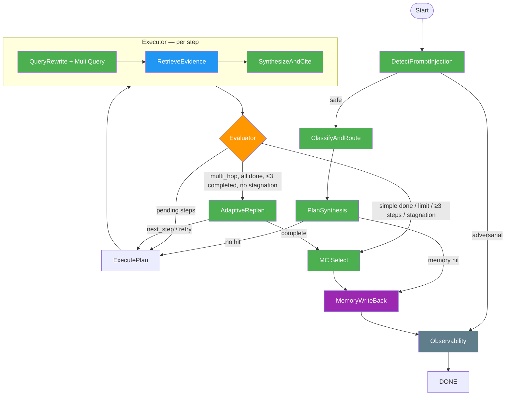

# Architecture

## Graph Overview



**Legend**: Green = LLM skill call, Blue = retrieval (ChromaDB), Orange = evaluation logic, Purple = memory, Grey = observability

**LLM call budget**: multi_hop MC = 11, multi_hop non-MC = 10, simple = 4. Injection check adds 1 when enabled.

---

## Node-by-Node Reference

### 1. detect_injection_node

**Purpose**: Screen user input for adversarial prompt injection before any pipeline work.

**Skill**: `detect_prompt_injection.md` (~160 words). Core principle: legal topics involving crime/violence/sensitive subjects are SAFE when framed as research. Fail-open — assumes safe if parser fails.

**Decision criteria**:
- Safe: legitimate legal questions, even on sensitive topics (criminal law, drugs, self-defense)
- Adversarial: attempts to override instructions, reveal prompts, or manipulate behavior

**Routing**: safe → classifier, adversarial → observability (with rejection message) → END.

**Skip**: Set `SKIP_INJECTION_CHECK=1` to bypass (saves 1 LLM call). Recommended for eval runs.

**Observed behavior**: Always classifies legal questions as safe. No false positives in any traced eval.

---

### 2. classifier_node

**Purpose**: Classify the objective as `simple` or `multi_hop` to determine the loop structure.

**Skill**: `classify_and_route.md` (~200 words). Two buckets:
- **simple**: Single legal rule/definition/standard. Can be answered by one focused passage.
- **multi_hop**: Multiple interacting concepts, application to facts, comparing rules/exceptions/defenses.

MC-specific guidance in the skill:
- MC testing ONE concept → simple
- MC requiring MULTIPLE interacting concepts → multi_hop
- When in doubt → multi_hop

**Routing**: Fixed → planner. The query_type determines whether the replanner fires later.

**Observed behavior**: Classifies all bar exam MC as multi_hop (6/6). Only out-of-corpus ("asylum requirements") got simple. This is by design — the "when in doubt" rule biases toward more research.

**Cost impact**: multi_hop costs 11 LLM calls vs 4 for simple. The classifier's bias means every MC question takes the expensive path, but this produces better research for the MC selector.

---

### 3. planner_node

**Purpose**: Check QA memory cache, then generate an initial research plan.

**Skill**: `plan_synthesis.md` (~200 words). Produces a JSON array of plan steps (fields: `step_id`, `phase`, `question`).

**Decision criteria**:
1. **Memory check first**: Queries `qa_memory` collection (cosine similarity >= 0.92). On hit, short-circuits to memory_writeback with cached answer. No LLM call spent.
2. **MC isolation**: Strips `\n\nAnswer choices:` block from objective before planning. The planner researches legal concepts, not MC options.
3. **Step truncation for multi_hop**: Even if the LLM produces multiple steps, only step 1 is kept. The replanner generates subsequent steps adaptively based on what step 1 finds.
4. **Simple queries**: Take whatever the LLM produces (typically 1 step).

**Routing**: memory hit → memory_writeback, no hit → executor.

**Observed behavior**: For MC torts ("battery claim against Guard"), the planner produces step 1: "What is the definition of battery and the required intent?" — a clean, unbiased legal question that doesn't mention answer choices.

---

### 4. executor_node

**Purpose**: Execute the next pending step: query rewrite → multi-query retrieve → synthesize with citations → compute confidence.

The executor runs one step per node invocation. If multiple steps are pending, it takes the first and returns — the evaluator routes back for the next.

**Sub-operations**:

#### 4a. Query Rewrite (LLM call)
**Skill**: `query_rewrite.md` (~320 words). Transforms the step question into a primary query + 2 alternatives using different legal terminology.
- Expands legal terms with synonyms ("fired from job" → "wrongful termination employment at-will discharge")
- Strips conversational filler
- Each query is 10-30 words, dense with bar exam vocabulary
- Alternatives MUST use substantially different terminology to bridge vocab gaps

Example output for "What is battery and required intent?":
```
Primary: "battery tort intentional tort harmful offensive contact mens rea"
Alt 1:   "intentional torts unlawful touching assault battery elements"
Alt 2:   "criminal battery elements actus reus mens rea general intent"
```

#### 4b. Multi-Query Retrieval (no LLM call)
Pools bi-encoder candidates from all 3 queries, deduplicates by document idx, cross-encoder reranks the full pool against the primary query, returns top 5.

**Cross-step deduplication**: Gathers all `retrieved_doc_ids` from prior completed/failed steps and passes them as `exclude_ids`. This ensures every step retrieves fresh passages — 100% unique docs across all steps.

#### 4c. Synthesize and Cite (LLM call)
**Skill**: `synthesize_and_cite.md` (~300 words). Critical anti-fabrication rule: NEVER include any legal rule, statute, or detail not directly stated in the evidence passages. Every factual claim must cite `[Source N]`. Structure: Rule → Elements → Exceptions → Application. Ends with a `## Sources` map.

Example output:
```
**Rule**: Battery requires an act by the defendant that brings about
harmful or offensive contact [Source 1] [Source 3].

**Elements**: (1) act causing contact, (2) intent to cause contact,
(3) contact is harmful or offensive [Source 1] [Source 2].

## Sources
- **Source 1**: Battery elements definition
- **Source 2**: Intent requirement for battery
```

#### 4d. Compute Confidence (no LLM call)
Mean cosine similarity between the optimized query embedding and the 5 retrieved document embeddings. Observed range: 0.65–0.85 with gte-large-en-v1.5.

---

### 5. evaluator_node

**Purpose**: Mark executed steps as completed or failed based on confidence threshold. Accumulate evidence summaries for the replanner.

**Decision criteria**:
- `EVAL_CONFIDENCE_THRESHOLD` env var (default: `0.70`)
- Score >= threshold → `completed`
- Score < threshold → `failed`

**Evidence accumulation**: For each evaluated step, appends to `accumulated_context`:
```json
{"step_id": 1.0, "question": "...", "answer": "<first 300 chars>...", "confidence": 0.777, "status": "completed"}
```
This context is sent to the replanner to inform its next decision.

**Answer aggregation**: When all current steps are done, calls `_aggregate_completed_answers()` to join completed step answers with `### Step N: {phase}` headers and scoped `[Query X][Source N]` citations.

**Routing** (3-way):
1. **→ executor**: Pending steps remain (process next step)
2. **→ replanner**: multi_hop, all steps done, < 3 completed, under iteration limit 4
3. **→ mc_select/verify**: simple done, OR iteration limit exceeded (>4), OR hard step cap (≥3 completed), OR stagnation (3+ consecutive failures with scores < 0.35)

**Observed behavior**: With the 0.70 threshold, most steps pass (0.72-0.85). Constitutional law topics score lowest (0.67-0.70) because the corpus has weaker coverage there.

---

### 6. replanner_node (multi_hop only)

**Purpose**: Decide the next research action based on accumulated evidence. Only fires for multi_hop queries.

**Skill**: `adaptive_replan.md` (~250 words). Receives the objective (MC choices stripped) + accumulated context. Three possible actions:
- **`next_step`**: An unanswered aspect remains. Provides a new research question.
- **`retry`**: A failed step should be retried with different wording.
- **`complete`**: Evidence sufficiently addresses the objective, or further retrieval won't help.

**Hard rules in the skill**:
- 3 completed steps maximum → must return `complete`
- 3+ consecutive failures with confidence < 0.35 → stop retrying
- When all failed steps have similar scores (within 0.05), rephrasing won't help
- Questions must be self-contained — no references to step IDs or answer choices

**Error handling**: If the LLM call fails after retries (connection error, rate limit), falls back to `complete` with existing evidence rather than crashing.

**Routing**: next_step/retry → executor (with new pending step), complete → mc_select/verify.

**Observed behavior**: The replanner produces good adaptive questions. For torts, the progression is:
1. "Battery definition and intent?" → 2. "Self-defense as defense to battery?" → 3. "Duty of care to bystanders in self-defense?"

Each step builds on what the prior step found. For constlaw (all failures), the replanner correctly diagnosed "corpus lacks coverage" after 3 failures and chose `complete`.

---

### 7. verify_answer_node (MC selection)

**Purpose**: Run MC answer selection if the objective contains answer choices. Otherwise, pass through.

The verification LLM call was removed (it always passed — 8/8 traces). See F5 in `pipeline_flags.md`. The skill file `verify_answer.md` is retained for potential future use with an independent-evidence architecture.

**MC selection** (1 LLM call, only for MC questions):
Uses an inline system prompt (not a skill file) that instructs the LLM to:
1. Identify the legal rule and its ELEMENTS from the research
2. For EACH choice, check whether every required element is met by the facts
3. Eliminate choices where an element is missing or a defense applies
4. Select the choice where all elements are satisfied

Output format: `**Answer: (X)**` followed by per-choice reasoning.

The MC response is appended to the final answer after a `\n\n---\n\n` separator.

**Non-MC questions**: Pass through with no LLM call.

**Routing**: Fixed → memory_writeback (always).

**Observed behavior**: MC accuracy 4-5/6 depending on run. Torts, contracts, evidence, real property consistently correct. Crimlaw consistently wrong (Gemma 27B misapplies elements). Constlaw varies.

---

### 8. memory_writeback_node

**Purpose**: Cache successful answers for future retrieval.

**Write criteria**:
- Average confidence across completed steps >= 0.70
- Answer must exist and not be a failure message
- Verification must have passed (always true currently)
- Answer didn't come from cache (no re-writing what's already cached)

**MC stripping**: Before writing, strips the MC selection block (text after last `\n\n---\n\n` containing `**Answer:`). Only the research portion is cached. This prevents stale MC letter answers — the MC selection re-runs fresh each time.

**Routing**: Fixed → observability.

---

### 9. observability_node

**Purpose**: Aggregate and print run metrics before termination.

Prints: total LLM calls, input/output chars, parse failures, iteration count, steps completed/failed/pending, query type, memory hit status, has_answer, injection_safe.

**Routing**: Fixed → END.

---

## State Schema

```
AgentState:
  global_objective: str                # User's legal research question (with MC choices if present)
  planning_table: List[PlanStep]       # Steps with status, execution results, confidence
  query_type: str                      # "simple" or "multi_hop" (set by classifier)
  final_cited_answer: str              # Aggregated output with [Query X][Source N] citations
  accumulated_context: List[Dict]      # Step summaries for replanner (question, answer, confidence, status)
  iteration_count: int                 # Cycle counter for loop guard (max 4)
  injection_check: Dict[str, Any]      # {"is_safe": bool, "reasoning": str}
  verification_result: Dict[str, Any]  # {"is_verified": bool, ...} — always True (verifier removed)
  memory_hit: Dict[str, Any]           # {"found": bool, "answer": str, "confidence": float}
  run_metrics: Dict[str, Any]          # Aggregated metrics from observability node
```

---

## Case Study Examples

All case studies saved as JSON in `case_studies/`. Latest run: 2026-02-23, Gemma 3 27B, 20K passages.

### Successful MC: Torts (11 LLM calls, 74s, MC CORRECT)

**Question**: Bank holdup — Guard fires at Robber, bullet ricochets and hits Plaintiff. Plaintiff sues Guard for battery. Will Plaintiff prevail?
**Correct answer**: (C) No, if Guard fired reasonably in his own defense.

**Path**:
```
classify(multi_hop) → plan("battery definition and intent?")
  → step 1: rewrite → retrieve 5 → synthesize (conf 0.777 PASS)
  → eval → replan("self-defense as defense to battery?")
  → step 2: rewrite → retrieve 5 NEW → synthesize (conf 0.776 PASS)
  → eval → replan("duty of care to bystanders?")
  → step 3: rewrite → retrieve 5 NEW → synthesize (conf 0.766 PASS)
  → eval → hard cap (3 completed) → mc_select → **Answer: (C)** ✓
  → memory write (research only) → observability → END
```

**What the replanner did**: After step 1 established battery elements, it recognized the question involves self-defense and created step 2. After step 2 covered defenses, it identified the bystander angle (ricochet) and created step 3. Three complementary research angles → correct answer.

### Failed MC: Constitutional Law (11 LLM calls, 91s, MC WRONG)

**Question**: Which act by the Senate would be constitutionally IMPROPER?
**Correct answer**: (C)

**Path**:
```
classify(multi_hop) → plan("enumerated powers of the Senate?")
  → step 1: rewrite → retrieve 5 → synthesize (conf 0.692 FAIL, < 0.70)
  → eval → replan("retry: specific Senate powers?")
  → step 2: rewrite → retrieve 5 NEW → synthesize (conf 0.674 FAIL)
  → eval → replan("retry: constitutional limitations on Senate?")
  → step 3: rewrite → retrieve 5 NEW → synthesize (conf 0.697 FAIL)
  → eval → replan → "complete" (3 consecutive failures, corpus lacks coverage)
  → mc_select SKIPPED (failure message) → memory SKIPPED → END
```

**What happened**: All 3 steps scored just below threshold (0.67-0.70). The corpus has weaker coverage of constitutional structure topics vs. torts/contracts. The replanner correctly diagnosed "corpus appears to lack detailed coverage of specific constitutional improprieties" and stopped.

### Simple query: Out-of-corpus (4 LLM calls, 23s)

**Question**: What are the requirements for obtaining asylum in the United States?
**No gold passage** (topic not well represented in bar exam corpus).

**Path**:
```
classify(simple) → plan("statutory requirements for asylum?")
  → step 1: rewrite → retrieve 5 → synthesize (conf 0.717 PASS)
  → eval → no replanner (simple) → mc_select passthrough
  → memory write → observability → END
```

**What happened**: Classifier correctly identified this as simple (single legal standard). Only 1 step, no replanner. Retrieved caselaw passages mentioning asylum requirements. Produced a useful answer despite the topic being peripheral to the bar exam corpus.

### Multi-hop non-MC (10 LLM calls, 54s)

**Question**: Constitutional rights during traffic stop leading to drug search + Fifth Amendment at trial.

**Path**:
```
classify(multi_hop) → plan("4th Amendment search of vehicle?")
  → 3 adaptive steps covering:
    1. Fourth Amendment vehicle search standards
    2. Exceptions to warrant requirement
    3. Fifth Amendment privilege at trial
  → hard cap → passthrough (no MC choices) → memory write → END
```

**What happened**: 10 LLM calls (no mc_select call since no MC choices). The replanner correctly identified three distinct legal concepts that needed coverage and created complementary steps.

---

## Current Issues

See `pipeline_flags.md` for the full audit. Summary of open items:

### Bugs

1. **Premature failure message count**: When evaluator sets "All N steps failed" after step 1, the count shows "1" even if steps 2 and 3 also fail later. The message is set on the first `all_done` check and never updated.

### Dead code

2. **`verification_result` state field**: Always set to `is_verified: True`. Only read by memory_writeback's is_verified check, which always passes. Functionally inert.

3. **Stagnation check threshold mismatch**: `route_after_evaluator` checks `max(last_three) < 0.35`, but gte-large scores are always 0.65+. The check never fires — the replanner's own judgment handles stagnation instead.

4. **`route_after_verify` as conditional edge**: Always returns `memory_writeback_node`. Could be a fixed edge.

5. **Planner's "plan already exists" branch**: The planner is only visited once — no edge routes back to it. The `else: print("Plan already exists.")` path never executes.

### Accuracy

6. **Crimlaw MC consistently wrong**: Research quality is good, but Gemma 27B's MC selector misapplies element-to-fact mapping for criminal law questions. This is an LLM reasoning limitation, not a pipeline issue.

7. **Constlaw borderline threshold**: Scores hover at 0.67-0.70, right at the threshold. Run-to-run variance determines whether steps pass or fail. With a different embedding model or more constitutional law passages, this would stabilize.

### Yellow flags (low priority)

8. **Y2**: Classifier always picks multi_hop for MC (by design — safer but more expensive)
9. **Y6**: String-matching for retryable errors in `_llm_call()` could false-match
10. **Y7**: `step_id` is a float (cosmetic, works fine)
11. **Y9**: Graph rebuilds per query in eval_trace.py (milliseconds, not meaningful)
12. **Y10**: Count-based skip in corpus loader (known workflow limitation)
13. **Y11**: Evidence stored as parallel lists instead of structured dicts (fragile but works)
