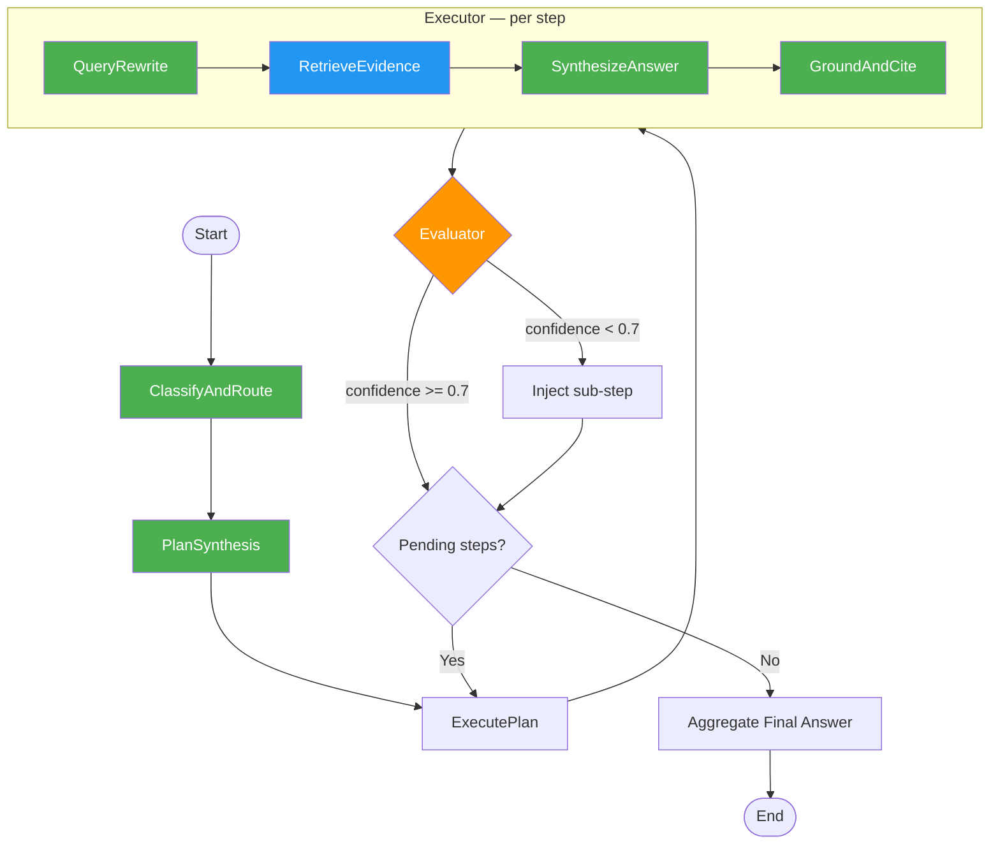

# Architecture

## Current Implementation (5 Skills)



**Legend**: Green = LLM skill (implemented), Blue = retrieval (ChromaDB), Orange = evaluation logic

---

## Full 12-Skill Vision


**Legend**: Green = built, Blue = retrieval, Grey = planned

---

## Skill Descriptions

| # | Skill | Status | Description |
|---|-------|--------|-------------|
| 1 | ClassifyAndRoute | Built | Classifies query as `simple` or `multi_hop` to determine plan complexity |
| 2 | PlanSynthesis | Built | Decomposes objective into a structured JSON plan of retrieval steps |
| 3 | ExecutePlan | Built | Orchestrates per-step execution: rewrite, retrieve, synthesize, cite |
| 4 | QueryRewriteAndDecompose | Built | Optimizes questions into dense legal retrieval queries (MBE/MEE vocab) |
| 5 | RetrieveEvidence | Built | Top-k vector retrieval from ChromaDB (HuggingFace all-MiniLM-L6-v2) |
| 6 | SynthesizeSubtaskAnswer | Built | Synthesizes grounded answers with Rule/Elements/Exceptions structure |
| 7 | GroundAndCite | Built | Audits answers for grounding, adds `[Source N]` citations, flags gaps |
| 8 | VerifyAnswer | Planned | Cross-checks final answer against retrieved evidence for consistency |
| 9 | DetectPromptInjection | Planned | Screens user input for adversarial prompts before processing |
| 10 | MemoryWriteBack | Planned | Persists successful query-answer pairs for future retrieval |
| 11 | ObservabilityAndCostControl | Planned | Tracks token usage, latency, and cost per query |
| 12 | OrchestratePlanExecuteRAG | Planned | Top-level orchestrator managing the full plan-execute-evaluate loop |

## State Schema

```
AgentState:
  global_objective: str          # User's legal research question
  planning_table: List[PlanStep] # Steps with status, execution results, confidence
  contingency_plan: str          # Fallback strategy if retrieval fails
  query_type: str                # "simple" or "multi_hop" (set by classifier)
  final_cited_answer: str        # Aggregated output with citations
```
