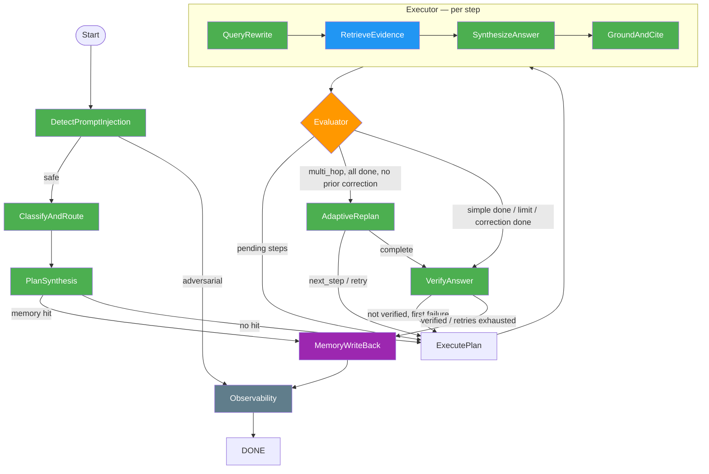

# Architecture

## Current Implementation (10 Skills + 9-Node Graph)



**Legend**: Green = LLM skill, Blue = retrieval (ChromaDB), Orange = evaluation logic, Purple = memory, Grey = observability

**Graph topology**: 9 nodes — `detect_injection → {classifier | observability}` (safe/unsafe); `classifier → planner → {executor | memory_writeback}` (no hit/memory hit); `executor → evaluator → {executor | replanner | verify_answer}`; `replanner → {executor | verify_answer}`; `verify_answer → {executor | memory_writeback}` (1 corrective retry max); `memory_writeback → observability → END`

**Caching**: The LLM client is a singleton (`@lru_cache`), and skill prompt files are cached after first read. When using providers that support prefix caching (DeepSeek, vLLM with `--enable-prefix-caching`, OpenAI), cache-hit metrics are logged automatically per call.

**QA Memory**: Successful query-answer pairs (avg confidence >= 0.7) are persisted to a separate ChromaDB collection (`qa_memory`, cosine distance). On subsequent runs, the planner checks for cached answers before generating a plan, short-circuiting execution on high-similarity matches (>= 0.92). The higher threshold ensures only near-exact question matches are served from cache.

**Verification**: The verify_answer skill produces a `suggested_query` — a proper legal research question — when it finds issues. If verification fails on the first attempt, a corrective step using that query runs through the standard executor pipeline, then routes directly back to verification (skipping the replanner to avoid tangential research). A second failure terminates without adding orphaned steps. Citations use unified `[Source N]` labels across synthesis and grounding skills.

---

## Skill Descriptions

| # | Skill | Status | Description |
|---|-------|--------|-------------|
| 1 | ClassifyAndRoute | Built | Classifies query as `simple` or `multi_hop` to determine plan complexity |
| 2 | PlanSynthesis | Built | Decomposes objective into a structured JSON plan of retrieval steps |
| 3 | ExecutePlan | Built | Orchestrates per-step execution: rewrite, retrieve, synthesize, cite |
| 4 | QueryRewriteAndDecompose | Built | Optimizes questions into dense legal retrieval queries (MBE/MEE vocab) |
| 5 | RetrieveEvidence | Built | Top-k vector retrieval from ChromaDB (HuggingFace all-MiniLM-L6-v2) |
| 6 | SynthesizeSubtaskAnswer | Built | Synthesizes grounded answers with Rule/Elements/Exceptions structure |
| 7 | GroundAndCite | Built | Audits answers for grounding, adds `[Source N]` citations, flags gaps |
| 8 | AdaptiveReplan | Built | Decides next research step based on accumulated evidence (multi_hop only) |
| 9 | RetrieveLegalPassages | Built | `@tool`-decorated wrapper for retrieval, bindable via `llm.bind_tools()` |
| 10 | DetectPromptInjection | Built | Screens user input for adversarial prompts before processing |
| 11 | VerifyAnswer | Built | Cross-checks final answer against retrieved evidence for consistency |
| 12 | MemoryWriteBack | Built | Persists successful query-answer pairs for future retrieval |
| 13 | ObservabilityAndCostControl | Built | Tracks LLM calls, char usage, parse failures, step metrics, answer status per query |

## External Tool Placeholders (external_tools.py)

| Tool | Description |
|------|-------------|
| `web_search` | Placeholder for web search via teammate's Playwright API |
| `web_scrape` | Placeholder for page scraping via Playwright |
| `external_api_call` | Generic placeholder for teammate's API wrapper |

Configured via `EXTERNAL_TOOLS_BASE_URL` and `EXTERNAL_TOOLS_API_KEY` env vars. All decorated with `@tool` for `llm.bind_tools()` integration.

## State Schema

```
AgentState:
  global_objective: str                # User's legal research question
  planning_table: List[PlanStep]       # Steps with status, execution results, confidence
  contingency_plan: str                # Fallback strategy if retrieval fails
  query_type: str                      # "simple" or "multi_hop" (set by classifier)
  final_cited_answer: str              # Aggregated output with citations
  accumulated_context: List[Dict]      # Step summaries for replanner (question, answer, confidence, status)
  iteration_count: int                 # Cycle counter for loop guard (max 6)
  injection_check: Dict[str, Any]      # {"is_safe": bool, "reasoning": str}
  verification_result: Dict[str, Any]  # {"is_verified": bool, "issues": [...], "reasoning": str}
  verification_retries: int            # Counter for verification retry attempts (max 1 corrective step)
  memory_hit: Dict[str, Any]           # {"found": bool, "answer": str, "confidence": float}
  run_metrics: Dict[str, Any]          # Aggregated metrics from observability node
```
