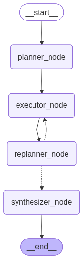

# LegalRagAgent

Agentic Legal RAG system built on LangGraph. Uses a **classify-plan-execute-evaluate** loop to answer legal research questions by retrieving passages from a ChromaDB vector store of bar exam materials.

## Setup

### 1. Clone and install

```bash
git clone https://github.com/1hamzaiqbal/LegalRagAgent.git
cd LegalRagAgent
uv sync
```

Requires Python 3.11-3.13 and [uv](https://docs.astral.sh/uv/). Alternatively: `pip install -r requirements.txt`.

### 2. Configure LLM provider

```bash
cp .env.example .env
# Edit .env — add your API key for at least one provider
```

Default provider: **Google AI Studio** (Gemma 3 27B, 14.4K requests/day free). Get a key at [aistudio.google.com](https://aistudio.google.com/apikey).

Other free-tier options: Groq, OpenRouter, Cerebras. Run `uv run python llm_config.py` to see all providers.

### 3. Download dataset

```bash
uv run python download_data.py
```

Downloads the [reglab/barexam_qa](https://huggingface.co/datasets/reglab/barexam_qa) dataset from HuggingFace (~686K bar exam passages + QA pairs). Saved to `datasets/barexam_qa/` (gitignored).

To check if data is already present: `uv run python download_data.py --check`

### 4. Build vector store

```bash
uv run python load_corpus.py curated        # Fast: ~1.5K passages, ~3 min
uv run python load_corpus.py 20000          # Full eval: 20K passages, ~30 min
uv run python load_corpus.py status         # Check current collection size
```

The first run downloads the embedding model (`gte-large-en-v1.5`, ~1.7 GB). Subsequent runs use the cached model. Set `HF_HUB_OFFLINE=1` after the first download to skip network checks.

GPU note: `sentence-transformers` auto-detects CUDA. For GPU embedding on WSL, ensure PyTorch has CUDA support: `uv pip install torch --index-url https://download.pytorch.org/whl/cu121`.

### 5. Run the agent

```bash
uv run python main.py simple       # "What are the elements of a negligence claim?"
uv run python main.py multi_hop    # Constitutional rights + 4th/5th Amendment scenario
uv run python main.py medium       # Preliminary injunction standard
```

## Architecture

Nine-node LangGraph state machine with adaptive replanning, injection detection, MC answer selection, and QA memory.



- **Injection Check**: Screens for adversarial prompts (skippable via `SKIP_INJECTION_CHECK=1`)
- **Classifier**: Routes queries as `simple` (1 step, 4 LLM calls) or `multi_hop` (adaptive steps, 10-11 calls)
- **Planner**: Checks QA memory cache first (cosine >= 0.92), then generates initial research step. Strips MC answer choices before planning.
- **Executor**: Per step — rewrites query into primary + 2 alternatives, multi-query retrieves from ChromaDB (with cross-step dedup), synthesizes answer with inline `[Query X][Source N]` citations
- **Evaluator**: Checks confidence against threshold (`EVAL_CONFIDENCE_THRESHOLD`, default 0.70). Accumulates step summaries for replanner.
- **Replanner**: (multi_hop only) Adaptively adds research steps based on accumulated evidence. Hard cap: 3 completed steps.
- **MC Select**: For MC questions, applies accumulated research to select answer letter. Non-MC passes through.
- **Memory**: Caches answers (confidence >= 0.70) for future retrieval. Strips MC selection before caching.
- **Observability**: Prints run metrics (LLM calls, confidence, steps, timing).

### Skills (7 prompt files in `skills/`)

| Skill | Purpose |
|-------|---------|
| `classify_and_route.md` | Classify query complexity (simple vs multi_hop) |
| `plan_synthesis.md` | Generate initial research step |
| `query_rewrite.md` | Rewrite into primary + 2 alternative queries (JSON) |
| `synthesize_and_cite.md` | Synthesize answer with inline `[Source N]` citations |
| `adaptive_replan.md` | Decide next research step from accumulated evidence |
| `detect_prompt_injection.md` | Screen for adversarial prompts |
| `verify_answer.md` | Cross-check answer against evidence (retained for future use) |

See [ARCHITECTURE.md](ARCHITECTURE.md) for full node-by-node reference, state schema, and annotated case studies.

## Evaluation

```bash
uv run python eval_comprehensive.py              # Two-phase: retrieval + full pipeline
uv run python eval_comprehensive.py retrieval     # Phase 1 only (no LLM)
uv run python eval_comprehensive.py pipeline 10   # Phase 2, first N queries
uv run python eval_trace.py 3                     # Traced diagnostics, first N queries
uv run python eval_trace.py 3 --save              # Save case studies to case_studies/
```

### Latest Results (Gemma 3 27B, 20K passages)

| Query | MC | Steps | Conf | LLM calls |
|---|---|---|---|---|
| torts | Y | 3c/0f | 0.773 | 11 |
| contracts | Y | 3c/0f | 0.773 | 11 |
| crimlaw | N | 3c/0f | 0.721 | 11 |
| evidence | Y | 3c/0f | 0.790 | 11 |
| constlaw | N | 0c/3f | — | 11 |
| realprop | Y | 3c/0f | 0.775 | 11 |

MC accuracy: 4/6. 100% passage diversity across all steps.

## Project Structure

```
main.py               # LangGraph pipeline (9 nodes, routing, state)
rag_utils.py           # Embeddings, ChromaDB, retrieval, reranker, memory
llm_config.py          # Provider registry (19 providers), LLM singleton
load_corpus.py         # Load passages into ChromaDB
download_data.py       # Download dataset from HuggingFace
skills/                # 7 markdown prompt files (~1700 words total)
eval_comprehensive.py  # Two-phase eval (retrieval + pipeline)
eval_trace.py          # Per-query diagnostics with --save for case studies
eval_reranker.py       # Bi-encoder vs cross-encoder A/B test
case_studies/          # JSON traces from eval_trace.py --save
ARCHITECTURE.md        # Full node reference, case studies, state schema
pipeline_flags.md      # Known issues audit with severity ratings
EXPERIMENT_LOG.md      # History of changes and eval results
```
