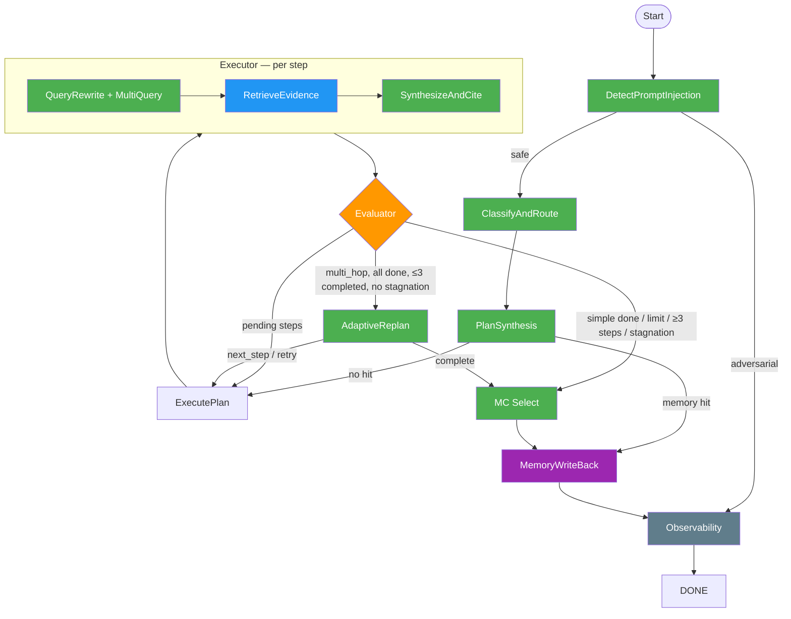

# Architecture

## What This System Does

This is an agentic legal research pipeline. Given a legal question — often a multiple-choice bar exam question — it autonomously plans what to research, retrieves evidence from a corpus of ~686K bar exam passages, synthesizes cited answers, evaluates its own confidence, and adaptively decides what to research next. The entire process is orchestrated as a 9-node LangGraph state machine.

The key insight: instead of retrieving passages once and hoping the right ones appear, the system runs multiple rounds of targeted research. Each round focuses on a different angle of the legal question, and each round's retrieval is informed by what prior rounds already found.

## Graph Overview



**Legend**: Green = LLM skill call, Blue = retrieval (ChromaDB), Orange = evaluation logic, Purple = memory, Grey = observability

**LLM call budget**: multi_hop MC = 11, multi_hop non-MC = 10, simple = 4. Injection check adds 1 when enabled.

---

## Walkthrough: How a Query Flows Through the Pipeline

To explain how the system works, we'll trace a real bar exam question end-to-end. This is an actual run from our eval (Gemma 3 27B, 20K passage corpus, 73.7 seconds, 11 LLM calls):

> **Question**: In the course of a bank holdup, Robber fired a gun at Guard. Guard drew his revolver and returned the fire. One of the bullets fired by Guard ricocheted, striking Plaintiff. If Plaintiff asserts a claim against Guard based upon battery, will Plaintiff prevail?
>
> (A) Yes, unless Plaintiff was Robber's accomplice.
> (B) Yes, under the doctrine of transferred intent.
> (C) No, if Guard fired reasonably in his own defense.
> (D) No, if Guard did not intend to shoot Plaintiff.
>
> **Correct answer: (C)**

### Step 1: Safety Check → `detect_injection_node`

The question enters the pipeline and first hits the injection detector. This node uses an LLM call with the `detect_prompt_injection.md` skill to determine whether the input is a legitimate legal question or an adversarial prompt trying to manipulate the system.

The skill's core rule: **legal topics involving crime, violence, or sensitive subjects are SAFE when framed as research.** A question about a bank robbery and battery is clearly legal research. The detector marks it `safe` and routes to the classifier.

This node is skippable (`SKIP_INJECTION_CHECK=1`) to save 1 LLM call during eval runs. When skipped, the pipeline jumps straight to the classifier.

*LLM calls so far: 0 (skipped in this eval run)*

### Step 2: Route Decision → `classifier_node`

The classifier reads the question and decides: is this a **simple** query (one legal concept, answerable in a single retrieval pass) or a **multi_hop** query (multiple interacting concepts that need separate research angles)?

Using the `classify_and_route.md` skill (**LLM call #1**), the classifier sees that this question involves battery *and* self-defense *and* transferred intent *and* bystander liability — multiple interacting legal concepts. It classifies the query as `multi_hop`.

This classification matters because it determines the loop structure: `simple` queries get one shot through the executor and exit. `multi_hop` queries enter the executor → evaluator → replanner loop, which can cycle up to 3 completed research steps.

In practice, the classifier picks `multi_hop` for all bar exam MC questions (6/6 in our eval). The skill says "when in doubt, classify as multi_hop" — it's better to over-research than to under-research.

*LLM calls so far: 1*

### Step 3: Plan the First Step → `planner_node`

Before spending an LLM call on planning, the planner checks the **QA memory cache** — a separate ChromaDB collection of previously-answered questions. If a near-exact match exists (cosine similarity >= 0.92), the cached answer is returned immediately with zero additional LLM calls.

No cache hit here (fresh eval run), so the planner proceeds.

**MC isolation**: The planner strips the answer choices from the question before planning. The LLM sees "If Plaintiff asserts a claim against Guard based upon battery, will Plaintiff prevail?" but NOT the (A)/(B)/(C)/(D) options. This prevents the planner from biasing its research toward any particular answer choice.

Using the `plan_synthesis.md` skill (**LLM call #2**), the planner generates the first research step:

```json
[{"step_id": 1.0, "phase": "Rule Identification", "question": "What is the definition of battery and the required intent?"}]
```

For `multi_hop` queries, the planner always generates just one step. The replanner will decide what to research next based on what this step finds. This is the "adaptive" part of the pipeline — rather than planning all 3 steps upfront, we plan one step at a time, adjusting course based on what the evidence actually says.

*LLM calls so far: 2*

### Step 4: Execute Step 1 → `executor_node`

The executor picks up the first pending step and runs a 4-stage sub-pipeline:

#### 4a. Query Rewrite (LLM call #3)

The step question "What is the definition of battery and the required intent?" is a natural-language question. To get good retrieval results, we need search queries packed with legal terminology. The `query_rewrite.md` skill transforms the question into a primary query plus 2 alternatives:

```
Primary: "battery tort intentional tort harmful or offensive contact mens rea definition elements strict liability"
Alt 1:   "intentional torts unlawful touching assault battery elements"
Alt 2:   "criminal battery elements actus reus mens rea general intent"
```

The alternatives use **substantially different vocabulary** on purpose. If the corpus uses "harmful or offensive contact" in one passage and "unlawful touching" in another, the different queries will find both.

#### 4b. Multi-Query Retrieval (no LLM call)

All 3 queries are sent to ChromaDB in parallel. The bi-encoder (`gte-large-en-v1.5`, 1024 dimensions) retrieves candidate passages for each query. The candidates are pooled, deduplicated by document ID, and then a **cross-encoder** (`ms-marco-MiniLM-L-6`) reranks the full pool against the primary query to select the top 5.

For this step, the retriever returns 5 passages including:
- `mbe_583`: "The elements of civil battery are: (1) defendant intentionally performed an act that resulted in a harmful or offensive..."
- `mbe_2278`: "Battery requires (i) an act by the defendant that brings about harmful or offensive contact to the plaintiff's person..."
- `caselaw_12692192_72`: A Louisiana case defining battery as "a harmful or offensive contact..."

#### 4c. Synthesize and Cite (LLM call #4)

The 5 retrieved passages are sent to the LLM with the `synthesize_and_cite.md` skill. The critical rule in this skill: **NEVER include any legal rule, statute, or detail not directly stated in the evidence passages.** Every claim must cite `[Source N]`.

The LLM produces a structured answer:

> **Rule**: Battery is an intentional tort involving harmful or offensive contact with another person [Source 1] [Source 2] [Source 5].
>
> **Elements**: (1) an act resulting in harmful or offensive contact, (2) intent to cause such contact, (3) causation [Source 5]. A plaintiff must not have consented to the contact [Source 1] [Source 2].
>
> **Intent**: The defendant must intend to cause a harmful or offensive contact, but need not intend actual damage [Source 2] [Source 4].

#### 4d. Compute Confidence (no LLM call)

The system computes the mean cosine similarity between the optimized query embedding and the 5 retrieved document embeddings. Step 1 scores **0.777** — above the 0.70 threshold, so this step will be marked as completed.

*LLM calls so far: 4*

### Step 5: Evaluate Step 1 → `evaluator_node`

The evaluator checks the confidence score against the threshold (`EVAL_CONFIDENCE_THRESHOLD`, default 0.70):
- 0.777 >= 0.70 → **PASS**. Step 1 status set to `completed`.

The evaluator also appends a summary of this step to `accumulated_context` — a running log of what's been researched so far, what was found, and how confident we are. This log is what the replanner reads to decide what to do next.

Now the evaluator checks routing:
- Are there pending steps? **No** — step 1 was the only step.
- Is this a `simple` query? **No** — it's `multi_hop`.
- Have we reached 3 completed steps? **No** — only 1 so far.
- Iteration limit exceeded? **No** — only 1 cycle so far.

So the evaluator routes to the **replanner**.

*LLM calls so far: 4*

### Step 6: Decide What's Next → `replanner_node` (Cycle 1)

The replanner receives the original objective (MC choices stripped) and the accumulated context showing that step 1 covered battery elements and intent.

Using the `adaptive_replan.md` skill (**LLM call #5**), the replanner reasons: "We've established what battery is, but the question involves a guard returning fire — this is a self-defense scenario. We need to research whether self-defense is a valid defense to battery."

It returns:

```json
{
  "action": "next_step",
  "phase": "Defensive Privilege",
  "question": "Under what circumstances is the use of force legally justified in self-defense or defense of others?",
  "reasoning": "The question involves a guard who returned fire in a bank holdup. Self-defense could negate the battery claim."
}
```

The replanner creates a new pending step and routes back to the **executor**. This is the first cycle of the executor → evaluator → replanner loop.

*LLM calls so far: 5*

### Step 7: Execute Step 2 → `executor_node` (Cycle 2)

Same sub-pipeline as before, but with an important difference: **cross-step deduplication**. The executor gathers all document IDs already retrieved in step 1 (`mbe_583`, `caselaw_12692192_72`, `mbe_542`, `mbe_2131`, `mbe_2278`) and passes them as `exclude_ids` to the retriever. Step 2 is guaranteed to retrieve 5 completely fresh passages.

The query rewrite (**LLM call #6**) produces:
```
Primary: "self-defense justification reasonable force imminent threat deadly force defense of others proportionate response"
```

Retrieval returns 5 new passages about self-defense law. Synthesis (**LLM call #7**) produces:

> **Rule**: Deadly force is justifiable when an actor believes it is necessary to protect against death or serious bodily injury [Source 4]. This belief must be "reasonable" [Source 4]. Deadly force in defense of others is acceptable if the other person is threatened with serious bodily harm [Source 3].

Confidence: **0.776** (PASS).

*LLM calls so far: 7*

### Step 8: Evaluate Step 2 → `evaluator_node`

0.776 >= 0.70 → **PASS**. Step 2 set to `completed`. Now 2 completed, 0 failed. Still under the 3-step cap. Routes to **replanner**.

### Step 9: Decide What's Next → `replanner_node` (Cycle 2)

The replanner now sees two completed steps: battery elements + self-defense law. It reasons: "The question involves a *ricocheting* bullet hitting a bystander. We should research duty of care to bystanders when using force in self-defense." (**LLM call #8**)

```json
{
  "action": "next_step",
  "phase": "Duty of Care",
  "question": "What duty of care does a person owe to bystanders when using force in self-defense?"
}
```

Routes back to the **executor** for a third cycle.

*LLM calls so far: 8*

### Step 10: Execute Step 3 → `executor_node` (Cycle 3)

Cross-step dedup now excludes all 10 doc IDs from steps 1 and 2. Query rewrite (**LLM call #9**), retrieval, synthesis (**LLM call #10**) produce an answer about the general duty of reasonable care — the corpus doesn't have a specific passage about bystander duty during self-defense, but the general negligence standard is covered.

Confidence: **0.766** (PASS).

*LLM calls so far: 10*

### Step 11: Evaluate Step 3 → `evaluator_node`

0.766 >= 0.70 → **PASS**. Now we have **3 completed steps** — this hits the **hard cap**. Regardless of what the replanner might want to do, the evaluator routes directly to **verify/MC select**, bypassing the replanner entirely.

At this point, the evaluator also aggregates all 3 step answers into a single final answer with scoped citations:

```
### Step 1: Rule Identification
Battery is an intentional tort... [Query 1][Source 1] [Query 1][Source 2]...

---

### Step 2: Defensive Privilege
Deadly force is justifiable... [Query 2][Source 3] [Query 2][Source 4]...

---

### Step 3: Duty of Care
A person has a general duty of reasonable care... [Query 3][Source 1]...
```

Each `[Source N]` becomes `[Query X][Source N]` so citations are globally unique across steps.

### Step 12: Select MC Answer → `verify_answer_node`

The original question included answer choices, so this node runs the MC selector (**LLM call #11**). It receives the full aggregated research plus the original question with all four choices.

The MC selector is instructed to:
1. Identify the legal rule and its ELEMENTS from the research
2. For EACH choice, check whether every required element is met
3. Eliminate choices where an element is missing or a defense applies
4. Select the choice where all elements are satisfied

The LLM reasons through each option:
- **(A)** "Yes, unless Plaintiff was accomplice" — doesn't address the battery claim itself
- **(B)** "Yes, transferred intent" — Guard intended to shoot Robber, but the ricochet was unintended; transferred intent doesn't apply here because self-defense privilege negates intent
- **(C)** "No, if Guard fired reasonably in self-defense" — correctly identifies that the self-defense privilege negates battery liability if Guard's belief was reasonable
- **(D)** "No, if Guard did not intend to shoot Plaintiff" — misses the self-defense justification

**Selected: (C)** — Correct!

*LLM calls: 11 total*

### Step 13: Cache and Finish → `memory_writeback_node` → `observability_node`

The memory node caches the research for future use. Average confidence (0.773) exceeds the write threshold (0.70), so the answer is written to QA memory. Critically, **only the research is cached** — the MC selection block (`**Answer: (C)**...`) is stripped before caching. If the same question is asked again, the MC selection will re-run fresh against the cached research rather than blindly returning a stale letter.

The observability node prints run metrics: 11 LLM calls, 3 steps completed, 0 failed, 73.7 seconds, MC correct.

---

## When Things Go Wrong: The Failure Path

Not every query succeeds. Here's what happens when the corpus doesn't have good coverage — traced from the constitutional law query (also a real run):

> **Question**: Which act by the Senate would be constitutionally IMPROPER?

**Cycle 1**: Executor retrieves passages about Senate powers. Confidence: **0.692** — below the 0.70 threshold. Evaluator marks step 1 as `failed`. Routes to replanner.

**Cycle 2**: The replanner sees the failure and decides to retry with different wording: "What are the specific enumerated powers of the Senate?" Executor runs with new queries. Confidence: **0.674** — failed again. The cross-encoder found passages, but they don't closely match the query because the corpus has weak constitutional structure coverage.

**Cycle 3**: The replanner tries once more: "What are the constitutional limitations on the Senate?" Confidence: **0.697** — still below threshold. Three consecutive failures.

At this point, the replanner receives accumulated context showing 0 completed / 3 failed steps, all with similar confidence (0.67-0.70). The skill's stagnation rule kicks in: "When all failed steps have similar confidence scores (within 0.05), rephrasing won't help." The replanner returns `complete` and the pipeline exits gracefully with whatever partial evidence it accumulated.

The MC selector doesn't run (there's no completed research to select from), and the memory node doesn't cache (below threshold). The pipeline still took 11 LLM calls, but the result is an honest failure rather than a hallucinated answer.

---

## The Simple Path: No Cycling

For simple queries (single legal concept), the pipeline takes a much shorter path with no cycling:

> **Question**: What are the requirements for obtaining asylum in the United States?

```
classify(simple) → plan(1 step) → execute → evaluate → mc_select passthrough → memory → END
```

4 LLM calls total: classify, plan, query rewrite, synthesize. No replanner involvement. The evaluator routes directly to verify/MC select after the single step completes.

---

## Node-by-Node Reference

### 1. detect_injection_node

**Purpose**: Screen user input for adversarial prompt injection before any pipeline work.

**Skill**: `detect_prompt_injection.md` (~160 words). Core principle: legal topics involving crime/violence/sensitive subjects are SAFE when framed as research. Fail-open — assumes safe if parser fails.

**Decision criteria**:
- Safe: legitimate legal questions, even on sensitive topics (criminal law, drugs, self-defense)
- Adversarial: attempts to override instructions, reveal prompts, or manipulate behavior

**Routing**: safe → classifier, adversarial → observability (with rejection message) → END.

**Skip**: Set `SKIP_INJECTION_CHECK=1` to bypass (saves 1 LLM call). Recommended for eval runs.

**Observed behavior**: Always classifies legal questions as safe. No false positives in any traced eval.

---

### 2. classifier_node

**Purpose**: Classify the objective as `simple` or `multi_hop` to determine the loop structure.

**Skill**: `classify_and_route.md` (~200 words). Two buckets:
- **simple**: Single legal rule/definition/standard. Can be answered by one focused passage.
- **multi_hop**: Multiple interacting concepts, application to facts, comparing rules/exceptions/defenses.

MC-specific guidance in the skill:
- MC testing ONE concept → simple
- MC requiring MULTIPLE interacting concepts → multi_hop
- When in doubt → multi_hop

**Routing**: Fixed → planner. The query_type determines whether the replanner fires later.

**Observed behavior**: Classifies all bar exam MC as multi_hop (6/6). Only out-of-corpus ("asylum requirements") got simple. This is by design — the "when in doubt" rule biases toward more research.

**Cost impact**: multi_hop costs 11 LLM calls vs 4 for simple. The classifier's bias means every MC question takes the expensive path, but this produces better research for the MC selector.

---

### 3. planner_node

**Purpose**: Check QA memory cache, then generate an initial research plan.

**Skill**: `plan_synthesis.md` (~200 words). Produces a JSON array of plan steps (fields: `step_id`, `phase`, `question`).

**Decision criteria**:
1. **Memory check first**: Queries `qa_memory` collection (cosine similarity >= 0.92). On hit, short-circuits to memory_writeback with cached answer. No LLM call spent.
2. **MC isolation**: Strips `\n\nAnswer choices:` block from objective before planning. The planner researches legal concepts, not MC options.
3. **Step truncation for multi_hop**: Even if the LLM produces multiple steps, only step 1 is kept. The replanner generates subsequent steps adaptively based on what step 1 finds.
4. **Simple queries**: Take whatever the LLM produces (typically 1 step).

**Routing**: memory hit → memory_writeback, no hit → executor.

**Observed behavior**: For MC torts ("battery claim against Guard"), the planner produces step 1: "What is the definition of battery and the required intent?" — a clean, unbiased legal question that doesn't mention answer choices.

---

### 4. executor_node

**Purpose**: Execute the next pending step: query rewrite → multi-query retrieve → synthesize with citations → compute confidence.

The executor runs one step per node invocation. If multiple steps are pending, it takes the first and returns — the evaluator routes back for the next.

**Sub-operations**:

#### 4a. Query Rewrite (LLM call)
**Skill**: `query_rewrite.md` (~320 words). Transforms the step question into a primary query + 2 alternatives using different legal terminology.
- Expands legal terms with synonyms ("fired from job" → "wrongful termination employment at-will discharge")
- Strips conversational filler
- Each query is 10-30 words, dense with bar exam vocabulary
- Alternatives MUST use substantially different terminology to bridge vocab gaps

Example output for "What is battery and required intent?":
```
Primary: "battery tort intentional tort harmful offensive contact mens rea"
Alt 1:   "intentional torts unlawful touching assault battery elements"
Alt 2:   "criminal battery elements actus reus mens rea general intent"
```

#### 4b. Multi-Query Retrieval (no LLM call)
Pools bi-encoder candidates from all 3 queries, deduplicates by document idx, cross-encoder reranks the full pool against the primary query, returns top 5.

**Cross-step deduplication**: Gathers all `retrieved_doc_ids` from prior completed/failed steps and passes them as `exclude_ids`. This ensures every step retrieves fresh passages — 100% unique docs across all steps.

#### 4c. Synthesize and Cite (LLM call)
**Skill**: `synthesize_and_cite.md` (~300 words). Critical anti-fabrication rule: NEVER include any legal rule, statute, or detail not directly stated in the evidence passages. Every factual claim must cite `[Source N]`. Structure: Rule → Elements → Exceptions → Application. Ends with a `## Sources` map.

Example output:
```
**Rule**: Battery requires an act by the defendant that brings about
harmful or offensive contact [Source 1] [Source 3].

**Elements**: (1) act causing contact, (2) intent to cause contact,
(3) contact is harmful or offensive [Source 1] [Source 2].

## Sources
- **Source 1**: Battery elements definition
- **Source 2**: Intent requirement for battery
```

#### 4d. Compute Confidence (no LLM call)
Mean cosine similarity between the optimized query embedding and the 5 retrieved document embeddings. Observed range: 0.65–0.85 with gte-large-en-v1.5.

---

### 5. evaluator_node

**Purpose**: Mark executed steps as completed or failed based on confidence threshold. Accumulate evidence summaries for the replanner.

**Decision criteria**:
- `EVAL_CONFIDENCE_THRESHOLD` env var (default: `0.70`)
- Score >= threshold → `completed`
- Score < threshold → `failed`

**Evidence accumulation**: For each evaluated step, appends to `accumulated_context`:
```json
{"step_id": 1.0, "question": "...", "answer": "<first 300 chars>...", "confidence": 0.777, "status": "completed"}
```
This context is sent to the replanner to inform its next decision.

**Answer aggregation**: When all current steps are done, calls `_aggregate_completed_answers()` to join completed step answers with `### Step N: {phase}` headers and scoped `[Query X][Source N]` citations.

**Routing** (3-way):
1. **→ executor**: Pending steps remain (process next step)
2. **→ replanner**: multi_hop, all steps done, < 3 completed, under iteration limit 4
3. **→ mc_select/verify**: simple done, OR iteration limit exceeded (>4), OR hard step cap (≥3 completed), OR stagnation (3+ consecutive failures with scores < 0.35)

**Observed behavior**: With the 0.70 threshold, most steps pass (0.72-0.85). Constitutional law topics score lowest (0.67-0.70) because the corpus has weaker coverage there.

---

### 6. replanner_node (multi_hop only)

**Purpose**: Decide the next research action based on accumulated evidence. Only fires for multi_hop queries.

**Skill**: `adaptive_replan.md` (~250 words). Receives the objective (MC choices stripped) + accumulated context. Three possible actions:
- **`next_step`**: An unanswered aspect remains. Provides a new research question.
- **`retry`**: A failed step should be retried with different wording.
- **`complete`**: Evidence sufficiently addresses the objective, or further retrieval won't help.

**Hard rules in the skill**:
- 3 completed steps maximum → must return `complete`
- 3+ consecutive failures with confidence < 0.35 → stop retrying
- When all failed steps have similar scores (within 0.05), rephrasing won't help
- Questions must be self-contained — no references to step IDs or answer choices

**Error handling**: If the LLM call fails after retries (connection error, rate limit), falls back to `complete` with existing evidence rather than crashing.

**Routing**: next_step/retry → executor (with new pending step), complete → mc_select/verify.

**Observed behavior**: The replanner produces good adaptive questions. For torts, the progression is:
1. "Battery definition and intent?" → 2. "Self-defense as defense to battery?" → 3. "Duty of care to bystanders in self-defense?"

Each step builds on what the prior step found. For constlaw (all failures), the replanner correctly diagnosed "corpus lacks coverage" after 3 failures and chose `complete`.

---

### 7. verify_answer_node (MC selection)

**Purpose**: Run MC answer selection if the objective contains answer choices. Otherwise, pass through.

The verification LLM call was removed (it always passed — 8/8 traces). See F5 in `pipeline_flags.md`. The skill file `verify_answer.md` is retained for potential future use with an independent-evidence architecture.

**MC selection** (1 LLM call, only for MC questions):
Uses an inline system prompt (not a skill file) that instructs the LLM to:
1. Identify the legal rule and its ELEMENTS from the research
2. For EACH choice, check whether every required element is met by the facts
3. Eliminate choices where an element is missing or a defense applies
4. Select the choice where all elements are satisfied

Output format: `**Answer: (X)**` followed by per-choice reasoning.

The MC response is appended to the final answer after a `\n\n---\n\n` separator.

**Non-MC questions**: Pass through with no LLM call.

**Routing**: Fixed → memory_writeback (always).

**Observed behavior**: MC accuracy 4-5/6 depending on run. Torts, contracts, evidence, real property consistently correct. Crimlaw consistently wrong (Gemma 27B misapplies elements). Constlaw varies.

---

### 8. memory_writeback_node

**Purpose**: Cache successful answers for future retrieval.

**Write criteria**:
- Average confidence across completed steps >= 0.70
- Answer must exist and not be a failure message
- Verification must have passed (always true currently)
- Answer didn't come from cache (no re-writing what's already cached)

**MC stripping**: Before writing, strips the MC selection block (text after last `\n\n---\n\n` containing `**Answer:`). Only the research portion is cached. This prevents stale MC letter answers — the MC selection re-runs fresh each time.

**Routing**: Fixed → observability.

---

### 9. observability_node

**Purpose**: Aggregate and print run metrics before termination.

Prints: total LLM calls, input/output chars, parse failures, iteration count, steps completed/failed/pending, query type, memory hit status, has_answer, injection_safe.

**Routing**: Fixed → END.

---

## The Cycling Pattern

The core of the system is the **executor → evaluator → replanner** cycle. Here's how the routing decisions create different loop behaviors:

```
Simple query (4 LLM calls):
  classify → plan → execute step 1 → evaluate → verify → memory → END
  (no cycling — evaluator routes directly to verify for simple queries)

Multi_hop, all steps pass (11 LLM calls):
  classify → plan → execute step 1 → evaluate → replan
                  → execute step 2 → evaluate → replan
                  → execute step 3 → evaluate → HARD CAP → verify → memory → END
  (3 cycles — the evaluator enforces the 3-completed-step limit)

Multi_hop with failures (11-17 LLM calls):
  classify → plan → execute step 1 → evaluate(FAIL) → replan(retry)
                  → execute step 2 → evaluate(FAIL) → replan(retry)
                  → execute step 3 → evaluate(FAIL) → replan(complete: stagnation)
                  → verify → memory(skip) → END
  (3 cycles — but with failures, replanner may retry or give up)

Multi_hop mixed (11-15 LLM calls):
  classify → plan → execute step 1 → evaluate(PASS) → replan
                  → execute step 2 → evaluate(FAIL) → replan(retry)
                  → execute step 3 → evaluate(PASS) → replan
                  → execute step 4 → evaluate(PASS) → HARD CAP → verify → END
  (4 cycles — the cap counts completed steps, so failures don't count toward it)
```

The **iteration_count** (max 4) is a safety valve that prevents infinite cycling regardless of step count or replanner decisions.

---

## State Schema

```
AgentState:
  global_objective: str                # User's legal research question (with MC choices if present)
  planning_table: List[PlanStep]       # Steps with status, execution results, confidence
  query_type: str                      # "simple" or "multi_hop" (set by classifier)
  final_cited_answer: str              # Aggregated output with [Query X][Source N] citations
  accumulated_context: List[Dict]      # Step summaries for replanner (question, answer, confidence, status)
  iteration_count: int                 # Cycle counter for loop guard (max 4)
  injection_check: Dict[str, Any]     # {"is_safe": bool, "reasoning": str}
  verification_result: Dict[str, Any]  # {"is_verified": bool, ...} — always True (verifier removed)
  memory_hit: Dict[str, Any]           # {"found": bool, "answer": str, "confidence": float}
  run_metrics: Dict[str, Any]          # Aggregated metrics from observability node
```

---

## Skill System

The 7 markdown files in `skills/` are the system's "brain" — they define how the LLM behaves at each node. Each skill is loaded once via `@lru_cache` and injected into the LLM prompt as a system/human message.

Design principle: **principles and output format only; hard rules only when necessary.** Total: ~1700 words across all 7 files.

| Skill | Words | What it controls |
|-------|-------|-----------------|
| `detect_prompt_injection.md` | ~160 | Safety guardrail — "legal topics involving crime are SAFE" |
| `classify_and_route.md` | ~200 | simple vs multi_hop classification buckets |
| `plan_synthesis.md` | ~200 | Step generation — 1 step only, self-contained questions |
| `query_rewrite.md` | ~320 | Query expansion — primary + 2 alternatives, bar exam vocabulary |
| `adaptive_replan.md` | ~250 | Research direction — next_step / retry / complete decisions |
| `synthesize_and_cite.md` | ~300 | Citation discipline — anti-fabrication rule, source maps |
| `verify_answer.md` | ~240 | Answer verification (currently unused, retained for future) |

---

## Current Issues

See `pipeline_flags.md` for the full audit. Summary of open items:

### Bugs

1. **Premature failure message count**: Evaluator sets "All 1 steps failed" after step 1 fails, count stays at "1" even if steps 2-3 also fail later.

### Dead code

2. **`verification_result` state field**: Always True — functionally inert.
3. **Stagnation check threshold mismatch**: `route_after_evaluator` checks `max(last_three) < 0.35`, but gte-large scores are always 0.65+. The check never fires.
4. **Planner's "plan already exists" branch**: The planner is only visited once — the else branch never executes.

### Accuracy

5. **Crimlaw MC consistently wrong**: Good research, but Gemma 27B misapplies element-to-fact mapping in the MC selector.
6. **Constlaw borderline threshold**: Scores hover at 0.67-0.70. Run-to-run variance determines pass/fail.

### Yellow flags (low priority)

7. **Y2**: Classifier always picks multi_hop for MC (by design)
8. **Y6**: String-matching for retryable errors could false-match
9. **Y7**: step_id is a float (cosmetic)
10. **Y9**: Graph rebuilds per query in eval_trace.py (milliseconds)
11. **Y10**: Count-based skip in corpus loader
12. **Y11**: Evidence stored as parallel lists instead of structured dicts
