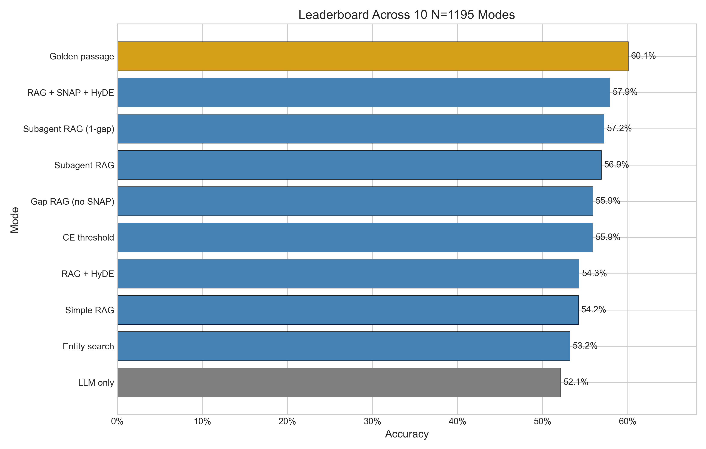
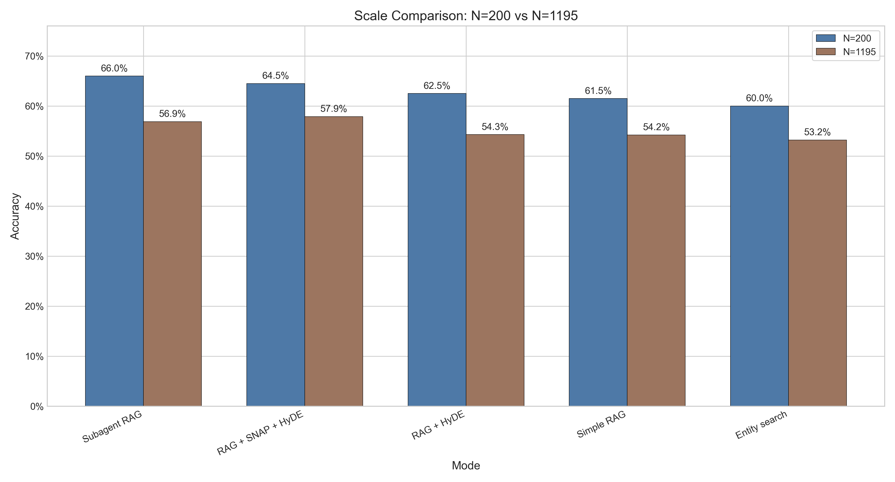
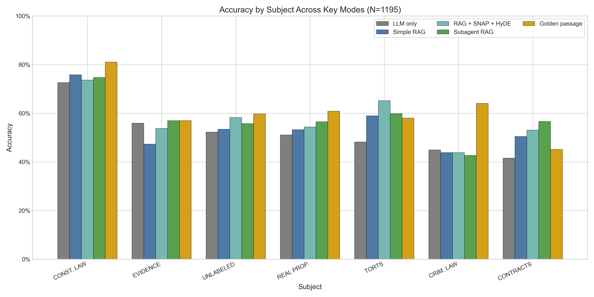
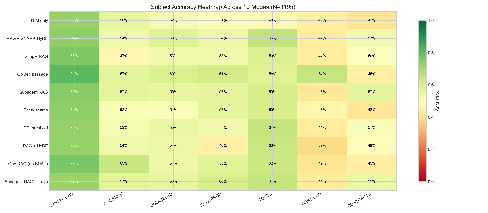
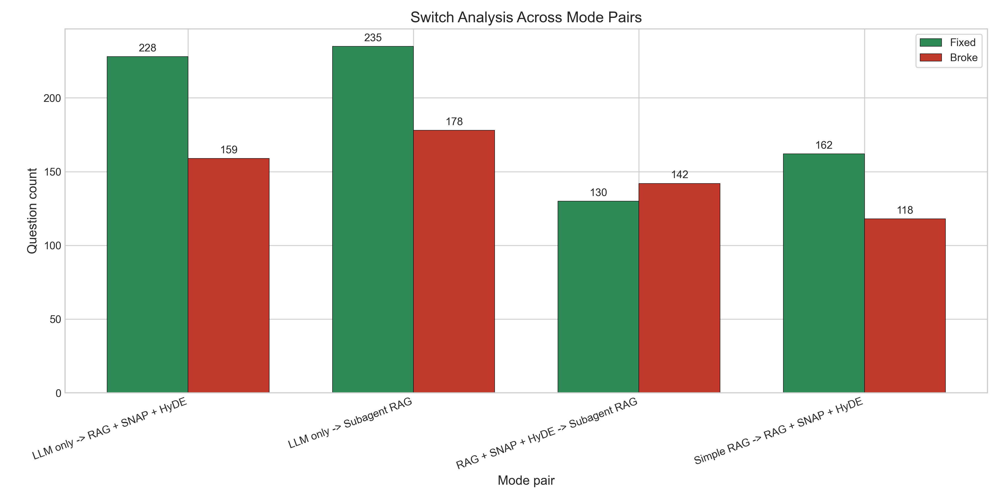
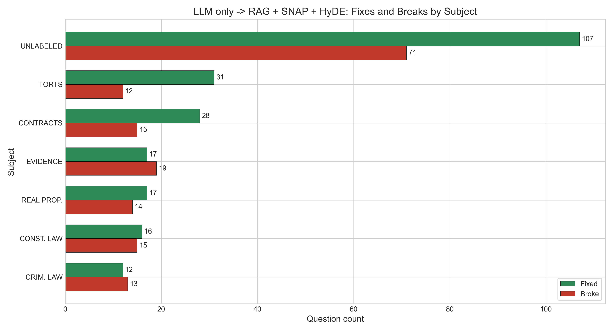

# Meeting Notes — April 17, 2026

Source note: `logs/experiments.jsonl` is the source of truth (189 entries as of 2026-04-17, synced from cluster).

---

## 1. Headline Results (since April 13)

### Breaking: rag_hyde fix validated — 66.0% at N=200

The Gemma HyDE bug (11-char garbage outputs) was caused by a sparse user message after system+user merge. The fix restructured the prompt; the revalidation run completed today:

- **`rag_hyde` (pure HyDE, no snap) = 66.0%** at N=200 — *above* `snap_hyde` (65.5%)
- **`snap_hyde_report` (snap+HyDE+summarize) = 66.0%** at N=200
- The old full N=1195 run (54.3%) was entirely broken — **full rerun submitted as Job 48555**
- **This may change the snap ablation narrative:** HyDE alone could be as good or better than snap+HyDE. Snap might bias the generated passage toward a wrong answer.

### Full N=1195 updates (completed since April 13)
- `ce_threshold`: **55.9%**
- `gap_rag_nosnap`: **55.9%**
- `subagent_rag` (1-gap prompt): **57.2%** (up from **56.9%**)
- `rag_hyde` (broken run): **54.3%** — invalidated by the HyDE bug, full rerun in progress
- `entity_search`: **53.2%**

**Key finding (pending rag_hyde rerun):** at full scale, only `snap_hyde` (**58.6%**) and `subagent_rag` (**57.2%**, 1-gap) clearly beat `llm_only` (**55.5%**). But if the fixed `rag_hyde` replicates its N=200 performance at scale, it could displace `snap_hyde` as the best retrieval method.

Relevant local detail logs:
- `subagent_rag` full (`56.9%`): `logs/eval_subagent_rag_cluster-vllm_20260414_1115_detail.jsonl`
- `subagent_rag` 1-gap full (`57.2%`): `logs/eval_subagent_rag_cluster-vllm_20260416_1720_detail.jsonl`
- `ce_threshold` full (`55.9%`): `logs/eval_ce_threshold_cluster-vllm_20260415_2022_detail.jsonl`
- `gap_rag_nosnap` full (`55.9%`): `logs/eval_gap_rag_nosnap_cluster-vllm_20260416_0544_detail.jsonl`
- `rag_hyde` full (`54.3%`): `logs/eval_rag_hyde_cluster-vllm_20260415_1346_detail.jsonl`
- `entity_search` full (`53.2%`): `logs/eval_entity_search_cluster-vllm_20260415_0454_detail.jsonl`

`snap_hyde` clean full (`58.6%`), `golden_passage` full (`62.2%`), and `llm_only` full (`55.5%`) are present in `experiments.jsonl`, but their local detail logs are not currently in `logs/`.

---

## 2. Full N=1195 Leaderboard

### All Gemma 4 E4B, BarExam, `N=1195` (ranked by accuracy)

| Rank | Mode | Accuracy | Detail Log | Notes |
|---|---|---|---|---|
| 1 | `golden_passage` | **62.2%** | Not in `logs/` | Present in `experiments.jsonl`; oracle upper bound |
| 2 | `snap_hyde` | **58.6%** | Not in `logs/` | Present in `experiments.jsonl`; later rerun logged `57.9%` at `logs/eval_rag_snap_hyde_cluster-vllm_20260413_1102_detail.jsonl` |
| 3 | `subagent_rag` (1-gap) | **57.2%** | `logs/eval_subagent_rag_cluster-vllm_20260416_1720_detail.jsonl` | Best full run |
| 4 | `subagent_rag` | **56.9%** | `logs/eval_subagent_rag_cluster-vllm_20260414_1115_detail.jsonl` | Original full prompt |
| 5 | `ce_threshold` | **55.9%** | `logs/eval_ce_threshold_cluster-vllm_20260415_2022_detail.jsonl` | Cross-encoder thresholding |
| 6 | `gap_rag_nosnap` | **55.9%** | `logs/eval_gap_rag_nosnap_cluster-vllm_20260416_0544_detail.jsonl` | Gap-guided retrieval without snap |
| 7 | `llm_only` | **55.5%** | Not in `logs/` | Present in `experiments.jsonl`; no-retrieval baseline |
| 8 | `rag_hyde` | **54.3%** | `logs/eval_rag_hyde_cluster-vllm_20260415_1346_detail.jsonl` | Fixed from broken 11-char HyDE outputs |
| 9 | `rag_simple` | **54.2%** | `logs/eval_rag_simple_cluster-vllm_20260408_1813_detail.jsonl` | Plain RAG baseline |
| 10 | `entity_search` | **53.2%** | `logs/eval_entity_search_cluster-vllm_20260415_0454_detail.jsonl` | Zero-embedding entity-graph retrieval |

Rows marked `Not in logs/` are still present in `experiments.jsonl`.



Full `vectorless_direct` / `vectorless_hybrid` validations remain canceled; they test extra parametric reasoning steps rather than real corpus search.

---

## 3. Snap Ablation Summary (the paper's core result)

| Retrieval family | No-snap mode | No-snap acc | Snap mode | Snap acc | Snap lift | Source |
|---|---|---|---|---|---|---|
| HyDE retrieval | `rag_hyde` | **62.5%** | `snap_hyde` | **65.5%** | **+3.0pp** | Pre-fix N=200 numbers |
| Plain RAG | `rag_simple` | **57.0%** | `snap_rag` | **62.0%** | **+5.0pp** | |
| Parametric reasoning | `vectorless_nosnap` | **59.5%** | `vectorless_direct` | **64.5%** | **+5.0pp** | |

**UPDATE (late April 17):** The fixed `rag_hyde` revalidation came in at **66.0%** (N=200), *above* `snap_hyde` (65.5%). This suggests the +3pp snap lift for HyDE may actually be **zero or negative** — the earlier 62.5% was from a partially broken prompt. The full N=1195 rerun (Job 48555) will settle this.

If confirmed, the paper narrative shifts: **HyDE is the real driver, snap helps plain RAG and parametric reasoning but is neutral for HyDE.**



---

## 4. Cross-Dataset Results

| Dataset | `llm_only` | `vectorless_direct` | `vectorless_nosnap` | `snap_hyde` | Take-away |
|---|---|---|---|---|---|
| HousingQA (`N=200`) | **50.5%** | 50.0% | 52.5% | 50.0% | Snap / parametric lift disappears off-domain |
| CaseHOLD (`N=200`) | **69.5%** | 68.0% | 67.5% | — | Off-domain controls are flat or negative relative to baseline |

Sources:
- HousingQA: all four runs are present in `experiments.jsonl`; local detail logs are absent.
- CaseHOLD: `vectorless_nosnap` local detail log exists at `logs/eval_vectorless_nosnap_cluster-vllm_20260414_0518_detail.jsonl`; the other runs are present in `experiments.jsonl`.

**Key:** the snap lift currently looks BarExam-specific rather than universal.

### Subject Breakdown





---

## 5. New Combo Modes (Job `48393`)

Job `48393` keeps the retrieval backbone fixed and varies what the final decision-maker is allowed to see.

| Mode | Backbone | What the final decision-maker sees | Calls | Hypothesis |
|---|---|---|---|---|
| `snap_hyde_report` | `snap_hyde` retrieval + one summarization pass | Report only | 4 | Denoise `snap_hyde` without reintroducing anchoring |
| `snap_hyde_report_snap` | Same as above | Report + snap answer | 4 | Test whether snap helps once evidence is compressed into a report |
| `subagent_rag_snap` | Per-gap retrieval + subagent reports | Reports + snap answer | ~5 | Test anchoring when evidence is mediated by reports |
| `subagent_rag_full` | Per-gap retrieval + subagent reports | Reports + snap answer + raw passages | ~5 | Test whether maximum information helps or just adds noise |

The same SLURM block also reruns fixed `rag_hyde` as the control path for the paper-core ablation table.

### Switch Analysis





---

## 6. Method Breakdown Updates

### `snap_hyde`

```
Step 1: SNAP — LLM answers the question cold (1 call)
        → reasoning + tentative answer

Step 2: HyDE — LLM turns the snap reasoning into a fake legal passage (1 call)
        "Write the legal passage that would justify this answer"

Step 3: RETRIEVE — embed the HyDE passage, search the corpus, cross-encoder rerank (0 calls)
        → top real passages from the 686K-passage corpus

Step 4: ANSWER — LLM answers fresh with retrieved passages only (1 call)
        Input: passages + question
        NOT shown: the snap answer

Total: 3 LLM calls. Snap steers retrieval but is hidden from the final call.
```

Sources:
- Paper-ablation `N=200`: present in `experiments.jsonl`; local detail log absent
- Clean full `N=1195`: present in `experiments.jsonl`; local detail log absent

### `subagent_rag`

```
Step 1: SNAP — LLM answers the question cold (1 call)
        → reasoning + tentative answer. Used only for gap analysis.

Step 2: GAP ANALYSIS — LLM identifies 1-2 evidence gaps (1 call)
        "What specific rule or factual uncertainty would change this answer?"

Step 3: PER-GAP SUBAGENT (2 calls per gap)
    3a. Retrieve passages for the gap-specific sub-question
    3b. Subagent reads those passages and writes a focused report

Step 4: MAIN AGENT — final answer from the subagent reports (1 call)
        Input: reports + question
        NOT shown: snap answer, raw passages, answer letters

Total: 5-7 LLM calls. The main agent sees compressed reports, not raw retrieval noise.
```

Sources:
- Best `N=200` run: `logs/eval_subagent_rag_cluster-vllm_20260413_1353_detail.jsonl`
- Original full `N=1195` run (`56.9%`): `logs/eval_subagent_rag_cluster-vllm_20260414_1115_detail.jsonl`
- Improved 1-gap full run (`57.2%`): `logs/eval_subagent_rag_cluster-vllm_20260416_1720_detail.jsonl`

### `snap_hyde_report`

```
Step 1: SNAP — answer the question cold (1 call)

Step 2: HyDE — generate the synthetic legal passage from the snap answer (1 call)

Step 3: RETRIEVE — search the corpus with the HyDE passage and rerank the top 5 (0 calls)

Step 4: REPORT — summarize all retrieved passages into one short legal report (1 call)
        Goal: surface the governing rule directly and discard irrelevant text

Step 5: ANSWER — final answer from the report only (1 call)
        NOT shown: snap answer, raw passages

Total: 4 LLM calls. This isolates whether evidence compression helps `snap_hyde` without reintroducing snap anchoring.
```

Status: job `48393` running. The mode definition is in [eval_harness.py](/Users/hamzaiqbal/grad/LegalRagAgent/eval/eval_harness.py:1084) and [slurm_combo_modes.sh](/Users/hamzaiqbal/grad/LegalRagAgent/scripts/hpc/slurm_combo_modes.sh:16).

### Information-level comparison

| Mode | Gap analysis? | Final sees snap? | Final sees reports? | Final sees raw passages? | Compression before final? | Status |
|---|---|---|---|---|---|---|
| `snap_hyde` | No | No | No | Yes | No | Full result logged (`58.6%` clean) |
| `snap_hyde_report` | No | No | Yes (single report) | No | Yes | Job `48393` running |
| `snap_hyde_report_snap` | No | Yes | Yes (single report) | No | Yes | Job `48393` running |
| `subagent_rag` | Yes | No | Yes (per-gap reports) | No | Yes | Full result logged (`56.9%` / `57.2%` 1-gap) |
| `subagent_rag_snap` | Yes | Yes | Yes (per-gap reports) | No | Yes | Job `48393` running |
| `subagent_rag_full` | Yes | Yes | Yes (per-gap reports) | Yes | Yes | Job `48393` running |

---

## 7. Open Questions

- **Does fixed `rag_hyde` hold at full N=1195?** Job `48555` is the key rerun. If it beats `snap_hyde` (58.6%) at full scale, the snap ablation narrative needs revision.
- **Is the snap lift real for HyDE, or was it a bug artifact?** The old `rag_hyde` 62.5% (N=200) used a partially broken prompt; the fixed version is 66.0%. Need to re-examine whether snap helps HyDE at all.
- **Combo modes:** `snap_hyde_report` matched `rag_hyde` at 66.0% — summarization is a wash so far. Remaining combos (subagent_rag_snap, subagent_rag_full) still running.
- **Cross-dataset coverage is thin:** HousingQA/CaseHOLD results are N=200 on Groq models, not Gemma 4 E4B. Need to replicate on the paper's target model.
- **Related work gap:** Haven't surveyed whether snap-then-retrieve or subagent summarization exists in prior work (Self-RAG, CRAG, Chain-of-Note).
- **PageIndex / tree navigation:** Not implemented. Entity graph (our simpler alternative) underperformed vector RAG at scale. Mention as future work.
- **Paper-writing clock:** `EMNLP 2026` due **May 20** (33 days); `ICML AI4Law Workshop` due **May 22**. Fallback: NAACL 2027 (August).

---

## 8. Action Items Status

| April 13 / paper-sprint item | Status | Update |
|---|---|---|
| Snap vs no-snap core ablation | **Done** | Core table now complete: `rag_hyde` vs `snap_hyde` = `+3pp`, `rag_simple` vs `snap_rag` = `+5pp`, `vectorless_nosnap` vs `vectorless_direct` = `+5pp` |
| Cross-dataset validation | **Done, but thin** | HousingQA and CaseHOLD follow-ups are logged at `N=200`; no broader or full-scale sweep yet |
| Full-scale `N=1195` validation | **Mostly done** | `snap_hyde`, both `subagent_rag` full runs, `ce_threshold`, `gap_rag_nosnap`, `entity_search`, and fixed `rag_hyde` are all present in `experiments.jsonl`; a few early local detail logs are absent |
| Subagent variants | **Partial** | `subagent_hybrid`, `subagent_rag_evidence`, and `subagent_hyde` are done; `subagent_vectorless` and `subagent_panel` remain |
| Corpus-structure / metadata approaches | **Partial** | `entity_search` and `snap_entity_informed` are done; proximity-RAG, topic-filtering, and PageIndex-style structure remain |
| Case-summary / entity-graph infra | **Mixed** | Case-summary build job `44371` is done; entity-graph rebuild job `44520` is still in progress in `docs/action_items.md` |
| Paper narrative / drafting | **In progress** | The core claim is now stable enough to draft around, but the combo-mode block is still pending |

Primary status source: `docs/action_items.md`.

### Follow-Up on April 13 Discussion Items

| April 13 item | Status | What we found |
|---|---|---|
| Test HyDE by itself vs snap_hyde | **Done** | Fixed HyDE bug → `rag_hyde` = **66.0%** (N=200), above `snap_hyde` 65.5%. Full rerun in progress. |
| Snap ablation across all methods | **Done** | +3pp HyDE (may be zero after fix), +5pp RAG, +5pp parametric |
| Cross-dataset eval (housing, casehold) | **Done (Groq only)** | Snap lift is BarExam-specific. Not yet replicated on Gemma. |
| Fix vectorless | **Done** | Relabeled as "parametric reasoning" — it's multi-turn LLM, not corpus search |
| Full N=1195 benchmark | **Done** | 10 modes validated. Only snap_hyde and subagent_rag clearly beat baseline at scale. |
| Combine subagent_rag and snap_hyde | **Done** | `snap_hyde_report` = 66.0% (N=200). Combos don't beat individual components. |
| PageIndex / tree structure | **Not done** | Researched — incompatible with 686K flat corpus. Built entity graph instead (53.2% full, below vector RAG). Future work. |
| Related work survey (is subagent RAG new?) | **Not done** | Gap for the paper. |
| AutoGen | **Not explored** | |

---

## 9. Quick Chart Read

- Constitutional Law is strongest across modes; Contracts and Criminal Law remain weakest.
- `llm_only` → `snap_hyde` helps most in Torts and is slightly negative on Evidence.
- `snap_hyde` → `subagent_rag` is slightly net negative overall despite many individual fixes.
