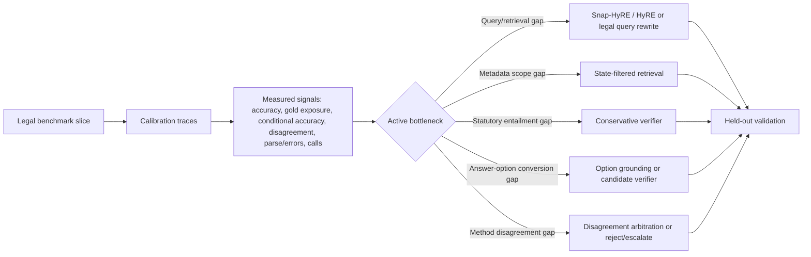

# Meeting Prep - Diagnostic Adaptation Framework - 2026-05-12

Purpose: source-gated status for the May 12, 2026 meeting. This consolidates
the current bottleneck-aware legal RAG direction, the ablation table to present,
and the narrow set of work worth doing before the meeting.

## Persistent Goal

Suggested north star:

> Develop and validate a bottleneck-aware legal RAG controller: use calibration
> traces to identify query/retrieval gaps, statutory-entailment gaps,
> answer-option conversion gaps, and method-disagreement gaps, then route each
> benchmark to the cheapest effective intervention among baseline retrieval,
> query rewrite, Snap-HyRE/HyRE, metadata filtering, option grounding, verifier
> policies, disagreement arbitration, or reject/escalate.

Short version for `/goal`:

```text
/goal Develop and validate a bottleneck-aware diagnostic adaptation framework
for legal RAG: use calibration traces to identify each dataset's active failure
mode, then route to the cheapest effective intervention among baseline RAG,
query rewrite, Snap-HyRE/HyRE, metadata filtering, option grounding, verifier,
disagreement arbitration, or reject/escalate. Keep the evidence legal-only,
source-gated, and meeting-ready by May 12 at 4pm.
```

## Where We Are

The framework is past the "idea only" stage. We have a source-gated
calibration portfolio and a compact held-out validation over four legal
datasets. The current evidence supports this claim:

> Legal RAG does not fail through one universal bottleneck. Snap-HyRE/HyRE helps
> when generated reasoning is aimed at the active bottleneck, but fixed HyRE is
> not enough. A diagnostic controller improves the portfolio by routing among
> retrieval, rewriting, verifier, and disagreement policies.

Do not claim that Snap-HyRE solves legal RAG. Claim that Snap-HyRE is one
route inside a bottleneck-aware controller.

## Framework Diagram



## Legal Benchmarks

| Benchmark | What it tests here | Current diagnostic read |
|---|---|---|
| BarExam | Legal multiple choice with strong model priors and weak literal gold-passage dependence | Query/legal-reasoning formulation matters; retrieval gold-hit is low but answer accuracy can still be high. |
| HousingQA | Jurisdiction-specific statutory yes/no entailment | Conservative verifier/entailment policy is the main win; naive rewrite hurts. |
| CaseHOLD | Holding selection from answer options | Answer-option conversion is separate from retrieval exposure; diverse HyRE and rewrite help, but selectors can collapse. |
| LegalBench-SCALR | Stance/candidate disambiguation with retrievable evidence | Candidate exposure and method disagreement matter; exact route policy needs refinement. |

MuSiQue should stay out of the main meeting table because this meeting direction
is legal-only. It can remain an internal mechanism check for retrieval depth.

## Calibration Ablation Table

Source: `docs/diagnostic_controller_portfolio_comparison_2026-05-10.json`.
Rows are current source-gated calibration evidence, mostly N=200. Query-rewrite
is mixed-N except BarExam; treat it as a control, not the main portfolio result.

| Model & Method | BarExam | HousingQA | CaseHOLD | SCALR | Avg. | Calls |
|---|---:|---:|---:|---:|---:|---:|
| Gemma 4 26B + baseline retrieval | 80.0 | 60.5 | 73.0 | 74.0 | 71.9 | 1.00 |
| + legal query rewrite control | 82.0 | 58.0* | 72.0* | 76.0* | 72.0 | 2.00 |
| + fixed HyRE family | 86.0 | 63.5 | 73.5 | 76.0 | 74.8 | 2.00 |
| + diagnostic controller routes | 86.0 | 74.5 | 73.5 | 77.5 | 77.9 | 1.30 |

`*` means the query-rewrite row is N=50 for that dataset in the calibration
portfolio. BarExam query rewrite is N=200.

Route inheritance:

| Dataset | Baseline | Added/compared route | Controller route |
|---|---|---|---|
| BarExam | `rag_simple` | `rag_rewrite`, `adaptive_snap_hyre_v2` | `adaptive_snap_hyre_v2` |
| HousingQA | `rag_state_filter` | fixed diverse HyRE, query rewrite | `adaptive_snap_hyre_housing_verifier` |
| CaseHOLD | `rag_simple` | query rewrite, diverse HyRE, option selectors | `adaptive_snap_hyre_diverse` plus reject/escalate policy |
| LegalBench-SCALR | `rag_simple` | `rag_snap_hyde_2call`, frontier, disagreement replay | `adaptive_snap_hyre_disagreement_majority_prior` |

## Held-Out Validation

Source: `docs/heldout_controller_eval_2026-05-10.json` and
`docs/heldout_query_rewrite_2026-05-10.json`. Same rows 200-249, N=50 per
dataset.

| Model & Method | BarExam | HousingQA | CaseHOLD | SCALR | Avg. | Calls |
|---|---:|---:|---:|---:|---:|---:|
| Gemma 4 26B + held-out baseline | 76.0 | 62.0 | 68.0 | 80.0 | 71.5 | 1.00 |
| + legal query rewrite | 90.0 | 58.0 | 76.0 | 78.0 | 75.5 | 2.00 |
| + selected diagnostic routes | 76.0 | 76.0 | 78.0 | 80.0 | 77.5 | 1.54 |

Interpretation:

- HousingQA is the cleanest controller win: +14pp over held-out baseline.
- CaseHOLD held-out is encouraging for diverse HyRE: +10pp over baseline and
  +2pp over query rewrite.
- BarExam is route-unstable: held-out query rewrite wins this slice while the
  selected Snap-HyRE route ties baseline. This argues for a rewrite-vs-HyRE
  diagnostic, not broad prompt sweeping.
- SCALR exact selected route ties baseline on the held-out slice, although the
  frontier component reaches 84.0%. The route policy needs refinement before
  claiming held-out SCALR lift.

## Bottleneck Summary

| Dataset | Bottleneck label | Evidence signal | Best current action |
|---|---|---|---|
| BarExam | Query/legal-reasoning formulation | Calibration Snap-HyRE 86.0 vs baseline 80.0; held-out rewrite 90.0 vs selected 76.0 | Add a rewrite-vs-HyRE selector; do not hard-code one route. |
| HousingQA | Statutory entailment / false-positive yes | Verifier 74.5 vs state-filter baseline 60.5; held-out 76.0 vs 62.0 | Keep state-filter retrieval plus conservative verifier. |
| CaseHOLD | Answer-option conversion | Diverse HyRE held-out 78.0 vs baseline 68.0; query rewrite 76.0; direct option table 70.0; replay selector 66.0 negative | Keep diverse HyRE now; direct option-table prompting is a clean negative design point. |
| LegalBench-SCALR | Method disagreement / candidate exposure | Calibration controller 77.5 vs baseline 74.0; held-out frontier 84.0 but exact replay route 80.0 | Refine disagreement arbitration; present as open routing nuance. |

## Live Work

CaseHOLD direct option-table held-out job `67744` completed cleanly on the
cluster. It is the repaired version of the previously blocked option-table
route: it scores the five displayed CaseHOLD holdings directly instead of
issuing brittle candidate-conditioned Chroma queries.

Source: `docs/casehold_option_table_direct_heldout_2026-05-11.md`.

- Job state: completed, exit code `0:0`.
- Slice: CaseHOLD rows 200-249, N=50.
- Mode: `adaptive_snap_hyre_option_table`.
- Provider: OpenRouter Gemma 4 26B.
- Result: 35/50 = 70.0%, 2.00 calls.
- Health: passed `analyze_detail_flags.py` and `audit_adaptive_hyre_logs.py`;
  no Traceback, CUDA assert, cross-encoder index error, parse failure, missing
  prediction, or empty retrieval failure.
- Same-slice comparison: +2pp vs `rag_simple` (68.0%), -6pp vs `rag_rewrite`
  (76.0%), and -8pp vs `adaptive_snap_hyre_diverse` (78.0%).

Meeting read: the implementation blocker is fixed, but the method result is
negative relative to the stronger CaseHOLD routes. This strengthens the
diagnostic claim that answer-option conversion is a distinct bottleneck; simply
showing all five holdings to an option-table selector is not enough.

## Pushback On The Older Notes

The older goal list mentions subagent RAG, GAP RAG, CRAG, and Self-RAG. Those
are reasonable related-work or future-work anchors, but they are not the right
15-hour target. Reimplementing them now would create a large engineering
surface without source-gated legal results.

The meeting-ready table should instead show inheritance across our current
intervention family:

1. baseline retrieval,
2. normal legal query rewrite,
3. fixed Snap-HyRE/HyRE,
4. bottleneck-specific controller routes.

That matches the evidence we actually have and still leaves room to describe
CRAG/Self-RAG as retrieval/verifier policies the controller could subsume later.

## Next 15 Hours

High priority before May 12 at 4pm:

| Window | Task | Output |
|---|---|---|
| T+0-1h | Monitor job `67744`; validate stdout and detail log if complete. | Decide whether option-table becomes a result row or stays a negative/blocked note. |
| T+1-3h | Re-run lightweight source checks on the four result JSONs and docs. | Freeze the two ablation tables above. |
| T+3-6h | Update final report/talk figures around the controller and bottleneck table. | One clean method diagram plus one compact ablation table. |
| T+6-10h | Only run targeted follow-ups if they answer a known routing gap. | BarExam rewrite-vs-HyRE selector or SCALR disagreement refinement; no broad sweeps. |
| T+10-13h | Integrate the final language into report/presentation. | Meeting-ready narrative with caveats in footnotes, not everywhere. |
| T+13-15h | Final verification: git clean, source links, PDF/table render, pushed branch. | Stable handoff state before the meeting. |

## What To Say In The Meeting

One-minute version:

> We moved from "does Snap-HyRE win everywhere?" to a stronger diagnostic claim:
> legal RAG tasks expose different bottlenecks, and generated reasoning helps
> only when aimed at the right one. Across four legal benchmarks, a
> bottleneck-aware controller improves the calibration portfolio from 71.9% to
> 77.9% macro accuracy, while the compact held-out check improves from 71.5% to
> 77.5%. The strongest evidence is HousingQA, where verifier-style statutory
> entailment fixes a false-positive pattern, and CaseHOLD held-out, where
> diverse HyRE beats the baseline by 10pp. The open work is making the route
> policy more automatic, especially for BarExam rewrite-vs-HyRE selection and
> SCALR disagreement arbitration.

Most defensible thesis:

> Snap-HyRE is not the whole method; it is a family of generated-reasoning
> interventions. The research contribution is diagnosing when that reasoning
> should be used for retrieval, rewriting, option grounding, verification, or
> abstention/escalation.
