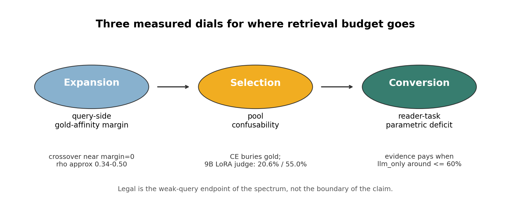

# Generalization pivot memo

Canonical wiki links: [[thesis-v2]], [[direction-2026-07]],
[[icml-ai4law-2026-rejection]], [[weak-vs-strong-query-regime]],
[[geometry-vs-factuality]], [[expert-judgment-replication]],
[[answer-conversion-gap]], [[regime-routing]], [[qpp]], [[query-drift]],
and [[vocabulary-gap]].

This memo is for the July 2 mentor meeting after the SCOPE rejection. It treats
the ICML AI4Law submission as a useful negative control, not as the shape of
the next paper.

## High level

The SCOPE submission claimed a legal query-expansion method that beats HyDE.
That claim is dead as a paper spine. The rejection correctly attacked method
novelty, legal specificity, answer evaluation, ablations, and grounding in
prior IR work [source: [[icml-ai4law-2026-rejection]]].

The new spine is the three-dial account from [[thesis-v2]]:

1. Expansion is governed by query-side gold-affinity margin: generated text
   helps when it moves the query geometrically toward gold evidence without
   drifting away from the task [source: [[thesis-v2]];
   [[affinity-margin-mechanism]]].
2. Selection is governed by pool confusability: once generated retrieval creates
   a mixed pool, the bottleneck is whether a selector can identify the right
   item inside a confusing candidate set [source: [[thesis-v2]];
   [[judge-pilot-v0-results]];
   [[judge-pilot-housing]]].
3. Conversion is governed by reader-task parametric deficit: retrieved evidence
   helps only when the reader lacks enough parametric competence to answer
   unaided [source: [[thesis-v2]];
   [[judge-answer-conversion]];
   [[medqa-fulln-matrix]]].

Legal is therefore not the whole scope. Legal is the extreme weak-query end of
a broader retrieval spectrum: ordinary user questions have low lexical and
geometric affinity to formal authority text, so retrieval budget has to be
explained as a regime-dependent allocation problem rather than sold as a
legal-only trick [source: [[weak-vs-strong-query-regime]];
[[vocabulary-gap]]].

Figure source note: the schematic summarizes BarExam judge Hit@5 `20.6%` on
`399` held-out pools [source: [[judge-pilot-v0-results]];
`scripts/judge_pilot/data/eval_results_9b.json`], Housing trained-judge Hit@5
`55.0%` on `500` pools [source: [[judge-pilot-housing]]],
BarExam reader break-even near `61%` Hit@5 against a `22.8%` pool ceiling
[source: [[judge-answer-conversion]]], and MedQA full-N
llm-only `85.6%` [source: [[medqa-fulln-matrix]]].

## Perspective changes

| Old perspective | New perspective | Reason |
|---|---|---|
| Method paper: SCOPE as a named legal QE method. | Mechanism and measurement paper: generated retrieval is one intervention for measuring where retrieval budget goes. | Method novelty and legal specificity were weak hooks in the rejection [source: [[icml-ai4law-2026-rejection]]]. |
| Legal venue framing. | IR venue framing, with legal as a stress test at the weak-query endpoint. | The July direction explicitly moves from legal method defense toward mechanism and generalization [source: [[direction-2026-07]]]. |
| HyDE comparison as the headline. | Gate measurement as the headline: when does expansion create usable gold affinity, and when does it drift? | BEIR strong-query settings show SCOPE drift robustness over HyDE, but legal answer wins are not a stable HyDE-beating story [source: [[snap-vs-hyde-ledger]]; [[beir-phase1]]]. |
| Cross-encoder as fixed infrastructure. | Selector as a bottleneck. | BarExam trained judge improves over CE from `3.8%` to `20.6%` Hit@5 on the same held-out pools [source: [[judge-pilot-v0-results]]; `scripts/judge_pilot/data/eval_results_9b.json`]. |
| Answer accuracy as downstream afterthought. | Conversion as a modeled dial with break-even behavior. | BarExam 70B llm-only is `77.7%`; gold-present retrieval adds only `+2.4` points while gold-absent evidence hurts by `-3.8` points [source: [[judge-answer-conversion]]]. |
| Legal labels as expensive annotation. | Free outcome labels as selector supervision. | The judge pipeline trains from existing gold/outcome structure, not new human relevance labels [source: `scripts/judge_pilot/build_judge_dataset.py`; `scripts/judge_pilot/train_tinker_judge.py`]. |
| More generated text assumed better. | Generated text is useful only through measurable affinity margin. | The mechanism result reports pooled Spearman about `0.44`, partial `R2` about `0.13`, and geometry proxy AUC `0.91` versus `0.57` for the weak alternative [source: [[affinity-margin-mechanism]]]. |

## Research questions

| RQ | Question | What would answer it | Current evidence status | What remains |
|---|---|---|---|---|
| RQ1 | Can expansion benefit be measured before answer generation? | Define a query-side gold-affinity margin and show that it predicts retrieval gain across generators, datasets, and retrievers. | Supported for the current mechanism result: pooled Spearman about `0.44`, partial `R2` about `0.13`, geometry proxy AUC `0.91`; three-retriever mean Spearman over `7` datasets is `0.342` for gte+CE, `0.354` for BM25, and `0.387` for E5 [source: [[affinity-margin-mechanism]]; [[three-retriever-generality]]]. | Turn the current mechanism analysis into a reviewer-clean measurement section and separate lexical overlap from embedding affinity. |
| RQ2 | Is legal a special domain or the weak-query endpoint of a spectrum? | Place BarExamQA, HousingQA, BEIR, MedQA, multi-hop QA, and historical legal benchmarks on the same query/gold-affinity axis. | Directionally supported. Fresh meeting EDA places BarExamQA at mean local TF-IDF query-gold cosine `0.0516`, below HousingQA `0.0966`, CaseHOLD `0.1503`, and BEIR subset means from `0.1683` to `0.2315` [source: [[05-datasets-eda]]]. | Replace first-pass lexical proxy with final affinity-margin measure where gold passages and embeddings are available. |
| RQ3 | When does generated retrieval drift rather than help? | Compare raw, HyDE, and snap-conditioned expansions under strong-query and weak-query regimes. | Supported for strong-query drift robustness, mixed for legal weak-query claims. Answer-side effects are non-significant in `13` of `16` paired tests; BarExam retrieval is not a stable SCOPE-over-HyDE headline in `3` of `4` model rows; BEIR strong-query SCOPE beats HyDE by `16` to `45` points, with `19` of `20` cells significant [source: [[snap-vs-hyde-ledger]]; [[beir-phase1]]]. | Write this as drift/gating measurement, not as a method leaderboard. |
| RQ4 | Can a small learned selector beat cross-encoder selection using free labels? | Train a compact judge on automatically derived outcome labels and rerank the same pools as CE. | Supported on BarExamQA and HousingQA. BarExam Qwen3.5-9B LoRA rank `32` trained on `3,500` pairs reaches Hit@5 `20.6%` on `399` pools versus CE `3.8%`, SCOPE-alone `12.0%`, zero-shot `15.3%`; Housing rank-`32` judge trained on `5,000` pairs reaches `55.0%` on `500` pools versus CE `38.2%`, SCOPE `41.2%`, zero-shot `52.8%`, ceiling `57.0%` [source: [[judge-pilot-v0-results]]; `scripts/judge_pilot/data/eval_results_9b.json`; `scripts/judge_pilot/data/train_info_9b.json`; [[judge-pilot-housing]]; `scripts/judge_pilot/data/housing_train_info.json`]. | Decide whether selector learning is the core contribution or a validation of the pool-confusability dial. |
| RQ5 | Is selector improvement capacity, instruction following, or learned judgment? | Compare trained 9B, trained 27B, prompted 235B, and zero-shot judges on the same pools, then test label-semantics transfer. | Supported as a capacity probe, mixed as a label-semantics story. BarExam judge pool: 9B zero-shot `15.3%`, trained 9B `20.6%`, 27B zero-shot `14.0%`, trained 27B `18.5%`, prompted 235B `15.3%`; FiQA `250` pools: CE `70.0%`, zero-shot `84.0%`, trained `82.4%`; SciDocs `400` pools: CE `52.0%`, zero-shot `60.5%`, trained `46.5%` [source: [[judge-capacity-dial]]; [[judge-pilot-fiqa]]; [[judge-pilot-scidocs]]]. | State that training helps only when the free label semantics match the intended relevance judgment. |
| RQ6 | When does better evidence convert into better answers? | Measure llm-only and evidence-conditioned accuracy across reader sizes and tasks, then estimate Hit@5 break-even. | Supported for BarExamQA, HousingQA, and MedQA. BarExamQA 70B: llm-only `77.7%`, CE `76.7%`, SCOPE `76.2%`, judge `75.2%`; HousingQA 70B: llm-only `54.2%`, CE `61.8%`, SCOPE `63.2%`, judge `65.6%`; MedQA full-N 70B: llm-only `85.6%`, raw RAG `83.1%`, HyDE `85.2%`, SCOPE `86.1%` [source: [[judge-answer-conversion]]; [[medqa-fulln-matrix]]]. | Present answer accuracy as reader deficit plus evidence quality, not as an appendix to SCOPE. |
| RQ7 | Can per-query routing replace mechanism measurement? | Show a QPP signal that predicts expansion help or harm on individual queries out of sample. | Negative. Best WIG-CE Kendall tau is about `-0.11`; held-out generator tau is `0.090`; held-out dataset tau is `0.052` [source: [[qpp-routing-negative]]]. | Use regime-level routing as a judge-less fallback only. |

## What is novel versus prior work

The novelty is not "we invented query expansion." The novelty is the measurable
allocation account: expansion, selection, and conversion are separate failure
modes, and each can be tested.

QPP prior work measures query difficulty. That is adjacent but not the same as
measuring expansion benefit. The QPP page makes this distinction explicit:
difficulty predictors are not reliable benefit predictors for generated
retrieval in the current experiments [source: [[qpp]];
[[qpp-routing-negative]]].

The 2025 QE survey describes selective expansion and gating as recurring
folklore. It does not give this paper a ready-made gate. Our gate is empirical:
query-side gold-affinity margin plus drift measurement for expansion, and
pool-confusability plus judge reranking for selection
[source: [[qe-survey-2025]];
[[thesis-v2]];
[[affinity-margin-mechanism]]].

The Thinking Machines expert-judgment thesis says small models can replicate
expert judgment when trained on outcome labels. Our departure is to replicate
that thesis for retrieval selection: a small judge learns to choose evidence
from confusing pools using free labels derived from existing gold/outcome
structure, with no new human annotation
[source: [[thinking-machines-expert-judgment]];
[[expert-judgment-replication]];
`scripts/judge_pilot/build_judge_dataset.py`;
`scripts/judge_pilot/train_tinker_judge.py`].

The conversion dial is the least standard piece. RAG papers usually report
answer accuracy after retrieval, but they rarely publish the break-even
relationship between reader-only competence, gold presence, distractor harm,
and required Hit@5. The BarExam result makes that concrete: 70B reader
competence is already high, and the estimated break-even retrieval requirement
is near `61%` Hit@5 against a current pool ceiling of `22.8%`
[source: [[judge-answer-conversion]]].

The claim should stay modest. We are not claiming a universal learned reranker,
a universal QE method, or a legal-specific retrieval law. We are claiming a
measurement framework with early evidence across weak-query, strong-query, and
high-reader-competence settings.

## Concrete departure from the SCOPE submission

Dropped claims:

- Drop "SCOPE beats HyDE" as the headline. The snap-vs-HyDE ledger says the
  answer-side story is mostly non-significant and the legal retrieval comparison
  is not a stable win [source: [[snap-vs-hyde-ledger]]].
- Drop "legal RAG method" as the contribution. The next paper should use legal
  as a weak-query endpoint, not as the only reason the method matters
  [source: [[weak-vs-strong-query-regime]];
  [[direction-2026-07]]].
- Drop cross-encoder as an unquestioned final selector. The judge results show
  CE can be the bottleneck even when the right evidence appears in the pool
  [source: [[judge-pilot-v0-results]];
  [[judge-pilot-housing]]].
- Drop answer accuracy as an incidental appendix. Conversion is one of the
  dials, and it can kill a retrieval win
  [source: [[judge-answer-conversion]]].

Kept results:

- Keep SCOPE as a generated-query intervention and drift-dampening probe. In
  strong-query BEIR settings, the point is not that SCOPE is a new method
  leaderboard; the point is that snap conditioning changes drift behavior
  [source: [[beir-phase1]];
  [[snap-vs-hyde-ledger]]].
- Keep the BarExam weak-query evidence, including the leakage audit. The audit
  reports matched overlap `13.7%` to `15.4%`, unmatched lift `+5.9` to `+6.1`
  points, and strict all-unmatched `10.5%` versus raw `1.5%` with `p=1.1e-20`
  [source: [[leakage-audit-barexam]]].
- Keep HousingQA, but de-emphasize it as a headline benchmark. It is useful for
  a strong-regime and answer-bound contrast, but its gold signal and answer
  format make it less clean as the face of the paper
  [source: [[05-datasets-eda]];
  [[judge-pilot-housing]]].
- Keep MedQA as the high-parametric-competence cautionary case. Full-N 70B
  llm-only is `85.6%`, so retrieval has little room to help
  [source: [[medqa-fulln-matrix]]].

New spine:

1. Measure expansion margin and drift.
2. Measure pool confusability and selector quality.
3. Measure reader deficit and conversion break-even.
4. Put datasets on a spectrum rather than inside a legal-only box.

## Tinker program and free-lane replication

The Tinker program was the fast experiment lane for testing the selector dial.
The main run trained a Qwen3.5-9B LoRA judge with rank `32` on BarExamQA using
`3,500` automatically derived relevance pairs, then evaluated on `399`
held-out candidate pools [source: [[judge-pilot-v0-results]];
`scripts/judge_pilot/data/train_info_9b.json`;
`scripts/judge_pilot/data/eval_results_9b.json`].

The Housing replication trained the same Qwen3.5-9B rank-`32` judge on `5,000`
automatically derived HousingQA pairs and evaluated on `500` state-filtered
held-out pools [source: [[judge-pilot-housing]];
`scripts/judge_pilot/data/housing_train_info.json`;
`scripts/judge_pilot/build_judge_dataset_housing.py`].

The capacity probe compared trained 9B, trained 27B, prompted 235B, and
zero-shot judges. Trained 9B Hit@5 `20.6%` beats prompted 235B Hit@5 `15.3%`,
which supports the expert-judgment-replication framing more than a pure scale
story [source: [[judge-capacity-dial]];
`scripts/judge_pilot/data/train_info_27b.json`].

The FiQA and SciDocs probes test label semantics. FiQA reports zero-shot
`84.0%`, trained `82.4%`, and CE `70.0%` on `250` pools
[source: [[judge-pilot-fiqa]];
`scripts/judge_pilot/data/fiqa_train_info.json`]. SciDocs reports zero-shot
`60.5%`, trained `46.5%`, and CE `52.0%` on `400` pools, showing that
citation-proxy labels can hurt semantic relevance training
[source: [[judge-pilot-scidocs]];
`scripts/judge_pilot/data/scidocs_train_info.json`].

The Tinker spend should be presented as deliberate burn-down of a small
experiment credit envelope, not as a production requirement. The Housing result
page records spend-to-date at roughly `$50` to `$70` against a `$150` Tinker
allocation [source: [[judge-pilot-housing]]].

The EIT replication is the free-lane insurance policy. The local HF PEFT port
mirrors the Tinker judge with LoRA rank `32`, Yes/No logit scoring, and the
same pool format [source: `scripts/judge_pilot/local_judge.py`]. The wiki log
records EIT A100 job `93632` matching the Tinker BarExam reference at Hit@5
`20.6%` with an identical `82` hits out of `399` pools (local MRR `0.135` vs
Tinker `0.138`), while the racing A40
job `93629` was canceled after the A100 run completed [source: [[log]]].

Bottom line: the next paper should not ask readers to believe in SCOPE as a
clever prompt. It should ask them to accept, reject, or refine the three
measured dials that determine when retrieval budget turns into useful answers.
