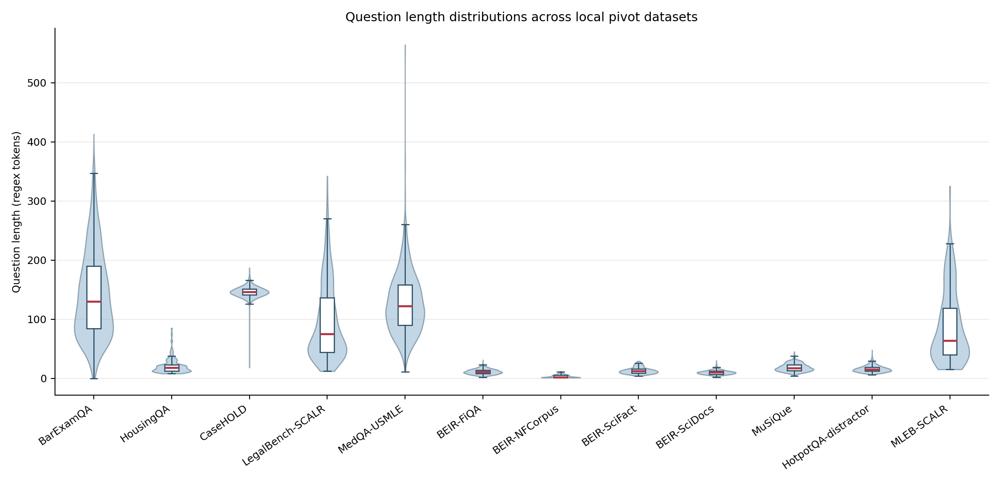
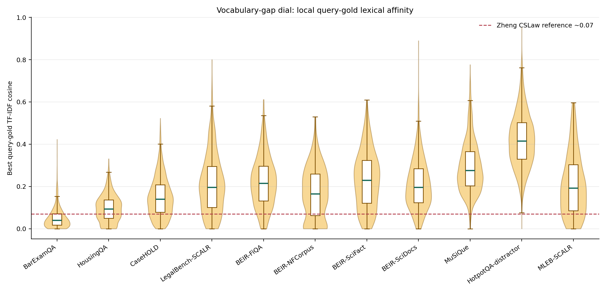
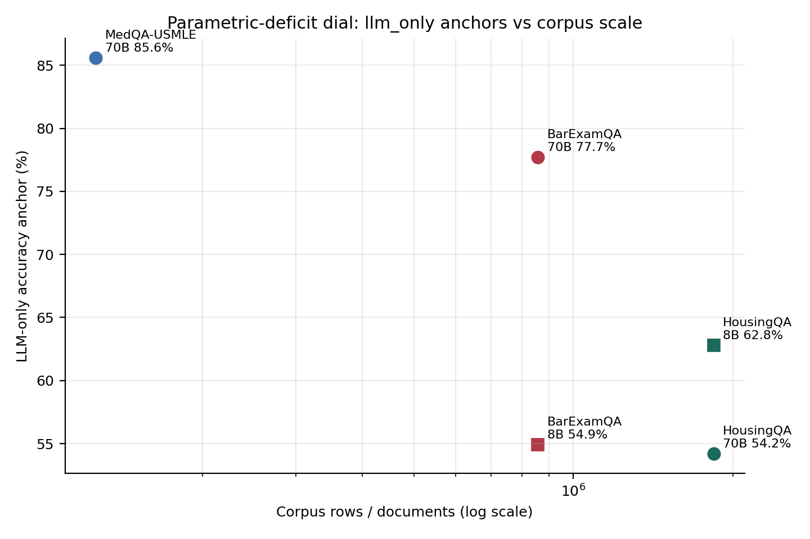

# Datasets and EDA

Canonical wiki links: [[thesis-v2]], [[direction-2026-07]],
[[weak-vs-strong-query-regime]], [[vocabulary-gap]],
[[answer-conversion-gap]], [[geometry-vs-factuality]],
[[judge-answer-conversion]], and [[medqa-fulln-matrix]].

This document is the dataset-facing companion to
[[04-generalization-pivot|generalization pivot memo]] for the July 2 mentor meeting.
Its job is to make the pivot concrete:
which datasets belong in the resubmission story, what each one measures, and
where the first-pass local EDA places them on the weak-query spectrum.

## EDA method

All local figures were generated with matplotlib using the Agg backend and
written only under `wiki/7_2_review_meeting/assets/`.
The requested `uv run python` command was attempted; the Homebrew `uv` binary
panicked in this environment, so the fallback `~/.local/bin/uv run python` was
used with `MPLBACKEND=Agg`, `MPLCONFIGDIR=/private/tmp/legalrag_mpl`, and
`UV_CACHE_DIR=/private/tmp/legalrag_uv_cache`.

Computed statistics use local files under `datasets/` and
`scripts/judge_pilot/data/`.
HousingQA statutes were not loaded in full; the local statute corpus is recorded
as `1,837,403` documents in the signed completion audit, and this EDA samples
the already hydrated `500` judge-test rows instead
[source: `docs/signoff_log.md`;
`docs/snap_hyre_completion_audit_2026-05-12.md`;
`scripts/judge_pilot/data/housing_qa_test500.csv`;
`scripts/judge_pilot/data/housing_needed_texts.jsonl`].

Query-gold overlap is a lightweight vocabulary-gap proxy:
for each query, take the maximum TF-IDF cosine against accessible gold passages
or positive contexts, using local regex tokenization and stopword filtering.
It is not the cross-encoder affinity margin from [[thesis-v2]], and it should
not be overclaimed as the final mechanism metric.

For BarExamQA, the local parser used `datasets/barexam_qa/qa/qa.csv` for
question text and the signed completion audit for the `856,835` passage corpus
count
[source: `datasets/barexam_qa/qa/qa.csv`;
`docs/signoff_log.md`;
`docs/snap_hyre_completion_audit_2026-05-12.md`].
For BEIR, the on-disk subsets are FiQA, NFCorpus, SciFact, and SciDocs under
`datasets/beir/`.

## Figures

Figure source note:
question lengths were recomputed from the local dataset files listed in the
dataset table below.

Figure source note:
the dashed BarExam reference line marks the previously recorded Zheng CSLaw
weak-query overlap around `0.07`
[source: `wiki/concepts/vocabulary-gap.md`].
The local BarExamQA TF-IDF overlap mean is `0.0516`
[source: `datasets/barexam_qa/qa/qa.csv`;
`docs/snap_hyre_completion_audit_2026-05-12.md`].
Metric caveat: the figure plots token *Jaccard* while the roster tables report
TF-IDF *cosine*; the two order extremely short keyword-query datasets
differently (BEIR-NFCorpus queries average `3.4` tokens, so they score
near-zero on Jaccard but `0.1683` on TF-IDF cosine). Legal sits at the weak
end under both metrics; NFCorpus's figure position is a query-length artifact,
not evidence that it is weaker-query than legal.

Figure source note:
llm-only anchors are taken from the conversion result pages:
BarExamQA 70B `77.7%`, HousingQA 70B `54.2%`, MedQA 70B `85.6%`,
BarExamQA 8B `54.9%`, and HousingQA 8B `62.8%`
[source: `wiki/results/judge-answer-conversion.md`;
`wiki/results/medqa-fulln-matrix.md`].

## Headline roster

| Dataset | Role | QA format | N questions | Corpus size | Gold-label nature | Local EDA | Conversion anchors | Sources |
|---|---:|---|---:|---:|---|---|---|---|
| BarExamQA | Headline weak-query endpoint. | Bar-style multiple choice legal QA with long fact patterns and gold legal passages. | `1,195` | `856,835` passages | Human legal-answer labels plus curated gold passages; leakage audit keeps unmatched claims separate. | Question length mean `142.3`, median `130`, p25 `84`, p75 `190`; TF-IDF query-gold cosine mean `0.0516`, median `0.0395`, p25 `0.0172`, p75 `0.0715`. | 70B llm-only `77.7%`; 8B llm-only `54.9%`. | `datasets/barexam_qa/qa/qa.csv`; `docs/signoff_log.md`; `docs/snap_hyre_completion_audit_2026-05-12.md`; `wiki/results/leakage-audit-barexam.md`; `wiki/results/judge-answer-conversion.md`. |
| HousingQA | Supporting contrast, deliberately de-emphasized as a headline. | Housing-law yes/no or state-specific answer-bound QA. | `6,853` | `1,837,403` statutes/passages | Noisy gold and answer-bound Y/N labels; useful for selector/conversion contrast but not the clean face of the paper. | Question length mean `21.0`, median `18`, p25 `12`, p75 `23`; hydrated judge-test overlap mean `0.0966`, median `0.0936`, p25 `0.0495`, p75 `0.1371` on `500` rows. | 70B llm-only `54.2%`; 8B llm-only `62.8%`. | `datasets/housing_qa/questions.csv`; `docs/signoff_log.md`; `docs/snap_hyre_completion_audit_2026-05-12.md`; `scripts/judge_pilot/data/housing_qa_test500.csv`; `scripts/judge_pilot/data/housing_needed_texts.jsonl`; `wiki/results/judge-answer-conversion.md`; `wiki/results/judge-pilot-housing.md`. |
| MedQA-USMLE | Headline conversion caution. | Medical multiple-choice QA. | `1,273` | `125,847` textbook rows | Human QA answer labels; no local gold passage IDs in this EDA, so no query-gold overlap computed. | Question length mean `127.6`, median `122`, p25 `90`, p75 `158`; overlap not computed locally. | 70B llm-only `85.6%`. | `datasets/medqa_usmle/questions.csv`; `datasets/medqa_usmle/textbooks.csv`; `wiki/results/medqa-fulln-matrix.md`. |
| BEIR-FiQA | Supporting strong-query/selector probe. | Financial QA retrieval queries. | `648` | `57,638` docs | BEIR qrels; semantic relevance labels are comparatively friendly to zero-shot judges. | Question length mean `11.2`, median `11`, p25 `8`, p75 `14`; overlap mean `0.2225`, median `0.2146`, p25 `0.1321`, p75 `0.2962`. | Not measured in the current answer-conversion matrix. | `datasets/beir/fiqa/questions.csv`; `datasets/beir/fiqa/corpus.csv`; `datasets/beir/fiqa/qrels_test.csv`; `wiki/results/judge-pilot-fiqa.md`. |
| BEIR-SciDocs | Supporting label-semantics warning. | Scientific-paper retrieval. | `1,000` | `25,657` docs | Citation/co-view proxy labels; important because proxy labels hurt trained semantic judging. | Question length mean `10.0`, median `10`, p25 `7`, p75 `12`; overlap mean `0.2103`, median `0.1963`, p25 `0.1239`, p75 `0.2841`. | Not measured in the current answer-conversion matrix. | `datasets/beir/scidocs/questions.csv`; `datasets/beir/scidocs/corpus.csv`; `datasets/beir/scidocs/qrels_test.csv`; `wiki/results/judge-pilot-scidocs.md`. |

## Historical and supporting roster

| Dataset | Role | QA format | N questions | Corpus size | Gold-label nature | Local EDA | Conversion anchors | Sources |
|---|---:|---|---:|---:|---|---|---|---|
| CaseHOLD | Historical legal baseline. | Legal holding multiple-choice / option selection. | `3,600` test questions | `51,296` holdings | Human case-holding labels; useful historical legal baseline but superseded for the active exact-scored main matrix. | Question length mean `145.7`, median `146`, p25 `141`, p75 `151`; overlap mean `0.1503`, median `0.1396`, p25 `0.0778`, p75 `0.2074`. | Not measured in the current conversion matrix. | `datasets/casehold/test.csv`; `datasets/casehold/holdings_corpus.csv`; `docs/signoff_log.md`; `CLAUDE.md`. |
| LegalBench-SCALR | Historical legal benchmark. | LegalBench-style statutory/case-law reasoning. | `571` qrel-aligned test questions | `1,733` corpus rows | Human benchmark labels, but historical/superseded for the active exact-scored matrix unless re-added under the current contract. | Question length mean `96.3`, median `75`, p25 `44`, p75 `136`; overlap mean `0.2107`, median `0.1960`, p25 `0.1012`, p75 `0.2947`. | Not measured in the current conversion matrix. | `datasets/legalbench_scalr/test.csv`; `datasets/legalbench_scalr/holdings_corpus.csv`; `docs/signoff_log.md`; `CLAUDE.md`. |
| BEIR-NFCorpus | Supporting strong-query retrieval. | Biomedical/nutrition retrieval queries. | `323` | `3,633` docs | BEIR qrels. | Question length mean `3.4`, median `2`, p25 `1`, p75 `5`; overlap mean `0.1683`, median `0.1656`, p25 `0.0623`, p75 `0.2586`. | Not measured in the current conversion matrix. | `datasets/beir/nfcorpus/questions.csv`; `datasets/beir/nfcorpus/corpus.csv`; `datasets/beir/nfcorpus/qrels_test.csv`; `wiki/results/beir-phase1.md`. |
| BEIR-SciFact | Supporting strong-query retrieval. | Scientific claim verification retrieval. | `300` | `5,183` docs | BEIR qrels over scientific abstracts. | Question length mean `13.1`, median `12`, p25 `9`, p75 `16`; overlap mean `0.2315`, median `0.2300`, p25 `0.1215`, p75 `0.3234`. | Not measured in the current conversion matrix. | `datasets/beir/scifact/questions.csv`; `datasets/beir/scifact/corpus.csv`; `datasets/beir/scifact/qrels_test.csv`; `wiki/results/beir-phase1.md`. |
| MuSiQue | Supporting multi-hop QA. | Multi-hop open-domain QA with supporting paragraphs. | `2,417` | `48,315` passages | Human answer/support labels through local positive contexts. | Question length mean `18.4`, median `17`, p25 `13`, p75 `23`; overlap mean `0.2934`, median `0.2756`, p25 `0.2031`, p75 `0.3656`. | Not measured in the current conversion matrix. | `datasets/musique/questions.csv`; `datasets/musique/passages.csv`. |
| HotpotQA-distractor | Supporting multi-hop strong-evidence contrast. | Multi-hop distractor QA with supporting facts. | `7,405` | `73,700` passages | Human supporting-fact labels in a distractor setting. | Question length mean `16.0`, median `15`, p25 `12`, p75 `19`; overlap mean `0.4209`, median `0.4153`, p25 `0.3292`, p75 `0.5024`. | Not measured in the current conversion matrix. | `datasets/hotpotqa_distractor/questions.csv`; `datasets/hotpotqa_distractor/passages.csv`. |
| MLEB-SCALR | Supporting / possible future legal generalization. | Legal reasoning retrieval/QA variant. | `120` qrels-covered queries out of `185` local queries | `523` corpus rows | Local qrels; legal but smaller and less central than BarExamQA. | Question length mean `88.3`, median `64`, p25 `40`, p75 `118.8`; overlap mean `0.2049`, median `0.1929`, p25 `0.0853`, p75 `0.3037`. | Not measured in the current conversion matrix. | `datasets/mleb_scalr/queries.csv`; `datasets/mleb_scalr/corpus.csv`; `datasets/mleb_scalr/qrels.csv`. |

## Dataset-by-dataset notes

### BarExamQA

BarExamQA is the cleanest weak-query endpoint.
The question text is long and fact-pattern-heavy, while the gold evidence is
formal legal authority; the local TF-IDF overlap mean `0.0516` is below the
Zheng CSLaw weak-query reference around `0.07`
[source: `datasets/barexam_qa/qa/qa.csv`;
`wiki/concepts/vocabulary-gap.md`;
`docs/snap_hyre_completion_audit_2026-05-12.md`].

This dataset measures all three dials:
expansion margin through the affinity mechanism result,
pool confusability through the judge pilot,
and conversion through the reader-size matrix
[source: `wiki/results/affinity-margin-mechanism.md`;
`wiki/results/judge-pilot-v0-results.md`;
`wiki/results/judge-answer-conversion.md`].

The caution is that 70B already answers many questions from parametric memory:
llm-only is `77.7%`, so retrieval must be much better than the current pool
to help answer accuracy reliably
[source: `wiki/results/judge-answer-conversion.md`].

### HousingQA

HousingQA is useful but should be deliberately de-emphasized.
It creates a strong selector/conversion contrast, but its gold signal is noisy,
state filtering matters, and the answer format is often bounded by yes/no
structure rather than open-ended evidence use
[source: `wiki/results/judge-pilot-housing.md`;
`scripts/judge_pilot/build_judge_dataset_housing.py`].

Its local question length mean is `21.0`, far shorter than BarExamQA mean
`142.3`, and its hydrated judge-test TF-IDF overlap mean is `0.0966`
[source: `datasets/housing_qa/questions.csv`;
`scripts/judge_pilot/data/housing_qa_test500.csv`;
`scripts/judge_pilot/data/housing_needed_texts.jsonl`;
`datasets/barexam_qa/qa/qa.csv`].

HousingQA is still valuable for the selection dial:
the trained judge reaches `55.0%` Hit@5 against a `57.0%` ceiling on `500`
pools
[source: `wiki/results/judge-pilot-housing.md`].
It is also valuable for conversion:
70B llm-only `54.2%` rises to judge-evidence `65.6%`
[source: `wiki/results/judge-answer-conversion.md`].

### MedQA-USMLE

MedQA is not a legal dataset, and that is why it matters.
It is the high-parametric-competence counterexample: the reader already knows
much of the task, so retrieval can fail to convert even when the corpus is
large and domain text is available.

The full-N run uses `1,273` questions and reports 70B llm-only `85.6%`,
raw RAG `83.1%`, HyDE `85.2%`, and SCOPE `86.1%`
[source: `wiki/results/medqa-fulln-matrix.md`;
`datasets/medqa_usmle/questions.csv`].

The local EDA could not compute query-gold passage overlap because the local
dataset files used here do not expose reliable gold passage IDs
[source: `datasets/medqa_usmle/questions.csv`;
`datasets/medqa_usmle/textbooks.csv`].

### BEIR subsets

The BEIR subsets are the strong-query side of the roster.
They are not legal and should not be hidden; they are how the paper avoids
looking like a legal-only repair job after the rejection.

The on-disk BEIR subsets are FiQA, NFCorpus, SciFact, and SciDocs
[source: `datasets/beir/fiqa/`;
`datasets/beir/nfcorpus/`;
`datasets/beir/scifact/`;
`datasets/beir/scidocs/`].
The current BEIR phase result reports full-N results over `5` datasets, so the
meeting roster should separate the on-disk local EDA subset from the previously
run signed result matrix
[source: `wiki/results/beir-phase1.md`].

FiQA and SciDocs are especially important for the judge story.
FiQA shows that zero-shot semantic judging can already be strong:
zero-shot `84.0%`, trained `82.4%`, CE `70.0%` on `250` pools
[source: `wiki/results/judge-pilot-fiqa.md`].
SciDocs shows the proxy-label hazard:
zero-shot `60.5%`, trained `46.5%`, CE `52.0%` on `400` pools
[source: `wiki/results/judge-pilot-scidocs.md`].

### CaseHOLD, LegalBench-SCALR, and MLEB-SCALR

These are historical or supporting legal datasets, not the new headline.
The repo instructions say CaseHOLD and LegalBench-SCALR are historical or
superseded for the active exact-scored main matrix unless explicitly re-added
under the current fixed-method contract
[source: `CLAUDE.md`].

They still help with the EDA picture:
CaseHOLD has mean query-gold overlap `0.1503`,
LegalBench-SCALR has mean `0.2107`,
and MLEB-SCALR has mean `0.2049`
[source: `datasets/casehold/test.csv`;
`datasets/casehold/holdings_corpus.csv`;
`datasets/legalbench_scalr/test.csv`;
`datasets/legalbench_scalr/holdings_corpus.csv`;
`datasets/mleb_scalr/queries.csv`;
`datasets/mleb_scalr/qrels.csv`].

Their role is to show that "legal" is not a single retrieval regime:
BarExamQA is much weaker lexically than these historical legal baselines in
the local EDA.

### MuSiQue and HotpotQA-distractor

MuSiQue and HotpotQA-distractor give the pivot a multi-hop QA contrast.
They have short questions and accessible positive contexts, but their local
query-gold overlaps are high relative to BarExamQA:
MuSiQue mean `0.2934` and HotpotQA-distractor mean `0.4209`
[source: `datasets/musique/questions.csv`;
`datasets/musique/passages.csv`;
`datasets/hotpotqa_distractor/questions.csv`;
`datasets/hotpotqa_distractor/passages.csv`].

They should be used as supporting evidence for the spectrum, not as the first
page of the resubmission.
Their value is to show what the weak-query end is not.

## Dial coverage table

| Dataset | Expansion / vocabulary-gap dial | Selection / pool-confusability dial | Conversion / reader-deficit dial | Resubmission role |
|---|---|---|---|---|
| BarExamQA | Primary: lowest local overlap mean `0.0516` and signed affinity-margin evidence. | Primary: trained judge Hit@5 `20.6%` versus CE `3.8%` on `399` pools. | Primary: 70B llm-only `77.7%`; break-even near `61%` Hit@5. | Headline weak-query endpoint. |
| HousingQA | Secondary: overlap mean `0.0966` on hydrated `500` judge-test rows. | Primary contrast: trained judge `55.0%` versus CE `38.2%`, ceiling `57.0%`. | Primary contrast: 70B llm-only `54.2%` to judge evidence `65.6%`. | Supporting, de-emphasized. |
| MedQA-USMLE | Not measured locally because gold passage IDs are unavailable in this EDA. | Not in current judge pool program. | Primary caution: 70B llm-only `85.6%` and SCOPE `86.1%`. | Headline conversion caution. |
| BEIR-FiQA | Strong-query contrast: overlap mean `0.2225`. | Label-semantics probe: zero-shot `84.0%`, trained `82.4%`, CE `70.0%`. | Not in conversion matrix. | Supporting strong-query / selector sanity. |
| BEIR-SciDocs | Strong-query/proxy-label contrast: overlap mean `0.2103`. | Proxy-label warning: trained `46.5%` below zero-shot `60.5%`. | Not in conversion matrix. | Supporting label-semantics warning. |
| BEIR-NFCorpus | Strong-query contrast: overlap mean `0.1683`. | Not in current judge pool program. | Not in conversion matrix. | Supporting IR generalization. |
| BEIR-SciFact | Strong-query contrast: overlap mean `0.2315`. | Not in current judge pool program. | Not in conversion matrix. | Supporting IR generalization. |
| CaseHOLD | Historical legal contrast: overlap mean `0.1503`. | Not in current judge pool program. | Not in conversion matrix. | Historical, not headline. |
| LegalBench-SCALR | Historical legal contrast: overlap mean `0.2107`. | Not in current judge pool program. | Not in conversion matrix. | Historical, not headline. |
| MLEB-SCALR | Small legal contrast: overlap mean `0.2049` over `120` qrels-covered queries. | Not in current judge pool program. | Not in conversion matrix. | Supporting / possible future. |
| MuSiQue | Multi-hop contrast: overlap mean `0.2934`. | Not in current judge pool program. | Not in conversion matrix. | Supporting spectrum endpoint. |
| HotpotQA-distractor | Multi-hop high-overlap contrast: overlap mean `0.4209`. | Not in current judge pool program. | Not in conversion matrix. | Supporting spectrum endpoint. |

Dial table sources:
`datasets/barexam_qa/qa/qa.csv`;
`datasets/housing_qa/questions.csv`;
`scripts/judge_pilot/data/housing_qa_test500.csv`;
`scripts/judge_pilot/data/housing_needed_texts.jsonl`;
`datasets/medqa_usmle/questions.csv`;
`datasets/beir/fiqa/`;
`datasets/beir/nfcorpus/`;
`datasets/beir/scifact/`;
`datasets/beir/scidocs/`;
`datasets/casehold/`;
`datasets/legalbench_scalr/`;
`datasets/mleb_scalr/`;
`datasets/musique/`;
`datasets/hotpotqa_distractor/`;
`wiki/results/judge-answer-conversion.md`;
`wiki/results/medqa-fulln-matrix.md`;
`wiki/results/judge-pilot-v0-results.md`;
`wiki/results/judge-pilot-housing.md`;
`wiki/results/judge-pilot-fiqa.md`;
`wiki/results/judge-pilot-scidocs.md`.

## Takeaway for the mentor meeting

The dataset story should be a spectrum, not a list.

BarExamQA sits at the weak-query legal endpoint and is the best dataset for the
expansion and selection argument.
HousingQA is useful for selector and conversion contrasts, but should be
de-emphasized because the gold and answer format are messy.
MedQA is the conversion warning: retrieval cannot rescue a task where the
reader already has high parametric competence.
BEIR, MuSiQue, and HotpotQA-distractor keep the paper honest by showing where
the same dials behave differently outside legal RAG.
CaseHOLD, LegalBench-SCALR, and MLEB-SCALR should be historical or supporting
unless the resubmission explicitly reopens the exact-scored legal matrix.
