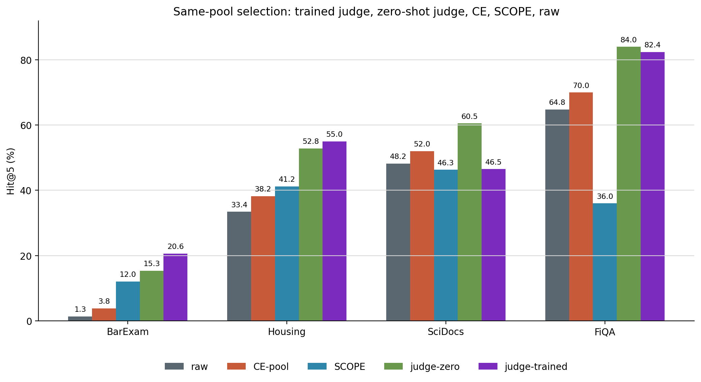
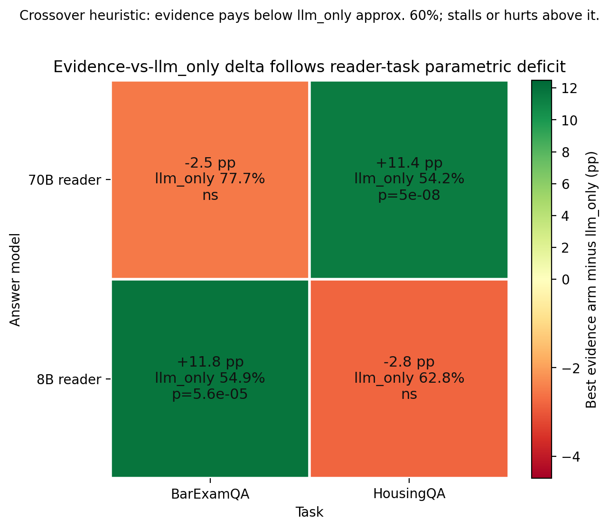
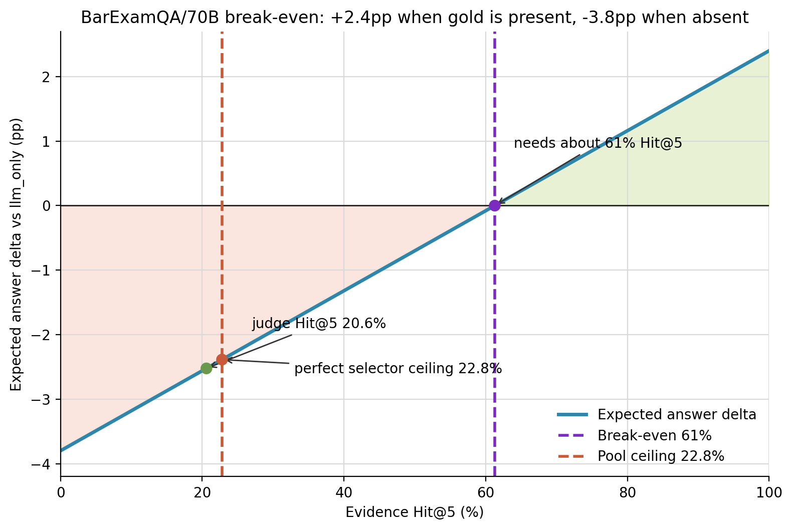

# Results and open questions

Audience: July 2 discussion between the repo owner and PhD-student mentor after
the SCOPE rejection. This consolidates the current result pages; canonical pages
still win if this transient meeting doc drifts.

## One-page executive summary

1. **The leakage objection is rejected in the regimes tested.**
   On BarExamQA, the weak-query lift survives on unmatched generations:
   all-unmatched questions are 10.5% Hit@5 vs 1.5% raw, McNemar 88/5,
   p=1.1e-20; matched rows amplify the lift but do not explain it. The same
   audit pattern extends to BEIR, where matched rates are 0-7% and help_m=0 in
   all six cells, and Housing, where unmatched behavior is neutral at +0.8 to
   +1.0pp over a 35.3% raw base. Source: [[leakage-audit-barexam]].

2. **A zero-shot 9B LLM judge beats the ms-marco cross-encoder in every
   domain tried.** On identical pools, zero-shot judge minus CE is +11.5pp on
   BarExamQA, +14.6pp on HousingQA, +8.5pp on SciDocs, and +14.0pp on FiQA,
   all p<=3e-05 where tested. The simple conclusion is not "SCOPE wins"; it is
   that the standard general-domain CE is the weakest part of the pooled RAG
   stack. Sources: [[judge-pilot-v0-results]], [[judge-pilot-housing]],
   [[judge-pilot-scidocs]], [[judge-pilot-fiqa]].

3. **Training equals label quality times headroom.**
   Legal benchmark gold has enough headroom and helps: BarExam trained judge
   reaches 20.6% Hit@5 and Housing reaches 55.0%. FiQA has human relevance
   labels but the zero-shot judge is already near the 90.8% pool ceiling, so
   training is neutral. SciDocs citation-proxy labels are actively harmful:
   trained is 46.5% vs zero-shot 60.5%, a -14.0pp drop, p=6.5e-06. Sources:
   [[judge-pilot-v0-results]], [[judge-pilot-housing]],
   [[judge-pilot-scidocs]], [[judge-pilot-fiqa]], [[judge-capacity-dial]].

4. **The conversion wall is now a parametric-deficit law, not a mystery.**
   On BarExamQA with a 70B reader, fixing exposure does not convert: judge
   evidence is 75.2% vs llm_only 77.7%, with gold-present evidence +2.4pp and
   gold-absent evidence -3.8pp. The break-even model needs about 61% Hit@5,
   far above the 22.8% pool ceiling. Housing with the same reader flips:
   llm_only 54.2% -> judge evidence 65.6%, +11.4pp, p=5.5e-08. The 8B reader
   flips the tasks again: BarExam evidence pays (+11.8pp, p=5.6e-05) and
   Housing evidence stops paying. Source: [[judge-answer-conversion]].

5. **MedQA full-N retires the q200 answer headline and confirms the law.**
   The q200 SCOPE-over-llm_only headline does not replicate. At full N=1,273,
   llm_only is 85.6%, raw RAG hurts at 83.1% (-2.44pp, p=0.005), HyDE is
   85.2%, and SCOPE is 86.1% (+0.55pp ns vs llm_only). SCOPE repairs raw RAG
   by +2.99pp, b/c=91/53, p=0.002, but only to parity with the strong
   parametric reader. Source: [[medqa-fulln-matrix]].

Figure source: [[judge-pilot-v0-results]], [[judge-pilot-housing]],
[[judge-pilot-scidocs]], [[judge-pilot-fiqa]]. Bars are omitted only if the
corresponding wiki page lacks that arm.

## Master tables by dial

### Dial A: expansion and mechanism

| Result family | Core measured result | Meeting read | Caveat |
|---|---:|---|---|
| Affinity-margin mechanism | Pooled Spearman about 0.44 between gold-affinity movement and retrieval gain; partial R2 0.13 vs <=0.004 for length/format/domain covariates; geometry AUC 0.91 vs 0.57 hallucination proxy | SCOPE-style generation is a geometry/margin intervention, not a generic better query | Distractor-margin variant was weakened by the BarExam floor artifact; re-openable inside Housing |
| Three retrievers | Mean SCOPE gold-affinity-delta to retrieval-gain Spearman: gte+CE 0.342, BM25 0.354, E5 0.387 across seven datasets | Mechanism is not a single encoder artifact | Closure criterion is mean-level, not every cell; TREC-COVID and some NFCorpus/SciDocs cells are marginal |
| BEIR phase 1 | Pooled raw Hit@5 62.0%; HyDE 30.7% (-31.3pp); SCOPE 49.7% (-12.2pp); mechanism rho 0.501 for HyDE and 0.426 for SCOPE | Ungated expansion is net-negative on strong-query corpora, but SCOPE is much less drift-prone than HyDE | Hit@5 exposure is not BEIR nDCG; single main generator in phase 1 |
| Pooling regime | BEIR pooled raw 62.2 -> raw-union-SCOPE 65.9 (+3.7pp); Housing 36.8 -> 41.1 (+4.3pp); BarExam SCOPE-alone 12.0 vs raw-union-SCOPE 3.9 and raw 1.4 | Pooling works in strong/mid regimes, but CE reranking destroys weak-regime generated candidates | This is the result the trained judge later overturns as a CE artifact, not as a candidate-pool artifact |
| MuSiQue cross-domain | SCOPE/HyDE bridge recall +15-16pp over raw | Generated queries help vocabulary-distant hops outside law | Per-question pools are structurally different from global-corpus retrieval |

Sources: [[affinity-margin-mechanism]], [[three-retriever-generality]],
[[beir-phase1]], [[pooling-regime]], [[musique-cross-domain]].

### Dial B: selection

| Domain | N / ceiling | raw top5 | CE pool | SCOPE-alone | judge zero-shot | judge trained | Main paired test |
|---|---:|---:|---:|---:|---:|---:|---|
| BarExamQA | 399 pools; ceiling 22.8% | 1.3% | 3.8% | 12.0% | 15.3% | 20.6% | trained vs CE 70/3, p=1.4e-17; trained vs SCOPE 44/10, p=3.4e-06; trained vs zero-shot 25/4, p=1.0e-04 |
| HousingQA | 500 pools; ceiling 57.0% | 33.4% | 38.2% | 41.2% | 52.8% | 55.0% | trained vs CE 86/2, p=2.5e-23; vs SCOPE 88/19, p=8.5e-12; vs zero-shot 18/7, p=0.043 |
| SciDocs | 400 pools; ceiling 77.2% | 48.2% | 52.0% | 46.3% | 60.5% | 46.5% | zero-shot vs CE +8.5pp, 50/16, p=3.3e-05; trained vs zero-shot -14.0pp, 48/104, p=6.5e-06 |
| FiQA | 250 pools; ceiling 90.8% | 64.8% | 70.0% | 36.0% | 84.0% | 82.4% | zero-shot vs CE +14.0pp, 41/6, p=1.8e-07; trained vs CE +12.4pp, p=9.3e-06; trained vs zero-shot -1.6pp, p=0.52 |

Sources: [[judge-pilot-v0-results]], [[judge-pilot-housing]],
[[judge-pilot-scidocs]], [[judge-pilot-fiqa]].

| Selection/capacity check | Result | Read |
|---|---:|---|
| Qwen3.5-9B judge | zero-shot 15.3%; trained 20.6%; conversion 67.0% -> 90.1% | Training helps when label semantics are good and headroom remains |
| Qwen3.6-27B judge | zero-shot 14.0%; trained 18.5%; conversion 61.5% -> 81.3% | More capacity did not close the pool ceiling |
| Qwen3-235B-A22B prompted | zero-shot 15.3%; conversion 67.0% | Prompted frontier scale ties prompted 9B and loses to trained 9B |
| BarExam-trained judge on Housing pools | 46.4% Hit@5; MRR 0.300; conversion 81.4% | Cross-task transfer is partial and below Housing zero-shot 52.8%; mixed legal labels matter |

Sources: [[judge-capacity-dial]], [[judge-pilot-housing]].

### Dial C: conversion

Figure source: [[judge-answer-conversion]].

| Reader/task cell | llm_only | Best evidence delta | Interpretation |
|---|---:|---:|---|
| 70B / BarExamQA | 77.7% | -2.5pp ns | Parametric-strong MC reader pays a distractor tax; exposure does not convert |
| 70B / HousingQA | 54.2% | +11.4pp, p=5e-08 | Statutory evidence has answer value; better selection converts monotonically |
| 8B / BarExamQA | 54.9% | +11.8pp, p=5.6e-05 | Weak reader benefits from even imperfect topical evidence |
| 8B / HousingQA | 62.8% | -2.8pp ns | Smaller reader cannot integrate statutes above its no-evidence baseline |

Sources: [[judge-answer-conversion]];
[BarExam 70B llm_only](../../logs/eval_llm_only_groq-llama70b_20260702_043852_barexam_detail.jsonl),
[BarExam 8B llm_only](../../logs/eval_llm_only_groq-llama8b_20260702_112000_barexam_detail.jsonl),
[Housing 70B llm_only](../../logs/eval_llm_only_groq-llama70b_20260702_061002_housing_detail.jsonl),
[Housing 8B llm_only](../../logs/eval_llm_only_groq-llama8b_20260702_113909_housing_detail.jsonl).

| Evidence arm, Housing 70B | Hit@5 | Answer accuracy | vs llm_only |
|---|---:|---:|---|
| llm_only | -- | 54.2% | -- |
| CE-pool top5 | 38.2% | 61.8% | +7.6pp, p=1.6e-04 |
| SCOPE top5 | 41.2% | 63.2% | +9.0pp, p=8.1e-05 |
| judge-trained top5 | 55.0% | 65.6% | +11.4pp, p=5.5e-08 |

Sources: [[judge-answer-conversion]];
[llm_only](../../logs/eval_llm_only_groq-llama70b_20260702_061002_housing_detail.jsonl),
[arm log 061742](../../logs/eval_rag_simple_groq-llama70b_20260702_061742_housing_detail.jsonl),
[arm log 062828](../../logs/eval_rag_simple_groq-llama70b_20260702_062828_housing_detail.jsonl),
[arm log 063923](../../logs/eval_rag_simple_groq-llama70b_20260702_063923_housing_detail.jsonl).

Figure source: [[judge-answer-conversion]].

| Break-even component, BarExamQA 70B | Value | Read |
|---|---:|---|
| Judge gold-present effect | +2.4pp | Exposure converts when gold is actually present |
| Judge gold-absent effect | -3.8pp | Distractor-only evidence hurts |
| Break-even Hit@5 | about 61% | Needed before evidence becomes net-positive under the measured gain/cost |
| Pool ceiling | 22.8% | Perfect selector cannot reach break-even on current pools |
| Judge-trained Hit@5 | 20.6% | Already near the pool ceiling, so the next bottleneck is candidate recall or reader robustness |

Sources: [[judge-answer-conversion]], [[judge-pilot-v0-results]].

| MedQA full-N arm | Accuracy | vs llm_only | q200 probe status |
|---|---:|---|---|
| llm_only | 85.6% | -- | q200 was 78.0% |
| raw-question RAG | 83.1% | -2.44pp, p=0.005 | q200 was 76.5% |
| HyDE | 85.2% | -0.31pp ns | -- |
| SCOPE | 86.1% | +0.55pp ns | q200 was 83.5%; headline retired |
| SCOPE vs raw RAG | -- | +2.99pp, b/c=91/53, p=0.002 | repair-to-parity holds |

Sources: [[medqa-fulln-matrix]];
[llm_only detail](../../logs/eval_llm_only_groq-llama70b_20260702_105258_medqa_detail.jsonl),
[raw detail](../../logs/eval_rag_simple_groq-llama70b_20260702_112426_medqa_detail.jsonl),
[HyDE detail](../../logs/eval_rag_hyde_groq-llama70b_20260702_115437_medqa_detail.jsonl),
[SCOPE detail](../../logs/eval_snap_hyre_groq-llama70b_20260702_122522_medqa_detail.jsonl).

### Dial D: falsification and robustness

| Stress test | Result | Read | Caveat |
|---|---:|---|---|
| Leakage, BarExamQA | unmatched sample lift +5.9 to +6.1pp over raw 1.4%; strict all-unmatched stratum 10.5% vs raw 1.5%, p=1.1e-20 | Weak-query lift is not explained by gold-entailment leakage | Uses exemplar-anchored 3SCOPE generations, not the uncommitted canonical single-SCOPE texts |
| Leakage, BEIR | matched rates 0-7%; help_m=0 in all six cells | Scientific-corpus expansion help is never leakage-gated in the tested cells | Strong-query corpora mostly show drift, so this is a falsification/decomposition result, not a mean-lift claim |
| Leakage, Housing | matched rate 5-7%; unmatched lift +0.8 to +1.0pp over 35.3% raw | Strong-legal regime is roughly neutral where little geometric gap remains | Housing labels are noisy and the subset runs differently from full-N |
| Factuality falsification | q200 pooled AUC: factuality 0.581, geometry 0.791; full-N gpt-4o factuality AUC 0.548, geometry 0.823, joint 0.826 | Geometry explains failures far better than hallucination/factuality scoring | BarExam is the least clean dataset; second independent judge still pending |
| QPP routing | held-out-generator Kendall tau 0.090; held-out-dataset tau 0.052; no predictor clears tau>=0.5 | Cheap per-query QPP routing is closed as a principled negative | Dataset/slice-level routing remains viable |
| Snap vs HyDE answers | 13/16 full-N answer pairs non-significant | Do not claim broad answer superiority for SCOPE over HyDE | Significant cells are dataset-dependent |
| Snap vs HyDE retrieval | BEIR: 19/20 dataset-by-generator cells significant, SCOPE +16 to +45pp Hit@5 over HyDE | The stable SCOPE claim is drift damping on strong-query corpora | BarExam weak-query retrieval is NS for 3/4 models; Housing flips by generator |

Sources: [[leakage-audit-barexam]], [[factuality-falsification]],
[[qpp-routing-negative]], [[snap-vs-hyde-ledger]], [[beir-phase1]].

## What is still running or imminent

| Item | Current source-backed status | Meeting use |
|---|---|---|
| EIT free-lane judge training race | **RESOLVED same day**: A100 job 93632 (HF PEFT port of the Tinker recipe, `scripts/judge_pilot/local_judge.py`) reproduced the Tinker reference exactly — Hit@5 20.6%, MRR 0.135, identical 82/399 hit count; racing A40 job 93629 cancelled. Judge training is now $0/run. Source: [[judge-pilot-v0-results]] §Free-infrastructure replication, [[log]]. | Infrastructure result: all follow-on judge training (mixed-label, deeper pools, MedQA) is free; Tinker no longer a dependency. |
| Mixed-label legal judge | **RESOLVED same evening ([[judge-mixed-legal]])**: one judge trained on pooled barexam+housing labels holds both domains — BarExam 22.1% (above the 20.6% specialist, p=0.070) and Housing 55.4% (tied with 55.0%, p=0.625), $0 on the EIT free lane. Specialization was a single-domain-training artifact. | The "general legal judge" now exists; discuss whether it upgrades the selector story from per-benchmark fix to reusable component. |
| C12 ablation trio | [[direction-2026-07]] queues pass-a0, keep+concat raw question, and conclusion-banned generation as the next mechanism ablations. | These determine whether SCOPE's design choices become findings rather than diagram features. |
| Held-out validation | [[thesis-v2]] leaves pre-registered held-out validation open, naming Legal-Link-EU end-to-end as a candidate. | Decide whether this is required before writing or can be run while drafting. |

Sources: [[log]], [[judge-pilot-v0-results]], [[judge-capacity-dial]],
[[judge-pilot-housing]], [[direction-2026-07]], [[thesis-v2]].

## Questions for this meeting

### 1. What is the flagship: mechanism paper or judge paper?

Current lean: lead with the mechanism paper and use the judge results as the
selection dial. The judge pilot is powerful, but it still has in-distribution
benchmark-gold supervision and an answer-conversion dependency; the mechanism
story already has leakage, factuality, BEIR, retriever breadth, QPP-negative,
and conversion law pieces. Sources: [[direction-2026-07]], [[thesis-v2]],
[[judge-pilot-v0-results]], [[judge-answer-conversion]].

### 2. What venue framing fits the new story?

Current lean: an IR/retrieval venue for the main mechanism paper, with legal or
NLP application framing only as a companion. The strongest claims are about
query-corpus geometry, selection, and conversion, not a legal-agent method; that
directly avoids the SCOPE rejection's method-overlap problem. Sources:
[[direction-2026-07]], [[icml-ai4law-2026-rejection]].

### 3. Should the headline be falsification-led or judge-led?

Current lean: open with falsification and the three-dial law, then show the
judge as the constructive selector once pooling creates headroom. Leakage
rejection and factuality rejection answer the reviewer threat model; the judge
result answers "what do we do with the pool?" Sources: [[leakage-audit-barexam]],
[[factuality-falsification]], [[judge-pilot-v0-results]], [[judge-pilot-housing]].

### 4. Is the free-outcome-label judge the flagship result or selection-dial evidence?

Current lean: for this paper, selection-dial evidence. It becomes the flagship
only if mixed-label training generalizes and at least one answer-side run shows
reader gains in a pre-registered setting. The Housing answer arm is encouraging,
but Housing is also explicitly caveated as a supporting dataset. Sources:
[[judge-pilot-housing]], [[judge-answer-conversion]], [[thesis-v2]].

### 5. Is the lawyer-label rung of Path C worth the annotation cost?

Current lean: yes only if the lab wants Path C as a second paper. The free-label
pilot proves the training recipe and exposes label semantics, but SciDocs shows
that bad/proxy labels can make training worse than prompting; real legal
judgment labels would be the differentiated version. Sources:
[[judge-pilot-scidocs]], [[judge-pilot-fiqa]], [[direction-2026-07]].

### 6. How should we handle the Zheng gold-ceiling inversion of C5?

Current lean: separate retrieval calibration from answer conversion without
blurring them. Zheng-style baselines make our retrieval-side exposure less
"marginal" than the rejection implied, but the conversion pages show why better
exposure can still fail to improve answers on parametric-strong tasks. Sources:
[[direction-2026-07]], [[judge-answer-conversion]], [[medqa-fulln-matrix]].

### 7. Is a minimum publishable unit ready now?

Current lean: close, but not quite if the target is a full main-track paper.
The core result set is coherent now; the cheapest risk reducers are the C12
ablations and a held-out validation pass, because they turn the story from
"post hoc synthesis" into "pre-registered dials." Sources: [[direction-2026-07]],
[[thesis-v2]], [[snap-vs-hyde-ledger]].

### 8. Should the next attack be pool ceiling or reader-side robustness?

Current lean: measure both, prioritize pool ceiling on BarExam because the
current 22.8% ceiling is below the roughly 61% break-even point. Reader-side
robustness matters too, but no selector can convert if the gold is not in the
candidate pool. Sources: [[judge-answer-conversion]], [[judge-pilot-v0-results]].

### 9. Do we need Legal-Link-EU end-to-end as the held-out validation?

Current lean: yes, if we want the three-dial law to look prospective rather
than retrospective. Housing is useful but caveated; Legal-Link-EU gives a legal
held-out path that is not just the BarExam/Housing pair. Sources:
[[thesis-v2]], [[snap-vs-hyde-ledger]], [[direction-2026-07]].

### 10. How much does the mixed-label "general legal judge" matter?

Current lean: it matters a lot for Path C and moderately for Path A. The
BarExam-trained judge transfers to Housing above CE but below Housing zero-shot,
so the judge is not yet a general legal relevance model; mixed labels are the
natural test of whether "trained legal judgment" is a real reusable component.
Sources: [[judge-pilot-housing]], [[judge-capacity-dial]].

### 11. How should Housing be weighted in the narrative?

Current lean: keep Housing as a supporting conversion-positive regime, not the
headline dataset. The 500-question subset runs hotter than signed full-N
llm_only, and the wiki records noisy-label caveats, but the paired comparisons
inside the subset are still valuable for the conversion law. Sources:
[[judge-answer-conversion]], [[thesis-v2]], [[judge-pilot-housing]].

### 12. What exactly do we claim about SCOPE vs HyDE?

Current lean: claim drift damping, not answer superiority. The safe statement is
that SCOPE and HyDE are answer-equivalent in most tested pairs, weak-query
BarExam retrieval is mostly non-significant, and SCOPE's replicated advantage is
strong-query BEIR drift robustness: 19/20 cells significant, +16 to +45pp
Hit@5. Sources: [[snap-vs-hyde-ledger]], [[beir-phase1]].

## Source discipline notes

- The q200 MedQA answer headline is retired; use [[medqa-fulln-matrix]], not
  the older q200 framing, for any meeting claim about MedQA.
- Housing subset answer runs are paired and useful, but the subset runs hotter
  than signed full-N llm_only; preserve that caveat whenever quoting the
  conversion-positive Housing result.
- Judge-training results use one seed/model family unless a page says
  otherwise; do not promote them as a stable production recipe yet.
- Legal judge training labels are in-distribution benchmark labels, not lawyer
  labels; the Path C lawyer-label rung remains a decision.
- The EIT free-lane race resolved after this doc was first drafted: A100 job
  93632 reproduced Tinker exactly (82/399); recorded in [[log]] and
  [[judge-pilot-v0-results]] §Free-infrastructure replication.
