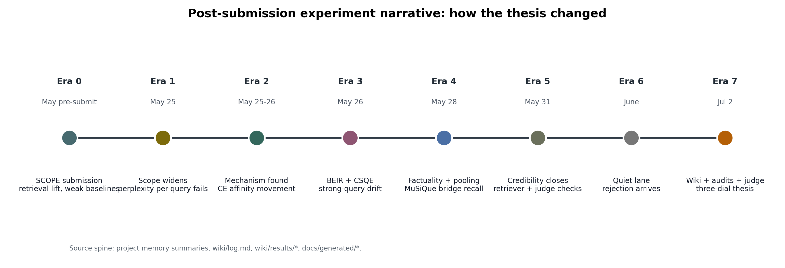
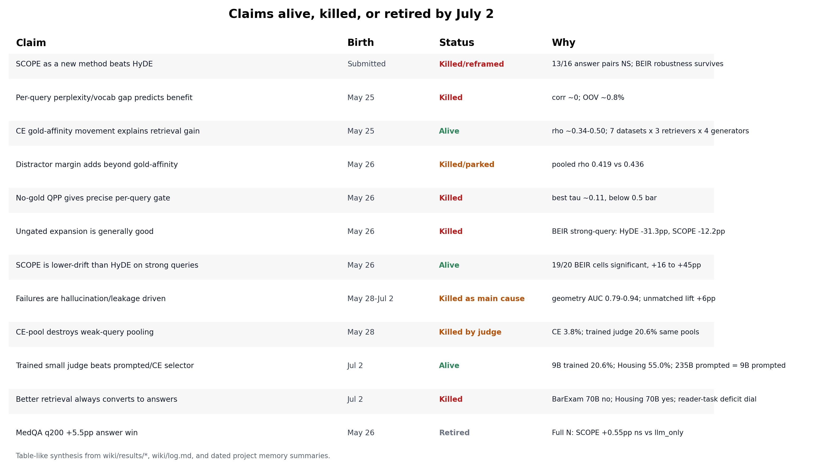

# Experiment narrative since the SCOPE submission

This is a lab-notebook narrative for the July 2 mentor meeting: what was tried,
what worked, what failed, what got retired, and how the thesis changed. Each
paragraph or table row with numbers carries its source inline.

Definitions up front:

- **SCOPE** = Snap-answer COnditioned Pseudo-document Embedding: call 1 writes a
  private snap answer plus an authority-style pseudo-document; retrieval embeds
  only the pseudo-document; call 2 answers from the original question plus
  retrieved evidence. Source: [[scope]], [[scope-paper-2026]].
- **Snap** = the private draft answer; **HyRE** = the generated retrieval-passage
  path used as `snap_hyre` or legacy `rag_snap_hyde_2call`. Source: [[scope]],
  `CLAUDE.md`.
- **CE** = the cross-encoder reranker, mainly
  `cross-encoder/ms-marco-MiniLM-L-6-v2`; CE affinity is the score between a
  query-like text and a passage. Source: [[scope]], [[affinity-margin-mechanism]].
- **QPP** = Query Performance Prediction, a label-free attempt to predict query
  or retrieval quality. Source: [[qpp]], [[qpp-routing-negative]].
- **Judge recipe** = rerank candidate passages with an LLM judge trained or
  prompted to decide whether a passage states the controlling evidence, instead
  of relying on the general-domain CE. Source: [[judge-pilot-v0]],
  [[judge-pilot-v0-results]].

Figure source: dated project memory summaries, [[log]], [[scope-paper-2026]], [[affinity-margin-mechanism]], [[beir-phase1]], [[factuality-falsification]], [[three-retriever-generality]], [[judge-pilot-v0-results]], [[judge-answer-conversion]], and [[medqa-fulln-matrix]].

Figure source: [[snap-vs-hyde-ledger]], [[affinity-margin-mechanism]], [[qpp-routing-negative]], [[beir-phase1]], [[factuality-falsification]], [[leakage-audit-barexam]], [[judge-pilot-v0-results]], [[judge-answer-conversion]], and [[medqa-fulln-matrix]].

## Era 0 - May pre-submission: the submitted SCOPE story

**Question.** The submission asked whether generated legal queries could repair
weak retrieval when question wording differs from authority wording. It framed
SCOPE as a legal RAG method, not yet as a general mechanism paper. Source:
[[scope-paper-2026]], [[scope]].

**What we ran.** The paper evaluated BarExamQA and HousingQA with three
BarExam answer models and two Housing answer models, comparing LLM-only,
raw-question RAG, HyDE, SCOPE, and gold-evidence controls. Source:
[[scope-paper-2026]].

| Submitted claim surface | Number | Why it matters | Source |
|---|---:|---|---|
| BarExamQA raw Hit@5 | 1.4% | Weak-query baseline was genuinely bad | [[scope-paper-2026]] |
| BarExamQA SCOPE Hit@5 | 9.5/12.1/11.0% for 8B/26B/70B | Retrieval lift was real | [[scope-paper-2026]] |
| Answer deltas vs raw RAG | +2.4/+4.0/+5.1pp | This was the flattering baseline | [[scope-paper-2026]] |
| Answer deltas vs LLM-only | -0.4/+1.2/+1.0pp | This exposed the weak-baseline error | [[scope-paper-2026]], [[icml-ai4law-2026-rejection]] |
| Housing SCOPE | worst non-LLM method | "Parity" framing was spin | [[scope-paper-2026]], [[icml-ai4law-2026-rejection]] |

**Thesis change.** The submitted paper already contained the answer-conversion
problem: retrieval exposure moved far more than answer accuracy. The July review
page records submission 97, submitted May 22, 2026, rejected June 12, 2026 with
two strong rejects. Source: [[icml-ai4law-2026-rejection]].

## Era 1 - May 25: widening scope and killing per-query perplexity

**Question.** After submission, the project widened beyond legal QA toward
medical, non-legal, reasoning RAG, and multi-agent settings. The original
theory was that SCOPE helps in proportion to a question-corpus vocabulary gap,
measured by query perplexity; HousingQA was already being de-emphasized as a
weird, binary, answer-bound supporting benchmark. Source:
`/Users/hamzaiqbal/.claude/projects/-Users-hamzaiqbal-grad-LegalRagAgent/memory/project_scope_widening_2026-05-25.md`.

**What we ran.** The first test was an add-1 unigram-perplexity axis on
BarExamQA and HousingQA. Source:
[perplexity_axis_2026-05-25](../../docs/generated/perplexity_axis_2026-05-25.md),
`/Users/hamzaiqbal/.claude/projects/-Users-hamzaiqbal-grad-LegalRagAgent/memory/perplexity_axis_result_2026-05-25.md`.

| Result | Number | Interpretation | Source |
|---|---:|---|---|
| BarExam log-PPL vs SCOPE retrieval/answer gain | -0.021 / +0.016 | per-query signal was approximately zero | [perplexity axis](../../docs/generated/perplexity_axis_2026-05-25.md) |
| Housing log-PPL vs SCOPE retrieval/answer gain | -0.046 / -0.046 | same failure in Housing | [perplexity axis](../../docs/generated/perplexity_axis_2026-05-25.md) |
| BarExam vs Housing median PPL | 1898 vs 1435 | weak dataset-level separation only | [perplexity axis](../../docs/generated/perplexity_axis_2026-05-25.md) |
| P(BarExam higher log-PPL) / Cohen's d | 0.652 / 0.30 | not a strong regime separator | [perplexity axis](../../docs/generated/perplexity_axis_2026-05-25.md) |
| OOV in both datasets | about 0.8% | not a vocabulary-coverage story | [[affinity-margin-mechanism]] |

**Dead end.** "SCOPE helps proportional to per-query perplexity" died here. The
weaker dataset-level cue survived only as a hint; it was not a mechanism or a
router. Source: [[affinity-margin-mechanism]],
`/Users/hamzaiqbal/.claude/projects/-Users-hamzaiqbal-grad-LegalRagAgent/memory/perplexity_axis_result_2026-05-25.md`.

## Era 2 - May 25-26: the mechanism appeared, and QPP became a negative

**Question.** If perplexity did not explain the effect, what did? The next test
asked whether SCOPE helps when the generated passage moves CE or embedding
affinity toward the gold passage, and hurts when it moves away. Source:
[[affinity-margin-mechanism]].

**What we ran.** The mechanism analysis measured CE(scope,gold) minus
CE(raw,gold), cosine analogues, raw affinity, length, perplexity, OOV, and
dataset covariates on the legal caches. Source:
[scope_gap_mechanism_2026-05-25](../../docs/generated/scope_gap_mechanism_2026-05-25.md),
[[affinity-margin-mechanism]].

| Finding | Number | Verdict | Source |
|---|---:|---|---|
| CE gold-affinity movement vs retrieval gain | Spearman about 0.44 | first durable mechanism | [[affinity-margin-mechanism]] |
| Cosine movement vs retrieval gain | Spearman about 0.37 | same direction in embedding space | [[affinity-margin-mechanism]] |
| Worst-to-best CE-delta bins | -36.4% to +26.9% retrieval | monotone movement toward gold | [[affinity-margin-mechanism]] |
| Joint regression partial R^2 | 0.130 for affinity movement | dominated confounds | [[affinity-margin-mechanism]] |
| Confound partial R^2 | 0.000 PPL, 0.002 tokens, 0.002 OOV, 0.004 dataset | perplexity/length/domain did not explain it | [[affinity-margin-mechanism]] |

**Dead end.** The pre-registered distractor-margin elaboration did not improve
the mechanism: pooled CE full-margin rho was 0.419 versus 0.436 for
gold-affinity-only. The distractor term was parked; the paper spine became
gold-affinity movement. Source: [[affinity-margin-mechanism]],
[affinity_margin_oncache_2026-05-26](../../docs/generated/affinity_margin_oncache_2026-05-26.md).

**Related work grounding.** The May 26 scan renamed the pieces in field terms:
our no-gold confidence metric is QPP, SCOPE is HyDE-family generated query
expansion, strong-query failures are query drift, and answer-conversion is a
retrieval-generation gap. It also warned that the method claim was weak/risky
and the mechanism/regime claim was the safer anchor. Source:
`/Users/hamzaiqbal/.claude/projects/-Users-hamzaiqbal-grad-LegalRagAgent/memory/related_work_grounding_2026-05-26.md`,
[RELATED_WORK_GROUNDING](../../paper/submission/RELATED_WORK_GROUNDING.md).

**QPP result.** No label-free QPP feature became a reliable per-query gate:
best pooled WIG-CE was Kendall tau -0.11 for retrieval and -0.02 for answers,
far below the tau >= 0.5 reliability bar. The direction still matched at regime
level: low raw-confidence bins had SCOPE net retrieval +6.8%, while
high-confidence bins had -12.6%. Source: [[qpp-routing-negative]],
[raw_retrieval_confidence_routing_2026-05-26](../../docs/generated/raw_retrieval_confidence_routing_2026-05-26.md).

**Thesis change.** The project moved from "perplexity-gated SCOPE" to
"gold-affinity movement explains retrieval; QPP is a principled negative for
precise per-query routing and a coarse regime hint." Source:
[[affinity-margin-mechanism]], [[qpp-routing-negative]].

## Era 3 - May 26: BEIR phase 1 and the strong-query correction

**Question.** The legal mechanism could still be a two-dataset artifact. BEIR
phase 1 asked whether the mechanism, geometric-failure falsification, and
weak/strong regime law replicate on standard non-legal retrieval datasets.
Source: [[beir-phase1]].

**What we ran.** Phase 1 used SciFact, NFCorpus, FiQA, TREC-COVID, and SciDocs;
initial generator Gemma 4 26B, then phase 1b added Qwen3.5-9B, Mistral Small
3.2 24B, and DeepSeek v3.2. Source: [[beir-phase1]],
[beir_phase1_verification_2026-05-26](../../docs/generated/beir_phase1_verification_2026-05-26.md).

| Result | Number | Meaning | Source |
|---|---:|---|---|
| Mechanism rho on BEIR | 0.501 HyDE, 0.426 SCOPE | legal mechanism replicated | [[beir-phase1]] |
| Geometry vs OOV/PPL failure AUC | 0.944/0.909 vs 0.520/0.509 | geometric, not vocabulary/factuality proxy | [[beir-phase1]] |
| Raw Hit@5 on BEIR | pooled 62%; SciFact 82%; TREC-COVID 98% | BEIR is strong-query dominated | [[beir-phase1]] |
| Ungated expansion on BEIR | HyDE -31.3pp, SCOPE -12.2pp Hit@5 | expansion is not a default | [[beir-phase1]] |
| SCOPE-vs-HyDE robustness after July 2 tests | 19/20 cells significant, +16 to +45pp | surviving snap claim is low drift | [[snap-vs-hyde-ledger]], [retrieval significance](../../docs/generated/retrieval_significance_2026-07-02.md) |

**Dead ends and nuance.** Fixed-medoid exemplar-SCOPE did not help on the
strong-query BEIR sets: pooled Hit@5 48.9% versus vanilla SCOPE 49.8%, with
gold-delta more negative at -0.85 versus -0.56. CSQE, a corpus-steered method
using real retrieved sentences, was excellent on strong-query BEIR at 59.4%
Hit@5 but collapsed on weak BarExamQA at 2.0% versus raw 1.4%, while SCOPE and
HyDE reached 12.1% and 11.4%. Source:
`/Users/hamzaiqbal/.claude/projects/-Users-hamzaiqbal-grad-LegalRagAgent/memory/exemplar_scope_phaseA_2026-05-26.md`,
[[pooling-regime]].

**Thesis change.** Generative expansion became a weak-query instrument; strong
queries need raw retrieval, corpus-grounded expansion, or pooling. SCOPE's edge
over HyDE became drift robustness, not universal answer lift. Source:
[[beir-phase1]], [[snap-vs-hyde-ledger]].

## Era 4 - May 28: factuality, pooling, and MuSiQue

**Question.** Could the geometric story be a strawman because the real cause of
failure is hallucination? And could pooling raw and generated candidates make
one deployable recipe for all regimes? Source: [[factuality-falsification]],
[[pooling-regime]].

**What we ran.** Phase A factuality used q200 per dataset across BarExamQA plus
four BEIR datasets, with Gemma 4 26B generations and LLM-as-judge factuality
against gold and raw-top3 evidence. Source: [[factuality-falsification]],
[factuality_falsification_2026-05-28](../../docs/generated/factuality_falsification_2026-05-28.md).

| Test | Number | Interpretation | Source |
|---|---:|---|---|
| OOV plus logPPL AUC for retrieval hurt | 0.514 | chance-ish | [[factuality-falsification]] |
| gold-grounded factuality AUC | 0.581 | some signal | [[factuality-falsification]] |
| geometry AUC | 0.791 | dominant predictor | [[factuality-falsification]] |
| geometry + factuality AUC | 0.792 | marginal factuality lift +0.001 | [[factuality-falsification]] |
| high-factuality rows still hurt | 8.5% hurt rate | failures remain geometric inside factual rows | [[factuality-falsification]] |

**Honest caveat.** The claim is not "factuality has no signal"; 0.581 is above
the OOV/PPL proxy, and BarExamQA is less clean because factuality and geometry
are correlated there. The defensible line is "geometry dominates factuality."
Source: [[factuality-falsification]].

**Pooling result.** Raw-union-SCOPE plus CE rerank helped strong/intermediate
settings but hurt weak ones: BEIR pooled raw 62.2 -> pool 65.9; Housing 36.8
-> 41.1; BarExam SCOPE-alone 12.0 -> pool 3.9, with raw 1.4. Three SCOPE
samples plus raw added nothing: 65.0 versus 65.9 on BEIR. Source:
[[pooling-regime]],
[3scope_raw_pool_2026-05-28](../../docs/generated/3scope_raw_pool_2026-05-28.md).

**CaseHOLD locked the gradient.** Pooling failed not only at BarExam's extreme
1.4% raw Hit@5; it also erased SCOPE's lift on CaseHOLD at raw 17.9%, while
Housing at 36.8% and BEIR at 62.2% benefited. The transition sat between about
18% and 37% raw Hit@5 under the CE selector. Source:
`/Users/hamzaiqbal/.claude/projects/-Users-hamzaiqbal-grad-LegalRagAgent/memory/three_scope_raw_pool_result_2026-05-28.md`,
[[pooling-regime]].

**MuSiQue bridge.** MuSiQue was not a global-corpus weak-query benchmark: its
per-question 20-paragraph pool made raw Hit@5 97.4% by construction. The real
signal was bridge recall: HyDE +14.6pp, SCOPE +16.1pp, and CSQE +33.4pp
bridge@5 because real text was guaranteed in the pool. Source:
[[musique-cross-domain]],
[musique_cross_domain_regime_2026-05-28](../../docs/generated/musique_cross_domain_regime_2026-05-28.md).

**Thesis change.** By May 28 there was no single CE-reranked recipe: weak
global-corpus, strong global-corpus, and per-question-pool multi-hop settings
had to be separated. Source: [[pooling-regime]], [[musique-cross-domain]].

## Era 5 - May 31: credibility checks against artifact critiques

**Question.** Could the mechanism be an artifact of one retriever stack, or
could the factuality result be a Gemma-judge artifact? Source:
[[three-retriever-generality]], [[factuality-falsification]].

**What we ran and found.**

| Critique | Result | Caveat | Source |
|---|---|---|---|
| single retriever artifact | mean SCOPE rho over seven datasets was 0.342 for gte+CE, 0.354 for BM25, and 0.387 for E5-large-v2 | mean-level closure, not every dataset | [[three-retriever-generality]] |
| per-dataset overstatement risk | TREC-COVID SCOPE was 0.108/0.195/0.234; gte+CE NFCorpus/SciDocs were 0.296/0.299 | do not say every cell cleared 0.30 | [[three-retriever-generality]] |
| Gemma judge artifact | full-N gpt-4o factuality AUC 0.548, geometry 0.823, joint 0.826, marginal +0.003 | single independent judge; Housing not covered | [[factuality-falsification]] |
| judge agreement | Spearman 0.681, kappa 0.614 vs original Gemma q200 | solid but not two-judge closeout | [[factuality-falsification]] |

**Thesis change.** By May 31, the mechanism paper had a credible spine:
geometry over perplexity, geometry over factuality, and geometry not tied to
one retriever family. What was missing was manuscript conversion. Source:
[[direction-2026-07]],
`/Users/hamzaiqbal/.claude/projects/-Users-hamzaiqbal-grad-LegalRagAgent/memory/icml_ai4law_rejection_2026.md`.

## Era 6 - June: quiet branch history, then rejection

**Record check.** On July 2, `git log --oneline --since=2026-06-01
--until=2026-07-01` returned empty on local branch `scope-generalization`, so
the local branch history shows no June commits. Source: local command run in
this workspace on 2026-07-02.

**What happened.** The paper was rejected on June 12, 2026 with two strong
rejects. The July 2 review inventory maps C1-C12 and treats the expert review
as a revision plan. Source: [[icml-ai4law-2026-rejection]],
`/Users/hamzaiqbal/.claude/projects/-Users-hamzaiqbal-grad-LegalRagAgent/memory/icml_ai4law_rejection_2026.md`.

**Thesis change.** The rejection killed the submitted method framing, not the
mechanism program. The July direction map says KoBLEX/ParSeR, GuRE, and Zheng
et al.'s own legal expansion baselines make the legal-method paper a poor
primary path; mechanism, regime, and conversion remain the viable path. Source:
[[direction-2026-07]], [[icml-ai4law-2026-rejection]].

## Era 7 - July 2: rejection sprint, leakage audit, judge program, conversion law

**Question.** The July 2 sprint asked what the reviewers were right about,
which prior art we missed, and which post-submission claims survived enough
adversarial checking to drive the next paper. Source: [[log]],
[[direction-2026-07]], [[icml-ai4law-2026-rejection]].

**Wiki and critique synthesis.** The wiki was created on July 2; the operation
log records 23 source pages and 28 raw files pulled or cloned, including
KoBLEX/ParSeR, GuRE, HyDE, Query2Doc, Weller drift, QPP work, Yoon leakage, and
Thinking Machines expert judgment. Source: [[log]].

| July 2 result | Number | What it changed | Source |
|---|---:|---|---|
| C7 answer ledger | 13/16 snap-vs-HyDE answer pairs NS | stop claiming snap beats HyDE | [[snap-vs-hyde-ledger]] |
| Pro-snap answer cell | Legal-Link-EU Gemma +4.17pp, p=0.00361 | one real but dataset-specific win | [[snap-vs-hyde-ledger]] |
| Pro-HyDE Housing 70B cells | -6.45pp p=1.4e-28 unfiltered; -2.57pp p=1.7e-06 state-filtered | Housing "parity" was worse than admitted | [[snap-vs-hyde-ledger]] |
| Retrieval significance sweep | 97/128 pairs significant | C7/C11 retrieval rigor gap filled | [retrieval significance](../../docs/generated/retrieval_significance_2026-07-02.md) |
| BEIR SCOPE-vs-HyDE retrieval | 19/20 significant | drift robustness survives as snap claim | [[snap-vs-hyde-ledger]] |

**Leakage audit.** The Yoon-style NLI audit rejected leakage as the main
explanation. BarExam matched samples were 13.7-15.4%; unmatched samples still
lifted Hit@5 by +5.9 to +6.1pp over raw 1.4%; all-unmatched questions hit
10.5% versus raw 1.5%, McNemar 88/5, p=1.1e-20. BEIR matched rates were 0-7%
with help_m=0 in all six cells; Housing unmatched lift was +0.8 to +1.0pp over
raw 35.3%. Source: [[leakage-audit-barexam]],
[BarExam audit](../../docs/generated/leakage_audit_barexam_2026-07-02.md),
[BEIR audit](../../docs/generated/leakage_audit_beir_2026-07-02.md),
[Housing audit](../../docs/generated/leakage_audit_housing_2026-07-02.md).

**Judge v0: selector bottleneck.** BarExam v0 trained a Qwen3.5-9B LoRA judge
on 3500 relevance pairs for 84 steps and evaluated 399 held-out raw-union-SCOPE
pools with a 22.8% ceiling. Trained Hit@5 was 20.6%, MRR@5 0.138, and
gold-in-pool conversion 90.1%, versus CE 3.8%, SCOPE-alone 12.0%, and
zero-shot same-model judge 15.3%; trained-vs-CE p=1.4e-17,
trained-vs-SCOPE p=3.4e-06, trained-vs-zero-shot p=1.0e-04. Source:
[[judge-pilot-v0-results]], [[judge-pilot-v0]].

**What judge v0 killed.** "Pooling destroys weak-query gains" was a CE selector
artifact. With a trained judge, the same pools gave the project's best BarExam
retrieval number, but the 22.8% pool ceiling still bound conversion. Source:
[[judge-pilot-v0-results]], [[regime-routing]].

**Housing judge replication.** On 500 held-out state-filtered Housing pools with
5000 training pairs, trained Hit@5 was 55.0%, MRR@5 0.477, and conversion 96.5%,
versus CE 38.2%, SCOPE-alone 41.2%, and raw 33.4%; trained-vs-CE p=2.5e-23 and
trained-vs-SCOPE p=8.5e-12. Source: [[judge-pilot-housing]].

**Transfer and label semantics.** BarExam-trained judge on Housing reached
46.4%, above CE 38.2% but below Housing zero-shot 52.8% and Housing-trained
55.0%. SciDocs zero-shot beat CE 60.5% versus 52.0% (+8.5pp, p=3.3e-05), but
training on citation-proxy qrels hurt to 46.5% (-14.0pp vs zero-shot,
p=6.5e-06). FiQA zero-shot beat CE 84.0% versus 70.0% (+14.0pp, p=1.8e-07),
while trained 82.4% tied zero-shot (p=0.52). Source: [[judge-pilot-housing]],
[[judge-pilot-scidocs]], [[judge-pilot-fiqa]].

**Capacity dial.** On identical BarExam pools, Qwen3.5-9B was 15.3% zero-shot
and 20.6% trained; Qwen3.6-27B was 14.0% zero-shot and 18.5% trained;
Qwen3-235B-A22B prompted was 15.3%. Prompted 235B equaled prompted 9B at top-5,
and trained 9B beat prompted 235B by +5.3pp. Source: [[judge-capacity-dial]].

**Answer conversion, BarExam 70B.** Four paired 399-question arms found
llm_only 77.7%, CE-evidence 76.7%, SCOPE-evidence 76.2%, and judge-evidence
75.2%; all deltas were non-significant, so 5.4x exposure did not convert.
Gold-present evidence was +2.4pp, gold-absent evidence -3.8pp, implying a
break-even around 61% Hit@5 versus the 22.8% pool ceiling. Source:
[[judge-answer-conversion]], `logs/experiments.jsonl`.

**Answer conversion, Housing 70B.** On 500 state-filtered Housing questions,
llm_only was 54.2%, CE-evidence 61.8%, SCOPE-evidence 63.2%, and
judge-evidence 65.6%; judge-evidence was +11.4pp over llm_only, p=5.5e-08,
and +3.8pp over CE-evidence, p=0.048. Source: [[judge-answer-conversion]],
`logs/experiments.jsonl`.

**Reader-size 2x2.** At 8B the regimes inverted: BarExam evidence paid
(SCOPE-evidence +11.8pp, p=5.6e-05; judge-evidence +8.8pp, p=0.0026), while
Housing evidence stopped paying (-2.8pp, non-significant). The conversion dial
became reader-task parametric deficit, with an observed crossover near 60%
llm_only accuracy. Source: [[judge-answer-conversion]],
`/Users/hamzaiqbal/.claude/projects/-Users-hamzaiqbal-grad-LegalRagAgent/memory/judge_pilot_v0_result_2026-07-02.md`.

**MedQA full-N correction.** The q200 MedQA answer headline was retired:
the probe suggested SCOPE +5.5pp over llm_only, p=0.019, but full-N N=1273
strict replay found llm_only 85.6%, raw-RAG 83.1%, HyDE 85.2%, and SCOPE 86.1%.
SCOPE was only +0.55pp versus llm_only, non-significant, while still repairing
raw-RAG harm by +2.99pp, p=0.002. Source: [[medqa-fulln-matrix]],
`logs/experiments.jsonl`,
[MedQA setup](../../docs/generated/medqa_usmle_widening_2026-05-26.md).

**EIT lane.** The July 2 judge-lane port needed transformers >=4.62 for the
qwen3_5 architecture and used a dedicated EIT venv at
`/engrfs/project/jacobsn/hiqbal/envs/judge_lane`. After an OOM iteration on
the A40 path (job 93606), the race resolved the same evening: A100 job 93632
reproduced the Tinker reference exactly — Hit@5 20.6%, MRR 0.135, identical
82/399 hit count — so judge training is now free infrastructure. Source:
[[judge-pilot-v0-results]] §Free-infrastructure replication, [[log]],
`/Users/hamzaiqbal/.claude/projects/-Users-hamzaiqbal-grad-LegalRagAgent/memory/judge_pilot_v0_result_2026-07-02.md`.

## The shape of what we now know

Mapped onto [[thesis-v2]], the story is no longer "SCOPE wins"; it is three
measurable dials:

1. **Expansion dial: query margin.** Expansion helps when raw gold-affinity
   is low and hurts when raw is already good. Evidence: rho about 0.34-0.50
   across seven datasets, three retrievers, and four generators; leakage and
   hallucination do not explain the lift. Source: [[thesis-v2]],
   [[affinity-margin-mechanism]], [[beir-phase1]],
   [[three-retriever-generality]], [[factuality-falsification]],
   [[leakage-audit-barexam]].
2. **Selection dial: pool confusability and label quality.** The general-domain
   CE is the weak selector; a trained 9B judge fixes BarExam and Housing pool
   reranking, zero-shot LLM judges beat CE across four domains, and training
   helps only when labels encode useful relevance. Source:
   [[judge-pilot-v0-results]], [[judge-pilot-housing]],
   [[judge-pilot-scidocs]], [[judge-pilot-fiqa]], [[judge-capacity-dial]].
3. **Conversion dial: reader-task parametric deficit.** Better retrieval
   converts only when evidence is valuable to the reader on the task. BarExam
   70B did not convert; Housing 70B did; 8B inverted the tasks; MedQA full-N
   retired the q200 answer win and confirmed harm-avoidance rather than lift.
   Source: [[judge-answer-conversion]], [[medqa-fulln-matrix]].

## Open holes for the meeting

- **No manuscript text exists for the new story.** The direction memory says eleven analysis reports and zero manuscript text existed at the rejection pivot. Source: `/Users/hamzaiqbal/.claude/projects/-Users-hamzaiqbal-grad-LegalRagAgent/memory/icml_ai4law_rejection_2026.md`, [[direction-2026-07]].
- **Many judge results are one-seed results.** BarExam, Housing, SciDocs, FiQA, and capacity pages carry one-seed or one-domain caveats. Source: [[judge-pilot-v0-results]], [[judge-pilot-housing]], [[judge-pilot-scidocs]], [[judge-capacity-dial]].
- **Labels are in-distribution benchmark labels, not lawyer labels.** v0 proves selector diagnosis and training recipe, not legal-judgment transfer beyond benchmark gold ids. Source: [[judge-pilot-v0-results]], [[expert-judgment-replication]].
- **BarExam conversion is pool-bound.** The pool ceiling is 22.8%, while the break-even model needs about 61% Hit@5 for the 70B reader. Source: [[judge-pilot-v0-results]], [[judge-answer-conversion]].
- **SCOPE-vs-HyDE is not a method win.** The surviving snap claim is strong-query drift robustness, not answer superiority: 13 of 16 answer pairs are non-significant, and BarExam retrieval is non-significant for 3 of 4 models. Source: [[snap-vs-hyde-ledger]].
- **C12 guardrail ablations remain owed.** Passing the snap answer to call 2, keeping/concatenating the raw query, and conclusion-banning the generated passage remain the cheap mechanism-lever tests. Source: [[icml-ai4law-2026-rejection]], [[direction-2026-07]], [[thesis-v2]].

Run-level provenance used where useful: `logs/experiments.jsonl` July 2 rows
for BarExam answer-conversion, Housing answer-conversion, the 8B reader-size
arms, and MedQA full-N replay.
