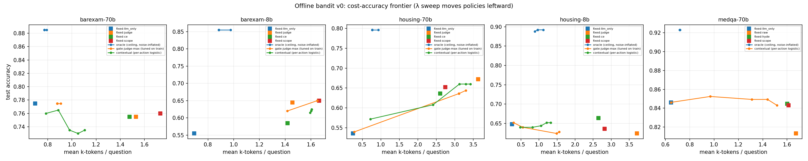

# Offline bandit v0 (bridge rung 1) — single-turn retrieve-or-not / arm choice

**Question** ([[skill-distillation-bridge]] rung 1; meeting Idea 1,
[[08-meeting-notes]]): before any RL/distillation, can a *cheap trained
policy* — features + judge scores, no model in the loop — allocate retrieval
per-question (retrieve or not; which evidence arm) better than fixed
policies, under reward = correct − λ·k-tokens?

**Setup.** Offline replay of the paired 2026-07-02 arms, zero new LLM calls:
5 cells (BarExamQA/HousingQA × 70B/8B + MedQA/70B), actions = llm_only +
3 evidence arms, per-row correctness and token costs from the detail logs.
50/50 train/test (seed 0). Policies: fixed arms; per-question **oracle**
(noise-inflated ceiling — argmax over Bernoulli draws); **judge-max gate**
(1-D threshold tuned on train); **contextual** per-action logistic reward
models (features: question length + trained-judge pool score max/margin/mean
where available). Full tables:
[offline_bandit_v0_2026-07-02](../../docs/generated/offline_bandit_v0_2026-07-02.md).

| Cell (test half) | best fixed | contextual | Δ | McNemar p | oracle ceiling |
|---|---:|---:|---:|---:|---:|
| BarExam/70B | llm_only 77.5% | 73.5% | −4.0pp | 0.096 | 88.5% |
| BarExam/8B | scope 65.0% | 62.5% | −2.5pp | 0.332 | 85.5% |
| Housing/70B | judge 67.2% | 66.0% | −1.2pp | 0.549 | 79.6% |
| Housing/8B | ce 66.4% | 65.2% | −1.2pp | 0.791 | 89.2% |
| MedQA/70B | llm_only 84.6% | 84.3% | −0.3pp | 0.885 | 92.3% |

The judge-max gate does no better: at best it *recovers* llm_only exactly
(BarExam/70B 77.5% at +0.2 ktok) — consistent with the score-gated
diagnostic in [[judge-answer-conversion]] (+0.75pp ns).

**Readings.**
1. **No cheap policy beats the best fixed arm in any of the 5 cells.** This
   extends [[qpp-routing-negative]] (retrieval-side, no-gold QPP) to the
   *answer-level allocation* problem with strictly richer features — the
   trained judge's own scores don't route either. Per-query external routing
   is now a two-way-closed negative.
2. **The headroom is large and real**: the per-question oracle sits 8–24pp
   above every fixed arm — the arms are strongly complementary at the
   question level (their union solves far more than any single arm). Caveat:
   the oracle is noise-inflated (argmax over 4 Bernoulli outcomes); a
   noise-free bound needs repeated samples per arm. Even discounted, the
   complementarity is far beyond what features capture (contextual agrees
   with the oracle action on only 5–48% of questions).
3. **The cost dial works mechanically**: as λ rises, learned policies walk
   left along the frontier toward llm_only (e.g. Housing/70B contextual:
   3.42 → 0.72 ktok) — the harness correctly trades cost for accuracy, there
   is just no *free* accuracy on the way.
4. **Implication for the bridge**: if allocation-relevant signal is not in
   cheap externals, it must come from the model's own state — which is
   precisely the internalization bet ([[skill0]]: competence in the weights,
   not the context/router). Rung 1's negative is rung 2's motivation: train
   the *policy itself* (small model decides retrieve/k as part of its own
   forward pass), rather than routing around a frozen one.

**Caveats.** Single seed/split; logistic-only policy class (a GBM/MLP might
scrape a point or two, but the oracle-agreement numbers say the features are
the binding problem); arm costs for the contextual policy use train-side arm
means; oracle inflation as above; MedQA cell has no judge features.

**Reproduce.** `uv run python scripts/bandit/offline_bandit_v0.py`
(pure replay of `logs/eval_*_20260702_*` + judge score files; numpy only).

## Links
[[skill-distillation-bridge]] · [[08-meeting-notes]] ·
[[judge-answer-conversion]] · [[qpp-routing-negative]] ·
[[helpfulness-benchmark]] · [[thesis-v2]]
