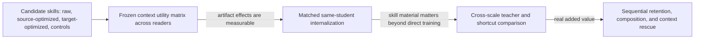

# Skill lifecycle research snapshot — 2026-07-17

## Bottom line

The proposed end-to-end chain is technically coherent:

`optimize a skill artifact → expose it during training → remove it at inference → transfer behavior across scale`.

It is **not** a sufficient novelty claim. [[skillopt]] explicitly proposes
self-distilling optimized skills into weights; [[opcd]] already internalizes
optimized system prompts and performs cross-size context distillation;
[[skill-sd]] and [[seed-self-evolving-opd]] already combine natural-language
skills, teacher-only context, OPD, and outcome RL; [[skill-zero-five]] already
splits skills between weights and context; [[skillc]] already turns paired
with/without-skill performance into direct internalization credit; and
[[latent-skill]] already compiles textual skills into modular LoRA weights.
Earlier [[promptkd]] already optimizes teacher-side soft context with student
guidance specifically to make generative distillation more absorbable.

The scientifically interesting object is the possible mismatch between three
orderings over several **fixed, same-task candidate artifacts**:

1. the skill that is best **as context for one model and harness**;
2. the skill that is best **as context for another model and harness**;
3. the skill that is best **as teaching material after context withdrawal**.

The first two columns are now prior art and required controls: [[skillgen-verified]]
publishes fixed source-skill × evaluator matrices, [[skilllens]] crosses
identical skill text over consumers, and [[masa]] crosses fixed skill
granularities over backbones. The remaining under-characterized transition is
from either contextual column into the third.

The clean question is:

> **For a fixed student and several fixed procedural skills, does the skill
> that helps most as runtime context also teach the most after the skill text
> is withdrawn?**

This is now the **secondary** research candidate. The completed collision audit
found that contextual artifact-by-reader matrices are already unusually close
prior art, while the internalization arm requires expensive matched training.
[[research-question-recommendation-2026-07-17]] therefore recommends the
cleaner student-specific forced-action-value study as the first experiment.

“Where should a skill live—context, weights, or both?” is a useful lifecycle
follow-up, but [[constant-context-skill-learning]], [[latent-skill]],
[[skill0]], [[skillc]], and related 2026 systems make it too broad to serve as
the primary novelty claim.

These are empirical questions. No metric, scaling law, calibration method, or
new architecture should be selected in advance. The first study should record
enough raw outcomes to discover whether the phenomenon is ranking mismatch,
threshold shift, non-monotonic reversal, forgetting, composition failure,
cost-only tradeoff, or a null.

No experiment was launched during this pass.

## Recommended center of gravity

The most elegant, plausibly under-owned skill question is:

> **Does contextual skill utility predict post-withdrawal acquisition
> utility?**
>
> Operationally: for exact versioned skill artifacts evaluated on common
> held-out tasks, does their causal with/without-context ordering preserve the
> ordering of no-context improvement after matched training from the same base
> checkpoint?

This is a **utility-transport measurement paper**, not a pipeline paper.
[[skillsbench]] already estimates curated-skill contextual lift across
model–harness configurations; [[ctx2skill]] directly swaps final skill sets
between GPT readers; and [[skillsinjector]] estimates repeated-execution
marginal skill benefit for a fixed reader. We therefore do not claim
cross-reader skill helpfulness or execution utility as new. More decisively,
[[skillgen-verified]], [[skilllens]], and [[masa]] already cross fixed
candidate artifacts over readers. The remaining joint object is the ordering
of **multiple same-task candidates across placement**: runtime context versus
matched training-only exposure followed by withdrawal. This extends the
reader-specific intuition in [[llm-specific-utility]] with placement-specific
acquisition value rather than another context-transfer matrix.

Student-friendly teaching is an established idea: [[lgtm-student-level-kd]]
optimizes teachers using validation influence, [[promptkd]] adapts soft teacher
context with student guidance, [[personalized-teacher-selection]] routes each
prompt using response quality and target-student likelihood,
[[distillation-traps-guards]] directly controls teacher distillability, and
[[token-teachability]] selects locally absorbable token signals. The narrower
opening is the joint ordering of **independently execution-optimized,
human-readable skills** across frozen-reader context use and no-context target
acquisition after withdrawal. Model and harness must both index the reader,
and the context renderer/compiler must be frozen or crossed explicitly;
[[skillrae]] shows that presentation effects can differ by executor.

The minimum coherent study should vary only:

1. **artifact** — several independent optimization lineages, each retaining
   raw, intermediate, accepted, rejected, compact, and curriculum-broadened
   variants;
2. **reader** — the source model–harness pair and a small scale/family ladder
   of target model–harness pairs;
3. **placement** — context at execution time versus teacher-only/training-only
   context followed by removal.

Hold the task, examples, optimizer, internalization method, and compute budget
fixed. Direct target training, context-only use, direct target
internalization, [[opcd]], a [[constant-context-skill-learning]]-style
task-family adapter, and a modular [[latent-skill]]-style adapter are controls,
not additional research questions.

The first paper does **not** need multi-skill routing, continual learning,
legal authority structure, variable retrieval depth, a new architecture, or
the complete SkillOpt → teacher-internalization → student chain. Those become
follow-ups only if the crossed table contains a robust phenomenon.

Several legitimate contribution forms can emerge without being chosen in
advance:

- **rank preservation:** contextual utility reliably orders acquisition
  utility, possibly with a scale- or family-dependent transfer curve;
- **rank reversal:** compact execution-optimal skills are poor curricula while
  broader or apparently weaker artifacts internalize better;
- **selection regret:** choosing training material by contextual score causes
  a measurable post-withdrawal loss, motivating an acquisition-aware selector;
- **capacity threshold:** the relationship changes predictably with target
  capability or source-target gap;
- **strong null/boundary:** after matched direct training and cost, skill
  identity or internalization adds no value, clarifying when optimized context
  should remain external.

A scaling law should be named only if it predicts untouched model sizes and a
held-out family. A metric should be proposed only if the raw crossed outcomes
reveal a stable failure that ordinary causal lift, ranking, and regret do not
already express. A new optimizer should be built only if a small amount of
target data can select better teaching artifacts than source execution scores
or direct target learning.

The clean working title is **“Useful Context or Useful Curriculum?
Placement-Conditioned Utility of Procedural Skills.”** A punchier
“best skill/best teacher” subtitle should be used only after a replicated
reversal and never claimed as the broad conceptual novelty.

## Why the literal chain is redundant

The three stages contain mandatory shortcuts:

- If OPD's teacher still receives the optimized skill, this is direct
  context distillation; first internalizing the skill into teacher weights is
  unnecessary.
- If the teacher first internalizes the skill and is then distilled, the
  student sees behavior after an extra, potentially lossy transformation.
  `teacher + skill → student` must be compared with
  `teacher internalizes skill → student`.
- If the student can internalize the skill directly through [[skill0]] or
  [[skillc]], the large teacher may add nothing.
- If direct target-model task SFT/RL matches the chained method, neither the
  skill nor the teacher is scientifically necessary.
- If keeping the skill in context wins after amortized cost, weight
  internalization is an inferior deployment choice even if it is feasible.

The full chain can be infrastructure or an ablation. Its lift must be measured
over the best shortcut, not over the untrained base student.

## Closest primary work and what remains

| Work | Already occupied | Remaining question |
|---|---|---|
| [[skillgen-verified]] | Six fixed source-conditioned final skills crossed with six evaluator models on the same held-out instances for four benchmarks; also shows a large best-of-eight candidate-selection effect. | Only the selected final artifact from each source crosses readers; no matched target training, withdrawal, or artifact-specific weight acquisition. |
| [[masa]] | Three fixed skill-granularity variants crossed over seven Qwen/Gemma readers; the preferred variant changes by reader and derived wrong-reader context-selection regret is nonzero. | The consumer remains frozen and the rewriter emits external text; no context-versus-acquisition ordering. |
| [[skilllens]] | Identical strong- and weak-pool skills crossed over six consumers, establishing fixed-artifact reader heterogeneity. | Only two artifacts, no observed rank reversal, no source-selection experiment, and no weights. |
| [[skillrevise]] | A fixed GPT-5.5-selected artifact transfers to four readers, while target-conditioned revision performs better. | Targets do not rank the source candidate sequence; no matched weight internalization or withdrawal. |
| [[skillmaster]] | Counterfactual probe utility trains a skill-managing policy whose aggregate ALFWorld performance mostly persists when retrieval is removed. | Acting tokens also receive task reward and skill-conditioned cold-start traces; no fixed-artifact attribution, crossed reader matrix, or matched direct-training control. |
| [[skillsbench]] | Paired no-skill versus one curated bundle across 87 tasks and 18 model–harness configurations; establishes reader/harness-specific contextual lift and task-level harm. | No same-task alternative candidates or source selector; no artifact-ranking regret, training, or withdrawal. |
| [[skillaudit]] | Skill-centered paired with/without-skill evaluation across 226 public artifacts and six model–harness configurations, including utility, execution cost, and safety. | No reported per-artifact rank transport or source selection; configuration-specific valid sets; no training or withdrawal. |
| [[ctx2skill]] | Generates Markdown skills per context and cross-applies GPT-4.1- and GPT-5.1-generated skill sets to the other reader, revealing asymmetric transfer. | One selected skill set per context/model; no multi-artifact ordering, source-selection regret, or post-withdrawal weights. |
| [[skillsinjector]] | Defines repeated-execution single-skill benefit, learns target-specific utility ranking and adaptive budget, measures harmful/costly skills, and renders descriptions set-conditionally. | One frozen reader per benchmark, dynamically changed descriptions, no cross-reader ranking or skill-to-weight acquisition. |
| [[sapo]] | Context-conditional with/without-candidate reward gap under the current policy/co-retrieved set; utility-gated promotion, reranking, and pruning as the policy evolves. | Co-evolving artifacts/readers and induction-query evaluation, not a common held-out ordering of fixed candidates; no artifact-specific withdrawal column. |
| [[skill-usage-in-the-wild]] | Realistic retrieval/loading/refinement over 34,198 public skills and three model–harness pairs; contextual gain can vanish or reverse. | Readers receive different selected/refined sets; no same-task fixed-candidate ranking or weights. |
| [[adaskill]] | Shows the same external skill can gain or lose value under different evaluation metrics; Metric Freedom predicts lift. | Orders metrics, not alternative artifacts; no weight placement. Metric must be frozen or indexed. |
| [[skillrae]] | Retrieves skill subunits and compiles a 384-token execution packet; the compiler's aggregate value differs between Codex/GPT-5.2 and Gemini/Gemini 3 Flash. | No per-skill utility/order, common crossed candidate set, weight update, or withdrawal; context presentation is a confound. |
| [[skillopt]] | Held-out-gated text-space optimization, cross-model/harness transfer, compact exported skills; explicitly proposes later weight internalization. | Does source-context optimization select the best curriculum for a named target student? |
| [[promptkd]] | Student-conditioned soft-prompt optimization for generative distillation; teacher context is explicitly changed to suit the student. | No fixed natural-language skill ranking, source-execution objective, agent task, or context-versus-withdrawal comparison. |
| [[smartad]] | Selects already-correct agent trajectories by minimum target-student NLL and weights action/final spans more heavily during SFT. | Trajectory compatibility rather than fixed skill context utility; no same-artifact runtime-context versus withdrawal comparison. |
| [[informative-alignment-rsr]] | Predicts post-training reasoning gain across 11 teachers and five students with a student-conditioned rank/surprisal metric; supports trajectory and teacher selection. | Reasoning trajectories, not fixed procedural skills; no runtime-context column or artifact withdrawal comparison. |
| [[lgtm-student-level-kd]] | Per-sample validation influence trains a teacher for the exact student's generalization. | BERT classification and teacher/sample weighting, not reusable skill artifacts or cross-reader placement. |
| [[personalized-teacher-selection]] | Per-prompt teacher routing from response quality plus target-student likelihood across families/scales. | Its “optimal” teacher uses a proxy, not measured causal learning gain or artifact-selection regret. |
| [[distillation-traps-guards]] | Teacher task utility and downstream distillability are separated and directionally controlled by teacher RFT. | Weight-calibrated teacher/proxy pairs, not fixed textual skills, runtime context, or artifact ranking. |
| [[opcd]] | Reverse-KL on student trajectories against a context-conditioned teacher; optimized system-prompt internalization and cross-size distillation. | Does the context artifact's source-model utility predict target acquisition, retention, or student-specific action utility? |
| [[skill-sd]] | Trajectory-derived teacher-only skills, importance-weighted reverse-KL, reward plus self-distillation, no skill at deployment. | Same-size and dynamic skills; no held-out-gated artifact or cross-scale teachability audit. |
| [[seed-self-evolving-opd]] | Current policy generates hindsight skills and distills their probability shift jointly with agent RL. | No independent, versioned skill whose contextual and post-withdrawal utilities are compared across readers. |
| [[lifeskill]] | Verifier-grounded skill-conditioned execution scoring and scaffold-removed reward-weighted policy updates during an online task stream. | Fresh per-failure skills and co-evolving readers; no fixed-artifact contextual-versus-acquisition ordering or reader crossing. |
| [[skill0]] / [[skillc]] | Skill-withdrawal curricula and paired skill/no-skill internalization credit. | Fixed skill material and same policy; no source-versus-target skill optimization. |
| [[skill-zero-five]] | General skills in weights plus task-specific skills in context. | Placement is a semantic general/specific rule, not learned from cost, update rate, retention, or target utility. |
| [[latent-skill]] | Hypernetwork compilation of text skills to plug-in LoRA skills with lower prompt overhead and modular composition. | No source/target teachability ranking, cross-scale teacher, or sequential skill-evolution audit. |
| [[constant-context-skill-learning]] | Moves recurring procedures/history into task-family LoRA modules trained with SFT+RL while retaining compact runtime state. | Reader-specific adapters rather than a transported textual candidate; no matched context-versus-weight artifact ordering or amortized-cost comparison. |
| [[skill1]] / [[opid]] | Unified skill selection/use/distillation and skill-conditioned on-policy RL. | Broad skill evolution/internalization is closed; model-indexed teaching-material value remains. |
| [[structured-prompt-optimization-extc]] | Literal three-stage rule optimization → large-to-small reasoning distillation → RL in text classification. | Not an agent-skill withdrawal or continual-update study, but it closes the generic pipeline shape. |
| [[continual-facts-in-weights]] | Context-versus-weight creation, composition, access, retention, and frozen/moving-teacher tests for invented facts. | It explicitly leaves procedural skills untested. |

## The measurement object

For candidate skill `s`, source/teacher model–harness pair `(T, H_T)`, target
student pair `(S, H_S)`, fixed evaluation metric `m`, one pre-specified
internalization method `M`, and matched training budget `b`, define causal
held-out contrasts:

- `U_(T,H_T),ctx(s; m) = E[Y_m | s in source context] - E[Y_m | matched no-skill source context]`;
- `U_(S,H_S),ctx(s; m) = E[Y_m | s in target context] - E[Y_m | matched no-skill target context]`;
- `U_(S,H_S),int(s; M,b,m) = E[Y_m | train with s under M, evaluate without s] - E[Y_m | matched direct task training without s from the same base, evaluate without s]`.

Reset the exact base checkpoint for every artifact and control. Use independent
training seeds per artifact, plus matched direct/no-skill training seeds;
repeated evaluation generations alone do not capture stochastic artifact
ranking induced by training.

The primary data object is the complete **fixed-target context × acquisition**
table, not a single score. A source-context column is a replication or
explanatory control, since fixed-artifact cross-reader ordering is prior art.
Useful post-hoc diagnostics include target-context/acquisition rank
correlations, learning curves, withdrawal gaps, and the regret of choosing
training material by the target's contextual column. Hold exact skill bytes
and presentation fixed for the core comparison; renderer/compiler variants
are a separate factor. Do not name one diagnostic as the contribution until
it replicates on untouched tasks, skill candidates, training seeds, and at
least one later target reader.

One pre-specified diagnostic makes the question concrete without inventing a
new metric. Let `s_ctx* = argmax_s U_(S,H_S),ctx(s; m)`. The contextual-
selection regret after withdrawal is

`R_ctx→int = max_s U_(S,H_S),int(s; M, b, m) - U_(S,H_S),int(s_ctx*; M, b, m)`.

Also report source-to-target context rank agreement as a replication/control,
not the novelty: [[skillgen-verified]] already supplies fixed cross-model
transfer matrices from which wrong-column regret can be derived. This is
ordinary decision regret applied to the artifact table, not a novelty claim by
itself. It becomes scientifically meaningful only if the **placement** regret
is stable across independent lineages and predicts untouched models/tasks
better than teacher score, student likelihood, token teachability, and
validation influence.

A small withdrawal gap is ambiguous: the student may have internalized the
skill, or it may have ignored it. Require positive no-context gain over the
initial student and over matched direct training.

## Research questions

### RQ1 — Replication/control: does contextual ordering transfer by reader?

[[skillsbench]], [[ctx2skill]], [[skillgen-verified]], [[skilllens]], and
[[masa]] already show aggregate and fixed-artifact cross-reader context
effects. Reproduce this prerequisite on the exact candidates used for the
withdrawal study: compare no skill, raw/human skill, several independent
source-optimized [[skillopt]] artifacts, target-optimized artifacts, and
controls. This column validates the setup and supplies a reader factor; it is
not the paper's primary claim.

### RQ2 — Does contextual marginal utility predict acquisition utility?

Holding the student, internalization method, examples, metric, and compute
fixed, does a [[sapo]]/[[skillsinjector]]-style contextual marginal-utility
ordering predict a [[lifeskill]]/[[skillc]]-style no-context post-training
ordering for the same artifacts? Does a compact, high-performing runtime skill
need to be expanded into diverse phrasings, failures, contrasts, and
applications before it becomes a good curriculum?

Teacher score, target-student likelihood ([[personalized-teacher-selection]]),
token compatibility ([[token-teachability]]), and validation influence
([[lgtm-student-level-kd]]) are mandatory predictors.
[[informative-alignment-rsr]] is the strongest direct trajectory-teaching
metric, and [[smartad]] supplies a student-NLL agent-distillation baseline. The
question is whether these explain artifact-level placement transport, not
whether “teachability” exists.

This is the central tension between [[skillopt]] and
[[continual-facts-in-weights]]: compact context can execute well, while broad
prompt coverage may be required to create usable, composable weight behavior.

### RQ3 — Which parts of a skill move into weights?

Separate direct benchmark behavior from:

- paraphrased and novel application;
- exception and conflict handling;
- routing/activation of the right skill;
- composition of two skills;
- recovery from an error or failed action;
- post-training use of a revised skill in context.

“Matches the headline benchmark” is not enough to establish procedural
internalization.

### RQ4 — Does a larger, skill-conditioned teacher add value?

Compare direct target training, direct student skill internalization, direct
[[opcd]] from `teacher + skill`, and teacher-first-internalization followed by
cross-scale OPD. Does the teacher reduce student interactions or compute at a
fixed held-out outcome, or is it extra machinery?

### RQ5 — Should the teacher be frozen or synchronized?

[[continual-facts-in-weights]] finds severe drift from a teacher built from
accumulated fact writes; [[skill-sd]] and [[seed-self-evolving-opd]] find gains
from synchronizing the teacher/analyzer with the current agent during joint
RL. These are different regimes. Cross frozen, periodically synchronized, and
fully moving teachers rather than assuming one rule.

### RQ6 — What survives later adaptation?

After one-skill success, train several skills or unrelated tasks sequentially.
Measure old-skill behavior, general capability, routing, and composition after
each update. Reinsert the canonical skill in context to distinguish lost
access from destroyed capability.

### RQ7 — When does internalization pay?

Account for SkillOpt rollout/optimizer calls, validation reuse, student
training GPU time, teacher scoring, context tokens, latency, and expected
deployment reuse. The decision may depend more on reuse horizon and skill
update frequency than on final accuracy.

## Discovery ladder

### Stage 0 — Frozen context matrix and existing-result replication

This stage is a control, not the main contribution: [[skillsbench]],
[[skillaudit]], [[ctx2skill]], [[skillsinjector]], and [[sapo]] already
establish cross-reader contextual lift, transfer, heterogeneity, harm, and
marginal utility. More directly, [[skillgen-verified]] already provides a
six-artifact × six-reader contextual matrix, while [[masa]] and [[skilllens]]
provide controlled three- and two-artifact versions. A new Stage 0 is an exact
setup replication and candidate-selection control, not a contribution. The
minimal secondary study uses one explicitly recorded target reader
configuration and evaluates every candidate on it; a source-reader column is
optional explanatory replication. Do not expand to a multi-scale/family
matrix unless the placement effect survives. Do not treat many snapshots from
one SkillOpt trajectory as independent skill evidence: run multiple
independent optimizer/model/seed lineages and retain lineage as a grouping
variable. Within each lineage, candidate artifacts include:

1. no skill;
2. raw/human skill;
3. source-model SkillOpt skill;
4. target-model SkillOpt skill;
5. length-matched paraphrase;
6. shuffled/irrelevant control;
7. optionally, a broadened “study curriculum” derived from the same skill.

Use [[skillsinjector]]'s repeated no-skill deltas, fixed-budget control, and
cost accounting; freeze any [[skillrae]]-style compiler for the main matrix.
Do not kill the teachability question because source and target **contextual**
rankings agree; teaching rank can reverse only after withdrawal. Use Stage 0
to verify that artifacts have measurable contextual effects and then run a
minimal matched Stage-1 test on pre-specified high, middle, low, and control
artifacts. Kill only if repeated independent lineages show neither meaningful
artifact differences nor post-withdrawal effects beyond matched direct
training.

### Stage 1 — Same-student internalization

At matched examples, environment calls, and training compute, use only four
arms for the first placement test:

1. frozen student without a skill or training;
2. frozen student plus each skill in context, no training;
3. direct student task SFT/RL with no skill;
4. one pre-specified withdrawal/internalization method applied separately to
   each candidate skill from the same base checkpoint.

Use multiple independent training seeds for every artifact and the direct-
training control. Keep `M` fixed: [[skill0]], [[skillc]], or another single
method may instantiate arm 4, but comparing methods is not part of the first
question.

Do not proceed because one loss is finite. Require an outcome gain over direct
training or a clear data/compute advantage.

### Stage 2 — Does the full chain add anything?

Compare:

1. target student with optimized skill in context;
2. direct target task SFT/RL without a skill;
3. direct target [[skill0]]/[[skillc]] internalization;
4. a removable [[latent-skill]]-style adapter where compatible;
5. direct [[opcd]] from `teacher + optimized skill`;
6. teacher internalizes the skill, then teacher-to-student OPD;
7. unskilled teacher-to-student OPD;
8. [[seed-self-evolving-opd]] as a same-model skill-evolution baseline;
9. [[promptkd]], [[smartad]], and [[informative-alignment-rsr]] as
   student-compatible teacher/trajectory baselines;
10. [[lifeskill]] with a no-skill second-retry control;
11. a [[constant-context-skill-learning]]-style task-family adapter where
    compatible;
12. a [[skillmaster]]-style aggregate retrieval-withdrawal control;
13. task RL plus reward/gap-gated cross-scale OPD;
14. bare OPD only as a collapse diagnostic.

If arm 5 matches arm 6, remove the teacher-internalization middle stage. If arm
2 or 3 matches the best OPD arm, there is no cross-scale contribution. If arm
1 or 4 wins after amortized cost, keep the skill external or modular rather
than claiming permanent internalization is preferable.

### Stage 3 — Durability and placement

Only after a clean single-skill result, add sequential skill revisions,
multi-skill routing/composition, conflicting skills, and context rescue. Keep
an untouched frozen-base-plus-context reference throughout.

## What to overcollect

Preserve row-level, versioned records so multiple analyses remain possible:

- item/task ID, split, environment seed, model/checkpoint, tokenizer, harness,
  renderer/compiler version, and evaluation metric/version;
- training seed, optimizer state/checkpoint selection, and exact reset-base
  hash for every artifact and matched direct-training arm;
- exact skill hash, source model/harness, optimizer/proposal model and seed,
  independent edit-lineage ID, description, and body;
- accepted and rejected edit proposals and selection scores;
- skill placement: absent, context, teacher-only context, weights, or both;
- repeated outcomes with and without the skill before and after training;
- action/tool traces, verifier components, reward, failure type, and recovery;
- tokens, turns, tool calls, latency, API cost, GPU time, and wall time;
- learning curve checkpoints, general-capability probes, and later updates;
- teacher/student token scores where the distillation method requires them;
- context-rescue outcomes after apparent forgetting.

Use disjoint or cross-fitted data for skill proposal, skill acceptance, student
training/model selection, and final evaluation. Reusing one selection set for
both SkillOpt and student checkpoint selection compounds adaptive overfitting.
Treat task and independent optimization lineage—not individual edits from one
adaptive trajectory—as the inferential units, and cluster or hierarchically
model within-lineage variants.

## Three-dial connection

The connection is natural but should remain an analytical lens:

1. **artifact quality/exposure** — raw versus optimized skill, breadth,
   conflicts, and placement;
2. **reader conversion** — each model's ability to use the skill in context or
   acquire it in weights;
3. **cost/lifecycle** — optimization, training, context, latency, reuse, and
   update cost.

This does not need to begin in legal RAG. A deterministic procedural task with
an automatic verifier is the correct first surface; legal retrieval can later
test whether the phenomenon survives noisy evidence and professional-domain
constraints.

## Relationship to student-specific action value

The integration becomes sharp only when the skill encodes a costly action
policy such as search, evidence acquisition, verification, or tool use. A
teacher-optimized skill may encode `external iff A_T(x) > price`, while the
student's correct boundary depends on `A_S(x)`. The skill could therefore
increase teacher imitation while increasing target-student regret.

That makes [[compute_elasticity_handoff_2026-07-17/10-student-specific-action-value]]
a possible **diagnostic target**, not a requirement for the general skill
study. The clean order is:

1. establish student-specific forced-action values independently;
2. test whether source-optimized skills import the wrong boundary;
3. only then test whether a small amount of target-student data can retarget
   the artifact more efficiently than student-only learning.

If the forced-action pilot produces real reversals, that action-value program
remains the sharper primary science question. Do not dilute it by forcing a
large skill pipeline around it.

## Candidate contribution shapes, if earned

- **Placement-conditioned procedural-skill utility:** a measurement study
  showing whether one target reader's contextual artifact ordering predicts
  that same target's matched post-withdrawal acquisition ordering. Source-
  reader columns remain replication or explanation; only after a positive
  fixed-target result should the placement relationship be tested across
  additional readers.
- **Context or weights for evolving skills:** a controlled map of execution,
  selection, composition, forgetting, and context rescue under sequential
  skill updates.
- **A strong null:** external optimized context dominates weight
  internalization after matched cost, identifying when not to bake skills into
  a model.

Possible working titles—not novelty claims—are “From Useful Context to Useful
Curriculum,” “Whose Skill Is It?”, and “From Context to Weights: Do Optimized
Agent Skills Preserve Their Utility?”

## Literature addendum - the self-distillation cluster

[[self-distillation-cluster-update-2026-07-17]] further closes the broad
context-to-weights story. [[opsd-self-distilled-reasoner]] distills a
verified-solution-conditioned same-model teacher on policy;
[[sdft-continual-learning]] distills instance-specific demonstrations into a
same model while reducing forgetting; and [[sdpo-rich-feedback]] distills
runtime feedback and successful peer behavior into a policy. A claim that
optimized context, interaction history, or a solution can be internalized and
removed at deployment is now directly occupied.

The fixed-artifact placement question remains narrower and testable because
none of the three compares several independently versioned procedural skills
for one named target both as runtime context and as reset-from-base,
cost-matched post-withdrawal curricula. SDFT is the strongest direct collision
and a mandatory same-model internalization baseline; OPSD is the unconditional
privileged-context OPD baseline; SDPO is the rich-feedback baseline where the
task exposes a verifier. Direct SFT/RL, context-only use, and the previously
listed target-conditioned teaching baselines remain necessary.

Two new gates are non-negotiable. First, measure whether privileged context
actually makes the target reader a better task-level teacher before training;
the cross-paper size results show that self-teaching can fail for weak models.
Second, audit the implemented loss rather than inheriting its prose label:
SDFT's manuscript says reverse KL, while the official repository says every
headline result used forward KL on student/on-policy prefixes. No
skill-lifecycle experiment was launched during this addendum.

## Immediate status

- Primary-source and code custody is recorded in [[literature/index]].
- The SkillOpt social-post claims were audited and corrected in [[skillopt]].
- [[skillgen-verified]], [[masa]], [[skilllens]], [[skillrevise]], and
  [[skillmaster]] materially narrowed the opening: contextual cross-reader
  ordering and aggregate post-training withdrawal are controls, not novelty.
- The closest newly identified sources have dedicated wiki pages.
- OPSD, SDFT, and SDPO are integrated as versioned downstream baselines in
  [[self-distillation-cluster-update-2026-07-17]].
- No benchmark, metric, architecture, or experiment has been committed.
- The recommended next experiment is the action-value pilot in
  [[research-question-recommendation-2026-07-17]]; this skill study remains a
  secondary option and should start only with a minimal matched-placement
  test, not a full chain.
